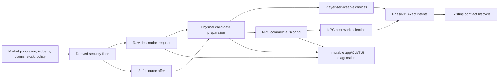

# Need-Driven Energy Logistics and Legible System Agency Implementation Plan

## Executive Summary

Replace opt-in, sparsely authored Energy demand and export pressure with deterministic logistics signals derived from each system's physical obligations. Every populated or operating system can request Energy when its stock is below a computed security floor; every system can offer only stock above the same floor and existing protected claims. Authored `core:energy` inventory targets and `authored_export_base` cease to decide whether a system participates.

Separate four concepts that the current implementation conflates:

1. **Raw system request** — destination-owned physical need.
2. **Physical serviceability** — a safe source, route, payload, storage headroom, and capable carrier exist.
3. **Player serviceability and choice** — the player's current carrier can perform the mission, even when it is not profitable.
4. **NPC commercial choice** — a positive-profit Energy mission beats the NPC's best ordinary work.

The existing delivery lifecycle, claims, locked lots, settlement, timeout recovery, exact reconciliation, deterministic ordering, and immutable app boundary remain authoritative. Accepted contracts remain immutable even if later generation or deliveries reduce the destination's current need.

This is a full replacement of Energy-target/export-pressure semantics. Persistence is not implemented, so do not retain aliases or parallel compatibility paths. Ordinary-goods targets remain authored and are outside this migration.

## Problem Statement

### Energy demand is currently an authored opt-in

The current request is:

```text
requested = max(0, authored_energy_target - stock - committed_inbound)
```

A market without an explicit `core:energy` target requests nothing, even at zero stock. Repository content gives only five of twenty systems an Energy target. The result is not emergent system behavior; it is a sparse content switch. Evidence: `crates/game-core/src/energy_logistics/mod.rs:1335-1431,1496-1630,1670-1730`; `content/economy.ron:1-135`; physical-logistics plan D3.

### Export participation is also manually enabled

The current source offer is bounded by safe exportable stock but also by:

```text
projected_curtailment + authored_export_base
```

Most systems use a zero base; one repository system authors a large base. A physically safe source therefore may offer nothing unless it is predicted to waste Energy or was designated as an exporter. Evidence: `crates/game-core/src/energy_logistics/mod.rs:1169-1188`; `crates/game-content/src/energy_logistics.rs:5-15,68-119`; `content/economy.ron:89-101`.

### Serviceability and commercial preference are conflated

`evaluate_energy_terms`, gross sizing, and `opportunity_score` combine physical constraints with positive-profit filtering. Player-visible opportunities and NPC work candidates therefore disappear for different reasons behind the same broad “not viable” result. A player cannot deliberately accept a physically safe but unprofitable relief mission, while diagnostics cannot distinguish absent surplus, absent route/capacity, and absent commercial interest. Evidence: `crates/game-core/src/energy_logistics/mod.rs:651-670,1335-1494`; physical-logistics plan D3–D4 and D10–D12.

### Systems execute rules but do not express their needs clearly

Generation, life support, production, brownouts, investments, and population are dynamic, but their Energy logistics response is controlled by manually assigned targets and one-off export pressure. This makes systems feel arbitrary and passive even when their physical state changes substantially.

The immediate UI precursor—switching between all posted requests and player-serviceable contracts—improves visibility but does not repair request generation or blocker semantics. The working branch contains this presentation slice; implementation must integrate it without treating it as evidence that the core distinctions already exist.

## Goals and Non-Goals

### Goals

- Derive every system's Energy security floor from population, healthy operating obligations, protected claims, and existing policy.
- Produce raw requests without requiring an authored `core:energy` target.
- Produce safe offers without requiring projected curtailment or `authored_export_base`.
- Ensure one frozen market state cannot simultaneously request and offer Energy.
- Preserve non-recovering inbound suppression and destination arrival-headroom projection.
- Separate physical eligibility from player choice and NPC commercial scoring.
- Let players inspect every request and accept any physically valid exact payload, including a mission with non-positive expected profit.
- Keep NPCs commercial: they require positive utility and continue comparing Energy against ordinary work.
- Make every absence visible through typed, exhaustive diagnostics and immutable frontend views.
- Preserve deterministic phase order, checked arithmetic, validate-before-mutate transitions, and exact physical reconciliation.
- Replace content fixtures that encode logistics participation with fixtures that encode structural generation, population, industry, and storage differences.

### Non-Goals

- General strategic AI for ordinary-goods targets or recipe selection.
- Development-project selection; that remains owned by `2026-07-14-feature-advanced-goods-development-projects-plan.md`.
- System-owned rescue ships; that remains owned by the draft service-fleet plan.
- Guaranteed rescue. A request may remain unserved for visible physical or commercial reasons.
- Dynamic route topology, cargo teleportation, external subsidies, or magical Energy creation.
- Changes to accepted-contract settlement, proportional fee conversion, timeout, or recovery accounting.
- Save migration or backward compatibility aliases.
- A new crate, dependency, ECS schedule framework, or frontend access to ECS entities.

## Authoritative Design Decisions

### ND1. One derived Energy security floor

At the phase-10 snapshot, derive the following checked values for each market:

```text
L = life_support_burn_per_capita * current_population
N = market_policy.operating_reserve_ticks
R = brownout_config.throttled_recovery_ticks

healthy_operating_reserve =
    life support for N ticks
    + source/recipe operating burn for N ticks
      at Normal throughput and current labor,
      using cloned deterministic carries

recovery_extension = L * max(0, R - N)

base_security_protection =
    ordinary_payment_claims
    + protected_liquidation_budget
    + logistics_export_reserve
    + healthy_operating_reserve
    + recovery_extension

security_floor_required =
    base_security_protection + outbound_preload_claims

security_floor_effective = min(storage_capacity, security_floor_required)
capacity_shortfall = max(0, security_floor_required - storage_capacity)
```

This reuses meaningful existing policy: `N` protects near-term operation and `R` is the runway required to recover to Normal. It does not add a new arbitrary per-system target knob.

“Healthy operating reserve” deliberately uses Normal throughput rather than the current suppressed brownout profile. A distressed system requests enough Energy to support recovery, not merely enough to remain shut down.

`base_security_protection` is claims-independent with respect to Energy delivery contracts. The aggregate floor shown in snapshots and used for offers/requests adds active outbound pre-load claims exactly once. During phase 6, calculate claim capacity as `max(0, stock - base_security_protection)`, then allocate individual claims in ascending `ContractId` order. Loading a winning claim must leave at least the base plus every later surviving claim; a state change that makes this impossible revokes the affected claim under the existing oldest-first rule. Never subtract the aggregate claim floor and then subtract individual claims again.

All terms use checked integer arithmetic and cloned carry state. The projection is immutable and never advances runtime carries.

### ND2. Raw requests are destination-owned need

```text
raw_requested_net = max(0,
    security_floor_effective
    - current_stock
    - committed_inbound_net)
```

`committed_inbound_net` retains the existing definition: remaining undelivered net Energy from active non-recovering contracts. Recovering contracts do not suppress destination need.

A zero-population system may still request Energy when healthy configured production, protected claims, or retained export policy produce a positive floor. A system with no population, production, claims, or reserve has no request.

Capacity shortfall is reported separately. The request is capped to fillable storage rather than advertising impossible volume forever.

### ND3. Candidate need is projected at arrival

Raw demand explains current system need. Contract sizing additionally freezes the candidate arrival horizon `H` and projects generation, life support, and healthy scheduled operating burn using the established immutable projection/carry rules.

```text
remaining_need_at_arrival = max(0,
    security_floor_effective
    - projected_physical_stock_at_H
    - committed_inbound_net)

candidate_net_cap = min(
    remaining_need_at_arrival,
    projected_arrival_headroom)
```

All non-recovering inbound commitments suppress duplicate sizing. Only commitments arriving by `H` occupy projected arrival headroom, preserving the existing D3 distinction.

### ND4. Safe offers are the exact complement of protected need

```text
safe_offered_gross = max(0,
    current_stock - security_floor_required)
```

The floor already includes outbound pre-load claims, ordinary claims, protected liquidation budget, healthy operation, recovery runway, and export reserve. Remove the projected-curtailment/authored-base pressure cap. A source does not need to be designated as an exporter; it needs actual safe stock.

Under one frozen state:

```text
raw_requested_net > 0  => safe_offered_gross = 0
safe_offered_gross > 0 => raw_requested_net = 0
```

Inbound may reduce a request to zero, but it cannot create an offer because inbound is not current stock.

### ND5. Remove authored Energy participation switches

- Reject `core:energy` in per-market generic targets at content-validation time.
- Remove repository Energy target rows from `content/economy.ron`.
- Reject governor `SetMarketTarget` commands for `core:energy` with a typed derived-policy error; ordinary-good target editing is unchanged.
- Remove `authored_export_base` from global and per-market Energy-logistics source schemas, compiled policy, content, tests, docs, and views.
- Retain `export_reserve` as an explicit amount a system chooses to keep, not an amount it offers.
- Remove `curtailment_projection_window` if repository search confirms it has no remaining use after offer replacement; do not retain a dead setting.

### ND6. Physical serviceability is not profitability

Refactor sizing into two layers:

1. **Physical candidate preparation** validates source surplus, route existence, exact payload, bulk headroom, destination need/headroom, tank fuel, loaded-route reimbursement, recovery reserve, allocation bound, and all checked arithmetic.
2. **Commercial scoring** computes fee minus deadhead cost and normalized utility.

The largest physically viable gross payload must not require positive commercial profit.

### ND7. Players may choose physically safe, unprofitable work

- Player serviceability uses physical candidate preparation only.
- Show fee, deadhead cost, expected net profit, and an explicit loss warning.
- Accept an exact positive gross payload up to the current physical maximum.
- Replace “Enter accepts displayed maximum” with a fresh exact-payload dialog; `m` may fill the maximum.
- Submission remains queued until phase-11 resolution. Stale need/source/carrier state rejects atomically with the recomputed maximum and typed reason.

The core command already carries an exact payload; this phase completes the frontend flow rather than adding a second command path.

### ND8. NPCs remain commercial

- NPC candidates start from the same physical candidates.
- An NPC requires strictly positive commercial utility after deadhead cost.
- It compares its best Energy mission with its best ordinary positive-profit work using the existing canonical score and stable tie rules.
- Dynamic commercial fleet spawning uses commercially positive unserved opportunities, not all raw requests.
- A future system service fleet may consume physical-but-unprofitable opportunities, but this plan adds no service vessels.

### ND9. Accepted contracts do not track changing need

Derived need gates discovery and acceptance only. Once accepted:

- terms, routes, source claim, gross payload, fee, net delivery, and recovery reserve remain immutable;
- generation or another delivery may reduce destination headroom;
- existing partial settlement, exact timeout, and same-contract recovery handle that change;
- no automatic cancellation, downsizing, rerouting, or fee rewrite is added.

### ND10. Diagnostics use an exhaustive causal ladder

For each destination unsupplied during phase 3, capture baseline state and freeze phase-10 feasibility before phase-11 mutation. Classify exactly once in this order:

1. `ArrivedSettlementBlocked`
2. `AcceptedDeliveryPending` at the phase-3 baseline
3. `NoSafeSourceSurplus`
4. `NoReachableSource`
5. `NoPhysicallyCapableCarrier`
6. `NoCommercialNpcCandidate`
7. `CommercialCandidateUnaccepted`

Player availability does not redefine autonomous world attribution. Player-specific serviceability is reported separately in views. Same-tick acceptance must not reclassify the tick's starvation cause.

### ND11. Existing phase order and physical invariants remain locked

Do not change the 15 simulation phases. Request/offer derivation and feasibility capture remain in phase 10; Energy intents resolve in phase 11. Preserve:

- stable-ID and contract-ID ordering;
- claims and inbound suppression;
- locked-lot ownership;
- validate-before-mutate atomicity;
- exactly-once events, conversions, counters, and ledgers;
- no ordinary Energy trading;
- no contract delivery through `RecordExternalDelivery`;
- exact whole-world physical reconciliation.

## Technical Approach

### Architecture



`game-core` owns every formula and classification. `game-content` supplies physical traits and validates that structural roles are possible. `game-app` resolves immutable names and typed labels. `game-tui` owns only view mode, selection, exact-amount input, and rendering. `game-cli` owns reporting and acceptance enforcement.

### Core model seams

Add cohesive pure types/functions under `crates/game-core/src/energy_logistics/` rather than expanding unrelated root logic:

```rust
struct EnergySecurityContext {
    required_floor: Energy,
    effective_floor: Energy,
    capacity_shortfall: Energy,
    raw_requested: Energy,
    safe_offered: Energy,
}

struct PhysicalEnergyCandidate {
    // carrier/source/destination/routes and exact physical bounds
}

struct CommercialEnergyScore {
    carrier_profit: Energy,
    deadhead_cost: Energy,
    net_profit: i128,
    normalized_score: i128,
}
```

Names may follow existing conventions, but the physical candidate must not contain a “positive-profit required” invariant.

Root orchestration in `game-core/src/lib.rs` may expose bounded helpers for policy, carries, and phase scheduling. Keep Energy-specific projection, sizing, snapshots, and diagnostics in the Energy module.

### Data and content impact

- `crates/game-content/src/energy_logistics.rs`
  - Remove `authored_export_base`.
  - Remove `curtailment_projection_window` if unused.
  - Preserve fee ladder, allocation cap, export reserve, and settlement timeout.
- `crates/game-content/src/lib.rs`
  - Reject authored `core:energy` generic targets.
  - Replace target/export-base fixture checks with derived-floor and safe-surplus validation.
  - Validate checked maximum floor arithmetic using allowed population/storage/policy ranges.
- `content/economy.ron`
  - Remove the five Energy target entries and the system-15 export-base override.
  - Keep population, generation, storage, recipes, sources, and meaningful policy overrides as structural inputs.
- `content/economy_config.ron`
  - Remove dead logistics fields.
  - Do not add per-system demand thresholds.

No save migration is required. Source schema removal is intentional full replacement.

### Runtime and performance impact

Compute each market's security context once per phase-10 capture and reuse it across source/destination/carrier combinations. Memoize destination projections by `(destination, horizon)` and source safe offers by source ID for the duration of the phase. Do not persist caches in ECS state.

The candidate cross-product remains bounded by systems × carriers × routes. Preserve the existing opportunity prefiltering and stable sorting. Add a benchmark-like bounded smoke assertion or timing evidence only if profiling shows regression; do not make wall-clock thresholds flaky test contracts.

### Governance impact

Energy security is derived, so generic Energy inventory targets are no longer editable. Existing governance may continue to affect:

- operating-reserve ticks;
- investments that change generation/storage/population support;
- ordinary-good targets and import policy.

A future design may expose a small Energy-security doctrine, but this plan does not replace one arbitrary target with many new thresholds.

## SpecFlow Analysis

### System request flow

1. Phase 3 records physical generation, life support, and any shortfall.
2. Brownout and operating profiles update through the existing phases.
3. Phase 10 freezes population, policy, claims, carries, storage, generation schedule, and inbound contracts.
4. Core derives security floor, capacity shortfall, raw request, and safe offer for every market.
5. Raw requests remain visible even when no source or carrier can serve them.

### Player flow

1. Open Logistics and default to **All Requests**.
2. Inspect every positive raw request with floor, stock, inbound, runway, stage, and causal blocker.
3. Switch to **Player Serviceable** to see physically valid source/destination choices.
4. Select a choice, review route burns, fee, expected gain/loss, recovery, and delivery.
5. Enter an exact payload or fill the current maximum.
6. Submit the queued intent; step/run to resolve it.
7. Observe typed acceptance or rejection and the existing automatic contract lifecycle.

### NPC flow

1. Build physical Energy candidates for each eligible idle bulk-capable NPC.
2. Commercially score only physically valid candidates.
3. Compare the best positive Energy score with ordinary work.
4. Capture one choice and resolve it in stable phase-11 order.
5. Failed/stale Energy work does not silently fall back during the same tick.

### Important variations

- A request with no safe source remains visible as raw demand.
- A safe source with no route is distinct from no surplus.
- A route with no currently capable carrier is distinct from commercial disinterest.
- A physically serviceable loss-making mission is available to the player but not commercial NPCs.
- Existing inbound may suppress raw request to zero without creating an offer.
- A floor above storage capacity requests only fillable stock and reports capacity shortfall.
- A contract accepted in a prior tick remains pending attribution even if it settles later in the current tick.
- A same-tick acceptance does not alter the phase-3/phase-10 attribution baseline.
- Need disappearing after acceptance leaves the contract immutable and relies on partial settlement/recovery.
- Overflow or stale recomputation rejects without mutation.

## Implementation Phases

### Phase 0: Integrate request visibility precursor

- [ ] Review and integrate the current `AllRequests` / `Serviceable` TUI work without staging unrelated untracked files.
- [ ] Default Logistics to all raw requests and keep stable request/opportunity selections independently.
- [ ] Ensure all-request Enter feedback never implies that a source/payload has been selected.
- [ ] Rename the eventual serviceable label to **Player Serviceable** once physical/commercial layers split.

Validation:
- [ ] Ratatui buffer tests show both modes at 80×30 and 160×45, including an unserviceable raw request.
- [ ] Input tests prove only the focused request panel handles the mode switch.

### Phase 1: Freeze derived arithmetic and compatibility

- [ ] Add failure-first pure tests for ND1–ND4, including zero population, no industry, single/multiple pre-load claims, claims-independent capacity allocation, carry boundaries, storage shortfall, inbound suppression, mutual request/offer exclusion, and checked overflow.
- [ ] Add typed source structs/snapshots for security floor and serviceability without changing runtime behavior yet.
- [ ] Add validation tests that reject authored Energy targets and removed export-base fields.
- [ ] Freeze the accepted-contract compatibility rule from ND9.

Validation:
- [ ] Targeted pure `game-core` tests pass with exact boundary vectors.
- [ ] Malformed `game-content` fixtures report source file, system, and removed/invalid field.

### Phase 2: Migrate content and derive system Energy posture

- [ ] Implement one security-floor helper using Normal-throughput operating obligations and cloned carries.
- [ ] Replace request snapshots with ND2 raw requests.
- [ ] Replace source offer pressure with ND4 safe offers.
- [ ] Remove Energy targets, `authored_export_base`, and any dead projection-window schema/content.
- [ ] Reject Energy target mutation through the existing governor command before mutation.
- [ ] Replace repository role validation with structural requester/exporter/route fixtures derived from physical content.

Validation:
- [ ] A populated system with no authored Energy target requests when below its derived floor.
- [ ] A system above its floor offers exact safe surplus without an authored export base.
- [ ] A market never requests and offers in the same frozen state.
- [ ] A valid claim is not revoked by double-counting itself; phase-6 oldest-first allocation uses the claims-independent base and remains insertion-order invariant.
- [ ] Export loading cannot reduce source stock below the claims-independent base plus every later surviving claim.
- [ ] A post-acceptance stock/stage change revokes a claim that would breach the new base floor without mutating unrelated contracts.
- [ ] Repository content validation passes without authored Energy participation switches.

### Phase 3: Project arrival need and split physical candidates

- [ ] Update destination projection to size against derived floor at candidate arrival.
- [ ] Extract physically viable gross sizing from commercial score requirements.
- [ ] Preserve exact route, tank, bulk, recovery, allocation, arrival-headroom, and checked-arithmetic bounds.
- [ ] Define typed physical rejection reasons and stable aggregation per request.
- [ ] Preserve stale exact-intent revalidation with no downsizing or fallback.

Validation:
- [ ] Physical maximum boundary tests cover every independent limit.
- [ ] Projected generation/inbound can reduce arrival need without hiding the raw current request.
- [ ] Capacity-shortfall and no-headroom cases are distinct.
- [ ] Physical candidate results are insertion-order invariant.

### Phase 4: Separate player choice from NPC commercial behavior

- [ ] Build player opportunities from physical candidates regardless of profit sign.
- [ ] Add an exact gross-payload dialog with current maximum, limiting reason, and `m` maximum fill.
- [ ] Display positive, zero, and negative expected profit without hiding physically valid work.
- [ ] Keep NPC and dynamic commercial fleet selection strictly positive-profit and canonically compared with ordinary work.
- [ ] Ensure active-contract ordinary buy/sell/travel guards remain unchanged.

Validation:
- [ ] Player accepts a physically valid loss-making mission through typed app requests.
- [ ] NPC refuses that mission and chooses profitable ordinary work when available.
- [ ] Raising the brownout fee can make the same physical mission commercially eligible next tick.
- [ ] Player and NPC paths reuse identical physical sizing outputs.

### Phase 5: Rebuild diagnostics and immutable presentation

- [ ] Extend core/app market snapshots with required/effective floor and capacity shortfall.
- [ ] Expose raw demand, safe surplus, physical serviceability, player serviceability, and NPC commercial state as distinct immutable facts.
- [ ] Replace D10 counters and labels with ND10's exhaustive priority ladder.
- [ ] Update CLI interval/final diagnostics with request volume, safe offers, capacity shortfall, physical candidate count, player-serviceable count, NPC-commercial count, selections, and ordered blockers.
- [ ] Update Logistics all-request details and Player Serviceable rows without reconstructing formulas in the TUI.
- [ ] Keep ECS `Entity` and mutable state behind `game-core`.

Validation:
- [ ] Every unsupplied destination tick has exactly one ND10 cause.
- [ ] Same-tick acceptance ordering regression remains green.
- [ ] App actor tests verify resolved names and typed exact-payload rejection.
- [ ] TUI tests render distinct “no surplus,” “no route,” “no carrier,” and “not commercially attractive” cases.
- [ ] CLI formatting tests cover every new counter and no obsolete target/base terminology.

### Phase 6: Tune, document, and run acceptance gates

- [ ] Tune only structural content inputs—generation, population, industry, storage, and meaningful reserves—after mechanics are fixed.
- [ ] Confirm ordinary trade, production, investment, population, fleet spawning/retirement, and contract activity remain nonzero in bounded deterministic runs.
- [ ] Update current documentation and encyclopedia vocabulary.
- [ ] Run architecture, accounting, determinism, simplicity, and spec reviews; resolve findings serially.
- [ ] Refresh world-dynamics and Energy-logistics acceptance evidence.

Validation:
- [ ] Full workspace tests, Clippy with warnings denied, formatting, content validation, and diff checks pass.
- [ ] The release 1,000-tick deterministic Energy acceptance passes twice with exact reconciliation and nonzero derived request/contract activity.
- [ ] Optimize any newly hot projection loop before running the required 10,000-tick gate.
- [ ] The current enforced 10,000-tick metastability and bounded player-impact gates pass, or the governing acceptance document is explicitly revised before merge rather than silently skipped.

## Acceptance Criteria

### Derived system behavior

- [ ] Every system with physical obligations has a computed Energy security floor without an authored Energy target.
- [ ] A below-floor system posts a positive request after subtracting committed inbound.
- [ ] An above-floor system offers only exact safe surplus.
- [ ] No frozen market state both requests and offers.
- [ ] Capacity below required security is explicit and never causes overflow, panic, or impossible requested volume.
- [ ] Removing Energy targets and export bases does not remove ordinary-good targets or governance.

### Serviceability and choice

- [ ] Raw requests exist independently of source, route, carrier, player, or NPC profitability.
- [ ] Physical serviceability includes every hard route, capacity, tank, recovery, and headroom constraint but no positive-profit requirement.
- [ ] Player Serviceable includes physically valid zero/negative-profit missions with clear warnings.
- [ ] NPCs and commercial dynamic spawning use only positive canonical utility.
- [ ] Accepted contracts retain immutable terms and existing settlement/recovery behavior when need changes.

### Presentation and diagnostics

- [ ] Logistics can switch between all raw requests and Player Serviceable contracts.
- [ ] Every raw request explains required floor, effective floor, stock, inbound, capacity shortfall, stage, and current serviceability blocker.
- [ ] Player payload entry is exact and freshly bounded.
- [ ] D10 attribution is mutually exclusive, exhaustive, and baseline-ordered.
- [ ] CLI reports physical feasibility separately from commercial selection.
- [ ] No frontend derives security, sizing, fee, or profitability arithmetic.

### Quality

- [ ] All arithmetic is checked and all multi-state transitions validate before mutation.
- [ ] Stable IDs and frozen phase-10 keys define every contention result.
- [ ] Exact physical reconciliation remains zero-difference.
- [ ] No ordinary Energy quote/buy/sell path returns.
- [ ] No new crate, dependency, or ECS/frontend boundary violation is introduced.
- [ ] Manual TUI playthrough confirms request discovery, loss warning, exact acceptance, queued resolution, and contract progress in compact and regular layouts.

## Validation Plan

### Automated validation

```bash
cargo fmt --all -- --check
cargo clippy --workspace --all-targets --all-features -- -D warnings
cargo test --workspace --all-features
cargo run -q -p game-cli -- --validate-content
cargo test --release -p game-content \
  tests::repository_energy_economy_remains_active_and_deterministic_for_1000_ticks \
  -- --ignored --exact --nocapture
cargo run -p game-cli --release -- --economy-diagnostics 10000
cargo run -p game-cli --release -- --player-impact \
  --impact-target frontier:system_04 --impact-tick 300 \
  --impact-good core:energy --impact-quantity 500 --impact-horizon 500
git diff --check
```

Use focused failure-first tests during Phases 1–5. Do not repeatedly run long gates while formulas are still changing.

### Manual validation

- Start with at least one below-floor request that has no player-serviceable contract; verify All Requests shows the causal blocker.
- Move the player to a safe source and verify Player Serviceable updates without changing raw demand.
- Accept an exact physically valid payload with negative expected profit; verify warning, queued feedback, and phase-11 resolution.
- Run through loading, delivery, partial settlement or completion, and inspect updated request/inbound state.
- Observe a capacity-shortfall market and confirm the UI distinguishes storage limitation from absent demand.
- Resize to 80×30 and 160×45 and verify selected rows and critical facts remain visible.

### Evidence to capture

- Pure arithmetic vectors for security floor/request/offer complementarity.
- Core insertion-permutation results and D10 totals.
- App/TUI buffer traces for raw versus Player Serviceable modes.
- CLI before/after counts for raw requests, physical candidates, NPC commercial candidates, contracts, and capacity shortfall.
- Release acceptance output and exact reconciliation line.
- Updated `archive/market-trading-prototype/docs/world-dynamics-validation.md` and `archive/market-trading-prototype/docs/energy-logistics-validation.md` entries.

## Dependencies and Risks

### Dependencies

- Existing physical contract lifecycle and Energy module.
- Existing brownout recovery thresholds, population, operating reserve, carries, and phase order.
- Existing immutable app views and typed request actor.
- Current in-flight TUI request-visibility precursor.

### Risks

| Risk | Impact | Mitigation |
|---|---|---|
| Security floor protects too much Energy | Ordinary demand and trade activity collapse | Freeze formula tests, report floor components, tune structural inputs only after bounded activity diagnostics |
| Safe offers cause export/request oscillation | Churn and redundant contracts | Use one complementary frozen floor, inbound suppression, immutable accepted terms, and stable phase ordering |
| Healthy operating projection overestimates needs | Systems request near capacity constantly | Expose each floor component; use configured healthy schedules and exact carries rather than arbitrary multipliers |
| Projection cross-product regresses runtime | Long diagnostics become impractical | Compute market contexts once, memoize destination horizons, retain prefilters, profile before long gates |
| Player loss-making missions undermine commercial fantasy | Confusing choices | Present explicit gain/loss and require deliberate exact confirmation; NPC behavior remains commercial |
| D10 changes break historical diagnostics | Evidence and tests become incomparable | Migrate labels/counters atomically and document old-to-new meaning; do not keep ambiguous aliases |
| Content migration accidentally restores arbitrary knobs | Same passive behavior under new names | Reject Energy targets/export bases at validation and command boundaries |
| Broader “system agency” expectations exceed this slice | Scope expands into projects/service fleets/AI policy | Keep ordinary strategic planning and public fleets in their existing plans; document intentional follow-up |

## Documentation and Follow-up

### Documentation to update

- [ ] `archive/market-trading-prototype/docs/energy-economy.md` — derived security floor, raw request, safe offer, serviceability layers, phase semantics, and diagnostics.
- [ ] `archive/market-trading-prototype/docs/energy-logistics-validation.md` — replace D1/D3/D4/D10 fixtures and invariant evidence.
- [ ] `archive/market-trading-prototype/docs/plans/2026-07-14-feature-physical-energy-logistics-plan.md` — mark replaced target/export-pressure decisions and link this plan; do not silently rewrite historical acceptance evidence.
- [ ] `README.md` — All Requests / Player Serviceable / exact payload flow.
- [ ] `content/encyclopedia.ron` — system need, safe surplus, player loss warning, and NPC commercial choice.
- [ ] `CHANGELOG.md` — player-visible system behavior and schema replacement.
- [ ] `archive/market-trading-prototype/docs/world-dynamics-validation.md` — refreshed long-run evidence.

### Intentional follow-up

- [ ] Coordinate physical-but-commercially-unattractive requests with `2026-07-14-feature-system-service-fleets-plan.md` without implementing service vessels here.
- [ ] Let development projects create strategic material demand under their own accepted plan rather than extending this Energy-only controller into generic AI.
- [ ] Revisit a small governor Energy-security doctrine only after derived defaults are playable; do not add raw numeric target editing back.

## References and Research

### Internal references

- `docs/architecture.md:1-145` — headless core, typed commands, immutable views, and dependency direction.
- `archive/market-trading-prototype/docs/energy-economy.md:11-17,143-164,178-188` — current physical stores, phase order, observability, and acceptance requirements.
- `archive/market-trading-prototype/docs/plans/2026-07-14-feature-physical-energy-logistics-plan.md:112-211,423-523,616-665` — current offer/request, sizing, D10/D12/D13, and frontend contracts being replaced or preserved.
- `archive/market-trading-prototype/docs/plans/2026-07-14-feature-system-service-fleets-plan.md:1-105` — future non-commercial resilience layer and commercial-versus-physical distinction.
- `archive/market-trading-prototype/docs/plans/2026-07-14-feature-advanced-goods-development-projects-plan.md:1-110` — separate system agency for durable projects and material demand.
- `crates/game-core/src/energy_logistics/mod.rs:651-670,1169-1188,1252-1630,1670-1835,1990-2076` — scoring, offers, projections, request/candidate generation, snapshots, and attribution.
- `crates/game-core/src/lib.rs:1624-1718,3284-3311,4300-4322,4993-5105,7124-7220` — market obligations, phase order, export protection, physical tick, and automated selection.
- `crates/game-content/src/lib.rs:154-178,255-292,711-803,1689-1729,1820-1921` — source schema, target compilation, generation, structural roles, and bootstrap validation.
- `crates/game-content/src/energy_logistics.rs:5-119` — current logistics source/override fields and validation.
- `crates/game-app/src/lib.rs:454-535,1338-1510` — immutable market/opportunity/contract/storage views and resolved-name mapping.
- `crates/game-tui/src/state.rs:205-224,260-330`; `crates/game-tui/src/lib.rs:2220-2505` — in-flight raw/serviceable view state and rendering.
- `crates/game-cli/src/main.rs:2078-2167` — current contract, D10, lot, and archetype diagnostics.
- `content/economy.ron:1-135`; `content/economy_config.ron:1-22`; `content/traders.ron:1-70` — repository physical traits, arbitrary participation switches, global policy, and carrier capabilities.

### Institutional knowledge

- `docs/solutions/rust-ecs-validate-before-mutate.md` — calculate complete checked next state before applying ECS mutations or emitting events.
- `archive/market-trading-prototype/docs/world-dynamics-validation.md` — preserve deterministic activity, metastability, and reconciliation evidence when changing economy behavior.

### Research decision

Local code and plans provide strong, current patterns for this project-local simulation change. No broad supplemental research or external framework documentation check was needed. Repository research used bounded core, content, app/TUI, and diagnostics slices; no relevant solution beyond the established validate-before-mutate pattern was found.
