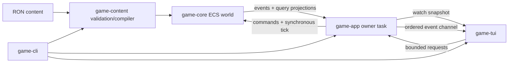

# Initial Prototype Implementation

## Executive Summary

Implement the first playable terminal prototype as a Rust Cargo workspace with a headless `bevy_ecs` simulation, validated RON content, an async Tokio application owner, and a Ratatui/Crossterm frontend. The prototype will load a connected 20-system 3D map, run a deterministic multi-layer economy, support automated and player-controlled traders over multi-hop routes, and expose trading and economy status through menu- and table-oriented terminal views.

The work is divided into independently testable slices so architectural boundaries are proven before the full economy and TUI are integrated. Persistence, final balance, procedural galaxy generation, and non-terminal frontends remain outside this prototype.

## Problem Statement

The repository currently contains architecture and prototype specifications but no Rust workspace or runtime implementation. The implementation must establish several boundaries correctly from the beginning:

- ECS simulation code must remain independent from terminal, filesystem, and async-runtime concerns.
- Human-authored RON must be validated and compiled before it enters the ECS world.
- Exactly one Tokio task must own and mutate the ECS `World`.
- The TUI must submit typed requests and render immutable application views rather than query ECS storage.
- Simulation behavior, routing, pricing, production, transactions, and automated trading must be deterministic enough for headless tests.
- The player must use the same trader and market rules as automated agents while choosing actions through the TUI.

The main implementation risk is not any individual algorithm; it is integrating content, ECS scheduling, asynchronous orchestration, and terminal lifecycle management without violating these boundaries.

## Proposed Solution

Create a five-library/application-crate implementation plus the executable:

```text
Cargo.toml
content/
  systems.ron
  goods.ron
  recipes.ron
  economy.ron
crates/
  game-core/       # typed simulation state, ECS systems, routes, economy
  game-content/    # RON source types, validation, compilation
  game-app/        # Tokio actor, request protocol, immutable views
  game-tui/        # Ratatui rendering, focus/input, terminal lifecycle
  game-cli/        # executable composition, diagnostics, shutdown
```

`game-core` remains synchronously stepped. `game-app` wraps it with bounded Tokio channels, owns timer-driven continuous execution, and publishes replaceable view snapshots plus ordered events. Content files define the 20 systems, goods, recipes, economic placement, initial balances/inventories, player trader, and automated traders.

Implementation uses replacement-free greenfield scope: there is no prior runtime, schema, or save data to support or migrate.

## Research Findings and SpecFlow Analysis

### Evidence index

References are relative to the repository root.

- **E1:** `docs/architecture.md:11-24,104-122` — chosen stack and dependency constraints.
- **E2:** `docs/architecture.md:125-183,274-284` — ECS ownership, scheduling, stable identity, and determinism.
- **E3:** `docs/architecture.md:185-229,326-356` — application/TUI boundary and async actor model.
- **E4:** `docs/architecture.md:231-252,294-322` — content pipeline and test strategy.
- **E5:** `docs/initial-prototype.md:28-60,78-139` — prototype scope and 20-system graph requirements.
- **E6:** `docs/initial-prototype.md:141-331` — themed goods, recipes, pricing, markets, automated traders, player trader, and status metrics.
- **E7:** `docs/initial-prototype.md:333-436` — proposed ECS state, tick flow, requests, channels, and views.
- **E8:** `docs/initial-prototype.md:438-538` — TUI controls, content layout, and required tests.
- **E9:** `docs/initial-prototype.md:541-567` — deliverables and end-to-end acceptance flow.

### Local research summary

- The repository is a new Git project with no Rust source or package manifest yet.
- `docs/architecture.md` and `docs/initial-prototype.md` are authoritative inputs; implementation files and RON content are future targets.
- No generated artifacts were identified. `.pi/`, `.obsidian/`, `.DS_Store`, and future `target/` output are not implementation targets.
- No relevant institutional solution documents exist under `docs/solutions/`.
- Broad supplemental research was skipped because the specifications already select the architecture and behavior.
- The implementation depends on Bevy ECS, Tokio, Ratatui, Crossterm, Serde, and RON APIs. No authoritative package documentation source was available through the current planning tools, so exact compatible versions and API behavior must be checked before dependency pinning.

### Primary flows

1. **Startup success:** CLI initializes file tracing, loads RON, validates and compiles definitions, constructs the ECS world and graph, starts the application owner, enters the alternate screen, and receives the initial paused view.
2. **Startup failure:** malformed or semantically invalid content returns source-aware diagnostics before terminal raw mode is entered where possible.
3. **Selection:** terminal input changes local focus/selection; selecting a system requests or derives a view update without mutating gameplay components.
4. **Single-step:** while paused, one request causes exactly one complete synchronous ECS schedule and one resulting view publication.
5. **Continuous run:** application-owned interval ticks advance the schedule while terminal input remains responsive; pause prevents timer-driven advancement.
6. **Player purchase:** request validation checks location, transit state, quantity, stock, cargo capacity, trader funds, and market funds before one atomic transfer.
7. **Travel:** the player previews a deterministic shortest path, starts travel, advances one route leg over distance-derived ticks, and cannot transact until arrival.
8. **Player sale:** the same market transaction service used by automated traders transfers owned cargo and currency atomically.
9. **Automated trade:** AI compares reachable destinations by projected profit per travel tick, follows deterministic tie-breaks, purchases, traverses a multi-hop route, and sells.
10. **Shutdown/recovery:** quit or cancellation stops the application task, drains or abandons no required durable state, restores terminal mode/cursor/screen, and flushes diagnostics.

### Important variations and provisional assumptions

These assumptions should be encoded in content/configuration, not scattered as constants:

- Every system has one aggregate market; facilities exchange goods with that market without internal currency transfers.
- All 20 markets are visible to the player and AI during the prototype.
- System placement, facilities, initial inventory, market currency, trader count, trader starts, cargo capacities, travel speed, and tick-rate choices are deterministic authored fixture data.
- No system contains a complete raw-to-sink chain; authored distribution must force inter-system trade.
- Multi-hop routes use deterministic Dijkstra shortest paths by total Euclidean distance; equal-cost choices break by stable system ID.
- Route-leg duration is `max(1, ceil(distance / configured_speed))` logical ticks.
- Buy/sell commands are processed immediately by the simulation owner but do not advance the logical clock; `Step` or a running timer advances a tick.
- The initial TUI quantity interaction may use fixed increments and a small numeric entry modal; exact key bindings are provisional but displayed in the UI.
- Cargo value uses the current market buy quote when docked and tracked acquisition cost while traveling, matching the prototype specification.

### Gaps to resolve during foundation

- Select mutually compatible crate versions and record the minimum supported Rust toolchain.
- Decide channel capacities and event-log retention limits based on bounded prototype needs.
- Author exact 20-system coordinates and economic placement that produce a connected graph and active trade chains.
- Choose initial market/trader balances high enough to avoid immediate economy deadlock while retaining transaction validation.
- Confirm whether Crossterm event streaming requires an adapter task or can be integrated directly with the selected versions.

None of these gaps changes the selected architecture; each has an explicit early validation task below.

## Technical Approach

### Architecture



#### `game-core`

- Define newtypes for `ContentId`, `Money`, quantities, ticks, and coordinate/distance values with checked constructors where invariants matter.
- Define components/resources from the prototype model without Serde/RON or Ratatui types.
- Implement graph construction, connectivity checks, direct-neighbor lookup, deterministic shortest paths, route plans, and leg timing.
- Implement pure pricing helpers and atomic market transaction functions before ECS system integration.
- Build an explicit ordered schedule for arrivals, sources, production layers, sinks, quotes, AI decisions, travel, events, and clock advancement.
- Expose a small session API for command submission, stepping, event draining, and read-only projection data.

#### `game-content`

- Define RON-facing source DTOs separately from compiled core definitions.
- Parse all four content files, collect diagnostics, resolve IDs, validate category/recipe constraints, and compile typed definitions.
- Validate exactly 20 unique finite 3D positions, nonuniform distances, unique namespaced IDs, positive quantities/targets, recipe references, economic distribution, player uniqueness, and graph connectivity.
- Return all actionable validation errors in one pass where practical rather than stopping at the first semantic error.

#### `game-app`

- Own `GameSession` in one Tokio task without `Arc<Mutex<World>>`.
- Define request envelopes with optional `oneshot` acknowledgements.
- Use bounded `mpsc` for requests and ordered events and `watch` for the latest complete `ApplicationView`.
- Handle pause, single-step, selectable tick rates, timer recreation, command rejection, and coordinated shutdown.
- Build TUI-independent views and player economy statistics after state changes/ticks.
- Keep selected-system application view state separate from ECS gameplay state.

#### `game-tui`

- Keep focus, table selections, scroll positions, modal state, and provisional key bindings local.
- Render systems, selected-system/routes, market quotes/inventory, player/cargo/status, events, and controls from a cached immutable view.
- Translate player intents into app requests; never expose ECS entities or queries.
- Use `tokio::select!` to react to input, view changes, ordered events, and shutdown.
- Protect raw mode, cursor visibility, alternate-screen entry, and restoration with an idempotent RAII guard and panic hook.

#### `game-cli`

- Resolve the content path, initialize file diagnostics, perform content loading before entering terminal mode, compose channels/tasks, and propagate contextual errors.
- Provide a headless mode or test harness entry point that exercises the same content/compiler/session path without a terminal.

### Data / Content Impact

Create initial RON content for:

- 20 stable system IDs, display names, finite 3D coordinates, initial markets, and facility placement.
- Four raw goods, three primary products, and three secondary products with the documented frontier names and prices.
- Three primary recipes, three secondary recipes, and three tertiary sink recipes.
- Raw replenishment, per-good market targets, recipe capacities, and initial inventories.
- One player trader and enough automated traders to exercise multi-hop trade, each with stable ID, location, balance, capacity, and speed.
- Pricing spread, tick rates, AI tie-break inputs, and economy initialization values.

Content validation is the first failure boundary. Tests should protect schema and invariants rather than permanently freezing every mutable coordinate, balance, or price as a magic number.

There is no save-data compatibility requirement in this prototype.

### Runtime / Platform Impact

- Initial supported platform is the local CLI environment, with macOS setup already documented; terminal behavior should remain portable through Crossterm.
- The ECS schedule runs on one owner task. No ECS system awaits, spawns tasks, accesses wall time, or performs I/O.
- Full application views contain only 20 systems and a small economy, so complete snapshot replacement is preferred over diff complexity.
- AI may search all 20 reachable systems each decision. Straightforward shortest-path evaluation is acceptable; cache paths only if profiling identifies a need.
- Continuous tick rates must not starve input or build an unbounded request/event backlog. Bounded channels and coalesced `watch` views provide backpressure.
- Diagnostic logs go to a file during TUI execution to avoid corrupting terminal rendering.

## Implementation Phases

### Phase 1: Workspace, dependency, and contract foundation

- [x] Create the root Cargo workspace and `game-core`, `game-content`, `game-app`, `game-tui`, and `game-cli` crates.
- [x] Check official release documentation/changelogs for compatible Bevy ECS, Tokio, Ratatui, Crossterm, Serde, and RON versions; pin intentional versions and record the Rust toolchain/MSRV.
- [x] Configure workspace lint policy, formatting, shared dependencies, test features, and release/dev profiles.
- [x] Define dependency edges so `game-core` cannot import TUI, terminal, filesystem, async runtime, or RON concerns.
- [x] Add `tracing` initialization and an executable error boundary without entering terminal mode yet.
- [x] Update `docs/architecture.md` if final crate boundaries, version constraints, or terminal input integration differ from its current intended structure.

Validation:

- [x] `cargo check --workspace --all-targets` succeeds.
- [x] `cargo tree` confirms the intended direct dependency direction and `game-core` has no forbidden direct dependencies.
- [x] A compile-time smoke test imports each public boundary from the intended downstream crate.

### Phase 2: Typed content pipeline and authored fixture

- [x] Implement validated stable IDs and source DTOs for systems, goods, recipes, economic sites, markets, sources/sinks, traders, and global economy configuration.
- [x] Implement RON parsing, cross-file ID resolution, semantic validation, aggregated diagnostics, and compilation into core-owned typed definitions.
- [x] Author 20 systems with varied 3D coordinates and deterministic economy/trader placement.
- [x] Author the documented frontier goods and production/sink recipes.
- [x] Author initial inventory, targets, balances, capacities, source rates, travel speeds, and trader configuration that force trade across systems.
- [x] Add a content-validation command or headless startup path suitable for CI.

Validation:

- [x] Valid repository content compiles into exactly 20 systems, 10 goods, 9 recipes, one player, and the configured AI traders.
- [x] Table-driven invalid fixtures cover duplicate/malformed IDs, unknown references, nonfinite/duplicate positions, nonpositive values, incorrect recipe-layer inputs/outputs, missing/multiple players, and disconnected economic configuration.
- [x] Diagnostics identify source file, definition ID, and field/path where available.

### Phase 3: Map graph and headless ECS shell

- [x] Implement core components/resources and deterministic ECS world construction from compiled definitions.
- [x] Construct normalized undirected three-nearest-neighbor edges and reject disconnected graphs.
- [x] Implement Euclidean distances, deterministic Dijkstra shortest paths, stable tie-breaking, route plans, and distance-derived leg durations.
- [x] Implement the explicit synchronous schedule skeleton, simulation clock, command queue, typed events, and projection/query boundary.
- [x] Add a minimal headless runner that loads content, constructs the world, steps it, and reports a summary without terminal initialization.

Validation:

- [x] Unit tests cover distance calculation, edge normalization, varied distances, connectivity, shortest/direct/multi-hop routes, equal-cost tie-breaking, unreachable destinations, and route timing.
- [x] Two sessions created from the same content/seed produce identical initial projections and event sequences over a fixed number of empty ticks.
- [x] Headless integration test confirms the repository content builds a runnable world without Ratatui or Crossterm.

### Phase 4: Economy, transactions, and trader simulation

- [x] Implement inventory, currency, market, recipe, source, sink, trader, travel, and ledger state.
- [x] Implement the documented integer pricing formula with checked arithmetic and explicit rounding.
- [x] Implement one atomic transaction service shared by player and AI commands, including stock, balance, capacity, location, transit, and quantity validation.
- [x] Implement raw replenishment, primary processing, secondary processing, tertiary sinks, market quote updates, and explicit schedule ordering.
- [x] Implement multi-hop travel progression and arrival events.
- [x] Implement deterministic AI opportunity evaluation across all reachable systems, profit-per-tick ranking, stable tie-breaking, purchase, route traversal, and sale.
- [x] Implement player ledger and comparative economy statistics.

Validation:

- [x] Unit/property-style tests exercise pricing bounds and monotonic scarcity behavior over broad inventory ranges.
- [x] Transaction tests prove atomic failure and goods/currency conservation for success, insufficient funds, insufficient stock, insufficient market funds, cargo overflow, zero quantity, wrong location, and transit.
- [x] Recipe tests prove atomic inputs/outputs and source/sink accounting for each layer.
- [x] Route/trader tests prove AI can prefer a profitable nonadjacent destination and complete a multi-leg trade.
- [x] A fixed-seed multi-tick integration test verifies deterministic snapshots, intended goods sources/sinks, and no unintended negative balances/inventories.

### Phase 5: Async application owner and immutable views

- [x] Define `AppRequest`, acknowledgements, command/rejection events, run states, tick rates, shutdown protocol, and channel capacities.
- [x] Implement the sole-owner Tokio task around the synchronous session.
- [x] Implement pause, exact single-step, continuous timer advancement, tick-rate changes, and clean cancellation.
- [x] Implement complete `ApplicationView`, system details, route preview/active route, market rows, player status, rankings/shares, and bounded recent-event projection.
- [x] Process buy, sell, and begin-travel requests through the same core transaction/travel rules used by AI.
- [x] Ensure slow view receivers coalesce snapshots while bounded event history remains available without blocking ECS indefinitely.

Validation:

- [x] Tokio paused-time tests prove no timer advancement while paused, exactly one tick per `Step`, expected advancement at each configured rate, and no duplicate tick after rate changes.
- [x] Concurrency tests prove requests are handled in order, acknowledgements resolve, closed receivers/senders terminate safely, and shutdown completes within a bounded timeout.
- [x] View tests confirm no ECS or Ratatui types cross the boundary and player/system/market statistics match core state.
- [x] Backpressure tests fill the bounded request channel and event-history limit and verify documented behavior rather than deadlock or unbounded growth.

### Phase 6: Ratatui interaction and terminal lifecycle

- [x] Implement responsive pane layout for systems, details/routes, market, player/trade status, events, and controls.
- [x] Implement local focus, list/table selection, scrolling, quantity entry, route preview, and help/control labels.
- [x] Map pause/resume, step, tick rate, buy, sell, travel, and quit intents to application requests.
- [x] Integrate Crossterm input with `tokio::select!` using the version-appropriate event strategy established in Phase 1.
- [x] Implement terminal RAII setup/restoration, idempotent cleanup, panic-hook cleanup, and application task shutdown.
- [x] Render command rejections and simulation events without writing diagnostic traces to the terminal surface.

Validation:

- [x] Ratatui `TestBackend` golden/snapshot or structural tests cover normal, narrow, short, empty-event, long-name, high-value, traveling, and rejection states.
- [x] Input mapping tests cover every required action and verify UI-only navigation sends no simulation mutation.
- [x] Terminal guard unit tests use an abstract terminal operations interface to verify cleanup order and idempotence without requiring a real TTY.
- [x] A manual TTY smoke test confirms pause, step, run, rate change, buy, sell, route preview, travel, resize, help, rejection display, and clean quit.

### Phase 7: End-to-end stabilization and CI

- [x] Add an end-to-end headless scenario matching the acceptance flow through purchase, multi-hop travel, sale, production, sinks, and player status updates.
- [x] Add a bounded economy soak test that runs enough fixed-seed ticks to detect overflow, negative inventory/balance, route stalls, and nondeterminism.
- [x] Add CI for formatting, Clippy, workspace tests, content validation, and headless acceptance execution.
- [x] Update `README.md` with build/run/test/content-validation commands and controls.
- [x] Reconcile `docs/architecture.md` and `docs/initial-prototype.md` with implemented names and deliberate deviations; record follow-up work separately rather than expanding prototype scope.

Validation:

- [x] `cargo fmt --all -- --check` passes.
- [x] `cargo clippy --workspace --all-targets --all-features -- -D warnings` passes.
- [x] `cargo test --workspace --all-features` passes.
- [x] Repository content validation and the headless acceptance scenario pass in CI.
- [x] Manual TUI acceptance is completed in a real terminal and terminal state is verified after normal quit and a forced recoverable error.

## Execution Status (2026-07-10)

Complete. The prototype, authored content, headless ECS simulation, async owner, and TUI are implemented. Dependency metadata and boundaries were verified; focused unit, integration, async, input, rendering, terminal-lifecycle, deterministic soak, and headless player-flow tests pass. PTY interaction and recoverable-error cleanup were exercised, and GitHub Actions run 29130410741 passed the configured quality gates. Evidence is recorded in `docs/evidence/2026-07-10-initial-prototype-validation.md`.
## Acceptance Criteria

### Functional requirements

- [x] Startup validates and compiles the four RON content files before creating the interactive terminal session.
- [x] The world contains exactly 20 uniquely identified systems with finite, nonduplicate 3D positions and varied derived distances.
- [x] Three-nearest-neighbor graph construction produces one connected undirected map, and deterministic shortest paths support multi-hop travel.
- [x] The documented 10 frontier goods and 9 recipes execute through raw, primary, secondary, and tertiary/sink layers.
- [x] Prices follow the documented integer scarcity formula and markets expose distinct trader buy/sell quotes.
- [x] Raw sources and tertiary sinks are the only intended goods creation/removal paths; market/trader transactions conserve both goods and currency.
- [x] Automated traders evaluate all reachable markets and can complete profitable multi-hop trades deterministically.
- [x] The player can inspect markets, buy cargo, preview and begin a route, advance through travel, and sell at arrival under the same market rules as AI.
- [x] Player status reports location/travel, currency, cargo, cargo value, net worth, ledger totals, rank, net-worth share, and sales-volume share.
- [x] Paused, single-step, and continuous tick-rate modes behave as specified while terminal input remains responsive.
- [x] The TUI renders systems, routes/details, markets, player/trade state, events, and controls without direct ECS access.
- [x] Quit and recoverable error paths stop the application owner and restore terminal raw mode, cursor, and alternate screen.
- [x] The same content and simulation flow can run headlessly without terminal initialization.

### Quality requirements

- [x] `game-core` has no direct Ratatui, Crossterm, Tokio, filesystem, or RON dependency.
- [x] Exactly one task owns and mutates the ECS world; no shared `Arc<Mutex<World>>` is introduced.
- [x] Fixed content and seed yield repeatable tested behavior on the supported target.
- [x] Content failures produce actionable source-aware diagnostics.
- [x] Bounded channels and event/view retention prevent unbounded memory growth.
- [x] Compile, format, Clippy, automated tests, content validation, and headless acceptance checks pass in CI.
- [x] Manual real-terminal validation covers rendering, resizing, interaction, failure display, and terminal restoration.
- [x] No save/content migration is required because this is the first runtime implementation.

## Validation Plan

### Automated validation

- [x] Run `cargo fmt --all -- --check`.
- [x] Run `cargo check --workspace --all-targets --all-features`.
- [x] Run `cargo clippy --workspace --all-targets --all-features -- -D warnings`.
- [x] Run `cargo test --workspace --all-features`.
- [x] Run the content validator against repository content and invalid fixtures.
- [x] Run the headless acceptance scenario twice and compare deterministic projections/events.
- [x] Run the bounded economy soak test under a fixed seed.

Test development should proceed with each phase rather than after integration: pure unit tests for IDs/math/pricing/routes; table-driven content validation; ECS schedule integration tests; Tokio paused-time/concurrency tests; Ratatui `TestBackend` rendering tests; and one end-to-end headless flow. If snapshot testing is not adopted, assert stable structural properties of rendered buffers so the lack of a dedicated snapshot framework does not block TUI coverage.

### Manual validation

- [x] Start from valid content and confirm the initial paused screen contains 20 selectable systems.
- [x] Inspect direct connections and a nonadjacent shortest route with total distance and estimated duration.
- [x] Buy cargo, confirm funds/capacity/market inventory update, and verify invalid quantities are rejected atomically.
- [x] Begin multi-hop travel, confirm trading is disabled in transit, advance ticks, arrive, and sell.
- [x] Run continuously while navigating panes and changing tick rates; confirm input remains responsive.
- [x] Observe production, sink consumption, automated trade, prices, events, and player comparative statistics changing over time.
- [x] Resize below the preferred dimensions and confirm a usable fallback rather than panic/corruption.
- [x] Quit normally and trigger one recoverable startup/runtime failure; verify terminal state and log output afterward.

### Evidence to capture

- CI output for format, check, Clippy, tests, content validation, and headless acceptance.
- Fixed-seed acceptance summary containing tick, selected inventories, player ledger/net worth, and completed routes.
- One terminal screenshot or capture of the integrated layout and controls.
- Manual test notes for resize, continuous responsiveness, and terminal restoration.
- Dependency/version verification notes with official documentation links added during Phase 1.

## Dependencies and Risks

### Technical dependencies

- Rust toolchain and Cargo, with exact MSRV selected during Phase 1.
- `bevy_ecs`, `tokio`, `ratatui`, `crossterm`, `serde`, and `ron` at mutually compatible pinned versions.
- `thiserror`, `anyhow`, `tracing`, and `tracing-subscriber` for boundaries and diagnostics.
- Optional dev dependencies for parameterized/property/snapshot testing only when they reduce test complexity.
- A real terminal for final lifecycle/interaction validation; automated core and rendering tests must not require one.

### Risks

| Risk | Impact | Mitigation |
| --- | --- | --- |
| Crate API/version mismatch | Rework in actor, event, or terminal integration | Verify official docs/changelogs and compile a minimal boundary in Phase 1 before feature work. |
| ECS borrowing/order complexity | Fragile systems or accidental order dependence | Keep systems narrow, use explicit sets/order, defer mutations deliberately, and test schedule-level outcomes. |
| Async timer/request race | Extra or missing ticks, unresponsive controls | Single owner loop, paused Tokio time tests, explicit timer reset semantics, bounded channels. |
| Terminal not restored after failure | Broken user shell session | Idempotent RAII guard, panic hook, cleanup abstraction tests, and manual forced-error validation. |
| Authored map/economy deadlocks | No profitable trade or stalled production | Validate placement invariants, use deterministic fixture simulations, tune initial liquidity in content, add soak diagnostics. |
| Integer overflow or rounding artifacts | Invalid prices/balances/profit ranking | Checked arithmetic at content/transaction boundaries, bounded quantities, explicit rounding tests. |
| AI route search expands later | Tick cost grows with galaxy size | Keep path/AI APIs replaceable; profile before adding path caches or search horizons. Twenty systems are safe for the prototype. |
| Full snapshots/events become noisy | Rendering churn or event backlog | `watch` coalescing for views, bounded snapshot history, render only on relevant changes/input. |
| Specification gaps become hidden constants | Difficult later tuning | Put speed, capacities, balances, targets, rates, and retention limits in validated configuration/content. |
| No authoritative docs cross-check during planning | Incorrect assumptions about selected crate APIs | Make official version/API verification a blocking Phase 1 task and capture source links. |

## Documentation and Follow-up

### Documentation to update

- [x] `README.md` — build, run, headless validation, tests, controls, and log location.
- [x] `docs/architecture.md` — final crate boundaries, dependency versions/constraints, channel/input implementation, and any deliberate architectural deviation.
- [x] `docs/initial-prototype.md` — only deliberate behavior/name changes discovered during implementation.
- [x] Add solution documentation under `docs/solutions/` only for reusable problems actually solved during implementation.

### Intentional follow-up

- [x] Deferred beyond the initial prototype: Persistence and schema migrations.
- [x] Deferred beyond the initial prototype: Procedural galaxy generation and larger-map pathfinding strategy.
- [x] Deferred beyond the initial prototype: Information limits, discovery, and imperfect AI estimates.
- [x] Deferred beyond the initial prototype: Final economic tuning, goals/progression, and richer market models.
- [x] Deferred beyond the initial prototype: Mod discovery, dependency resolution, content hot reload, and scripting.
- [x] Deferred beyond the initial prototype: Separate-process/network frontend adapters.

These items are explicitly deferred and must not be added as compatibility abstractions during the prototype.

## References & Research

### Internal references

- `README.md:1-14` — project intent and local setup entry points.
- `docs/architecture.md:11-24,104-122,125-183,185-252,274-356` — selected stack, boundaries, ECS/content/testing design, and async ownership.
- `docs/initial-prototype.md:28-60,78-139,141-331,333-538,541-567` — complete prototype behavior, data, flow, tests, and acceptance requirements.

### External references

- Official documentation was not accessible through the available planning tools. Phase 1 must add verified official links for the selected versions of Bevy ECS, Tokio, Ratatui, Crossterm, Serde, and RON before relying on version-sensitive APIs.

### Institutional knowledge

- No matching artifacts were found under `docs/solutions/` in the local artifact search.
