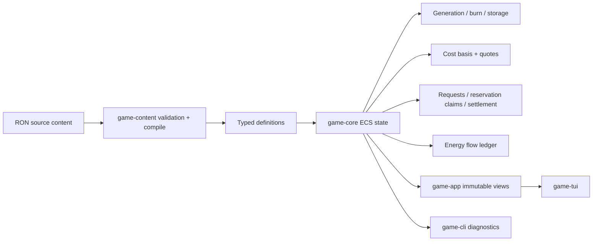

# Energy-Denominated Economy Foundation Implementation Plan

## Executive Summary

Implement Slice 1 as a full replacement of the prototype's conserved generic-currency economy with a physical, energy-denominated economy. Preserve the existing checked integer-newtype representation while renaming `Money` to `Energy`; make `core:energy` the single physical inventory good and the denomination for every price, cost basis, reservation, and settlement. Add per-system generation, static population and life-support burn, bounded storage, embodied-energy cost accounting, per-market policy, funded destination reservations, partial settlement, travel energy use, diagnostics, and TUI health readouts.

The work should remain inside the existing five-crate architecture. `game-core` owns all mutable economic state and deterministic behavior; `game-content` validates and compiles RON data; `game-app` publishes immutable views; `game-tui` renders them; and `game-cli` reports headless diagnostics. No new dependency or crate boundary is needed.

## Problem Statement

The current economy treats market and trader currency as separate balances, conserves a fixed total, derives quotes from base price plus local scarcity, and lets automated traders buy a full affordable stack before travel. On arrival, the NPC path attempts to sell the entire first cargo stack, discards any error, and retries forever. This allows liquidity concentration to leave laden traders stationary and processors unable to fund inputs. The design mocks demonstrate both the fixed-pool stall and the inability of scarcity-only asks to protect processor cost. Evidence: `crates/game-core/src/lib.rs:107-156,191-198,879-1048,1250-1301`; `crates/game-core/tests/economy_loop_mock.rs:1-119`; `crates/game-core/tests/pricing_model_mock.rs:1-167`.

The target design makes energy both the accounting unit and a physical resource. That introduces new correctness requirements: generated and burned energy must reconcile exactly; reservations must be funded and deterministic; physical stock, reserved amounts, and tank capacity must not be double-counted; recipe cost must propagate without floating-point arithmetic; and insufficient energy must not create partial mutation or permanent trader stalls. The governing requirements are in `todos/006-pending-p1-slice-1-energy-denominated-economy-foundation.md:25-55,76-217`.

## Proposed Solution

### Compatibility stance

Use **full replacement** for runtime state, APIs, current authored content, diagnostics, and player-facing terminology because persistence is not implemented and there is no shipped save schema. Rename the existing `Money(i64)` newtype to `Energy(i64)` and remove or rename every `currency`, `funds`, `cash`, and `balance` field according to its physical role: market value lives only in the `core:energy` inventory line, reservation state is `reserved_energy`, and trader value is `energy_tank`. Do not retain aliases, adapters, parallel abstract balances, or generic-currency UI wording. Retain the scarcity pricing mode only as the explicitly required temporary A/B comparison path; it must operate on the same physical energy state.

### Authoritative design contract

The implementation must follow todo 006 directly:

1. Author per-system solar quality and collector configuration now: a fixed-point `star_luminosity` (or equivalently named solar-energy potential) and `collector_efficiency` in `economy.ron`. `game-content` must compile them with checked deterministic integer arithmetic into the single runtime `energy_output_per_tick`; `game-core` consumes only that compiled rate. Author luminosity/solar quality independently from raw-resource placement and deliberately anti-correlate the two so net generation-minus-burn produces structural exporters, importers, and knife-edge systems.
2. Generation above `energy_storage_cap` is **lost** and recorded as curtailed/wasted energy; generation is never blocked.
3. Assess `life_support_burn_per_capita × population` every tick as a mandatory, first-priority sink. No market, production, or reservation path may silently skip or reduce the obligation. Phase 1 must document the exhausted-stock outcome without changing this rule; the recommended representation is zero physical stock plus an explicit unsupplied-life-support diagnostic, with population consequences deferred to Slice 2.
4. A market has one canonical `core:energy` inventory line. That same quantity is its storage stock, purchasing power, production input, and sellable energy. Implement a unified inventory abstraction capable of representing the renamed `Energy(i64)` amount for `core:energy`; do not mirror it into a separate market balance. A trader's energy tank is its wallet and is separate from ordinary cargo capacity, as required by the todo.
5. A reservation encumbers part of the destination's existing `core:energy` inventory line; it does not transfer energy into a second escrow inventory. Track `reserved_energy` as a claim used to compute unreserved stock. Expiry, cancellation, and partial fulfillment atomically reduce that claim without creating, returning, curtailing, or otherwise moving physical energy.
6. Use one shared reservation/settlement model for any trader that selects a committed opportunity. Automated planning and command-driven/player commitments must not acquire divergent funding rules. Immediate local sales use the same funded-quantity and partial-sale primitive.
7. Reservation locks a floor unit price. Settlement is never below that floor and may float upward under the current market policy; implementation details for an uplift must never consume another reservation, the operating reserve, or the protected liquidation budget.
8. Apply the anti-strand invariant to **every market and every laden trader**, not only accepted NPC trips. Define the explicit liquidation price from policy and compute a separate `protected_liquidation_budget` from content: route energy costs, trader travel-burn configuration, eligible cargo, and liquidation prices determine the energy needed to buy a sub-quantity that funds the cheapest adjacent jump. This budget is excluded from ordinary purchasing power, is not authored, and is not part of the operating reserve. Tuning the operating-reserve knob must never weaken the anti-strand guarantee.
9. The operating reserve remains exactly the todo formula: an authored per-market N-tick reserve for production, upkeep, and life-support burn. It is freely tunable policy and carries no correctness obligation. Therefore `unreserved_energy_for_purchases = energy_stock − reserved_energy − operating_reserve − protected_liquidation_budget` using checked, non-negative arithmetic.
10. Represent weighted-average cost as `(stock_quantity, total_embodied_energy)` per market/good. `core:energy` has a cost basis of exactly 1 energy-minor-unit per unit, anchoring the embodied-cost chain; this does **not** clamp its market bid or ask to 1. Scarcity adjustment applies to energy like any other good, allowing an energy-poor importer to quote above cost basis and an energy-glutted exporter to quote at or near it. Raw-source output is grounded in extraction energy; recipe output receives consumed input cost plus operating energy.
11. Add explicit authored allocation weights for multi-output recipes and implement one deterministic checked allocation rule. The exact rounding algorithm is an implementation choice to document and test, not a replacement for the authored weighting requirement.
12. `core:energy` may be purchased, hauled, and sold as ordinary cargo. Tank energy and cargo-bay energy are distinct physical stocks: the tank is the wallet and travel-burn source; bay energy consumes cargo capacity and is not spendable or burnable in transit. Buying bay energy pays the market ask from tank energy and transfers the purchased units from market stock to cargo. Selling bay energy transfers cargo units into market stock and pays the funded bid into the tank. Both operations use the same funded-quantity, reservation, cost-basis, and settlement primitives as every other good.
13. Refueling is a physical transfer, never an energy-for-energy purchase using a second payment. The original mock's “traders pay markets when refueling” revenue loop does not survive physicalization. The closed loop is generation → market stock → trade proceeds paid to traders for goods → travel burn or spending at other markets → market stocks. Markets gain energy only through generation and goods sales; travel burn is the universal system-level sink. Tank energy is acquired through trade proceeds or an explicit deposit/withdraw transfer allowed by authored refuel policy. An empty trader with insufficient tank energy is an anti-strand case.

Phase 1 may settle arithmetic and schema details, but it must not weaken these rules, narrow them to NPC-only behavior, or introduce parallel paths for liquidation, energy cargo, or energy pricing.

## Technical Approach

### Architecture



Keep the headless simulation boundary intact. Introduce typed definitions/components for:

- `Energy(i64)`, mechanically renamed from `Money(i64)`, for all energy quantities, prices, costs, reservations, and settlements.
- A unified market inventory abstraction whose `core:energy` line is the sole source for energy stock, capacity checks, purchasing power, production input, and energy trades.
- Compiled market `energy_output_per_tick`, plus `energy_storage_cap`, `population`, and cumulative burn/waste/unsupplied-life-support counters derived from the canonical energy inventory line. Runtime systems do not read luminosity or collector source fields.
- Trader `energy_tank`, `energy_tank_capacity`, ordinary cargo inventory that may include `core:energy`, cargo capacity, and travel burn configuration. Tank energy and bay energy are separate stocks with separate capabilities.
- `MarketPolicy` containing producer margin, operating-reserve ticks, import priorities, liquidation threshold/discount, and pricing mode.
- A content-compiled `protected_liquidation_budget` per market, derived from graph routes, travel costs, cargo/liquidation rules, and trader capabilities rather than authored or folded into `MarketPolicy`.
- Per-good `CostBasis` state and per-recipe/source operating-energy definitions.
- `TradeReservation` with trader/destination/good IDs, quantity, reserved-energy claim, floor unit price, expiry tick, and status.
- A deterministic reservation request queue resolved once per tick by opportunity score followed by trader stable ID.
- An `EnergyFlowLedger` with generated energy, travel burn, production/source/upkeep burn, life-support burn, curtailed generation, unsupplied life support, market↔tank↔energy-cargo transfers, ordinary goods-sale inflows, and physical stock deltas. Reservation-claim and protected-budget accounting changes are not physical flows and must never appear as generation, burn, or stock transfer.

Refactor the tick into explicit private phase functions even if the implementation remains in `crates/game-core/src/lib.rs` initially:

```text
complete travel legs
→ expire/cancel reservations and release claims
→ generate energy (cap stock; record curtailment)
→ assess and burn mandatory life support
→ execute sources and recipes with operating energy and cost transfer
→ collect automated opportunity/reservation requests
→ resolve requests in stable total order
→ settle arrivals, including partial/liquidation fallback
→ buy cargo and begin newly reserved trips
→ advance clock, reconcile ledger, emit events
```

Do not rely on Bevy query/entity iteration order. Materialize requests and settlement work into vectors and sort by the documented stable keys before mutation. Extend `GameCommand` with typed market-policy mutation for content/tests, but do not expose a Slice 1 TUI editor. Existing command and event boundaries are at `crates/game-core/src/lib.rs:415-450,592-605`.

All multi-component operations—reservation creation/release, buy/sell settlement, production, refueling, and travel burn—must calculate checked next state before applying it. Follow the repository's validate-before-mutate pattern rather than relying on checked arithmetic after partial writes. Evidence: `docs/solutions/rust-ecs-validate-before-mutate.md:9-33`.

### SpecFlow Analysis

#### Flow overview

1. **Startup/content flow:** parse all RON files; resolve `core:energy`; apply global policy defaults plus per-market overrides; validate numeric ranges, recipe weights, energy capacities, source/recipe costs, graph-aware bootstrap runway, and anti-strand feasibility; compute each market's protected liquidation budget independently from its operating reserve. Bootstrap runway fails validation by default, but a per-system authored acknowledgement downgrades only that failure to a source-aware warning and diagnostics annotation.
2. **Normal market tick:** generate energy, discard and ledger overflow, assess mandatory life support, execute only production whose goods and unreserved energy inputs are available, propagate embodied cost, then publish funded demand using `stock − reservation claims − operating reserve − protected liquidation budget`.
3. **Trade planning:** each trader selecting a committed opportunity—including an exporter→importer energy-hauling opportunity—uses cost-aware origin ask, destination funded bid, cargo-bay capacity, tank headroom, travel time, and travel energy to raise a request. Automated requests are collected before mutation; command-driven/player commitments enter the same typed request path. The resolver sorts all same-tick requests, recalculates remaining unreserved energy after each acceptance without touching either reserve, records the accepted claim against the destination's physical energy line, and attaches the reservation to the trader.
4. **Travel and refresh:** origin purchase and departure are atomic; travel burns energy by route distance using checked deterministic rounding. An en-route reservation refreshes its TTL. Cancellation, route failure, or inability to depart releases the claim atomically without moving physical stock.
5. **Arrival and settlement:** sell up to reserved quantity, transfer at least the reserved floor amount from the destination's `core:energy` line to the trader tank, optionally pay a policy-defined current-price uplift only from unreserved energy, reduce cost basis consistently, and release any unused claim. If cargo remains, every market offers the funded liquidation sub-quantity needed by the anti-strand invariant before deterministic rerouting.
6. **Player flow:** market and player panels show market energy stock, tank energy/capacity, and cargo-bay usage including hauled energy. Buying any cargo good—including `core:energy`—pays its market ask from tank energy and transfers the purchased units into the bay; selling cargo transfers the units to market inventory and pays the funded bid into the tank. Bay energy is not spendable or burnable during travel. Refuel/deposit actions, if exposed, move physical energy directly between the market line and tank under authored policy and must not simulate an energy-for-energy purchase with a second abstract payment. Immediate cargo sales disclose and execute the funded sub-quantity rather than silently failing a full stack.
7. **Diagnostic flow:** a seeded headless run reports interval activity plus global flow reconciliation and per-market solvency/stock/cost metrics. Reports distinguish operating reserve, computed protected liquidation budget, reservation claims, and unreserved purchasing energy; annotate acknowledged bootstrap risk; and evaluate the physical loop in which generation and goods-sale inflows refill markets while travel is the universal sink. A pricing-mode argument runs identical content/tick count under scarcity and cost-aware modes for comparison.

#### Important failure and recovery paths

- Invalid or overflowing content fails before `GameSession` construction with file/definition/field context.
- Insufficient market energy reduces advertised demand before a trader departs; ordinary funded demand may consume neither the authored operating reserve nor the computed protected liquidation budget.
- Reservation expiry/cancellation releases the claim once and only once; physical energy stock and the global flow ledger do not change.
- Insufficient production energy skips the recipe without consuming inputs. Life-support demand is still assessed first and in full; exhausted-stock handling records the unsupplied requirement without allowing discretionary spending to take priority.
- A laden arrival that cannot settle the full stack sells the funded sub-quantity, keeps the remainder, and either reserves/reroutes or uses the liquidation guarantee; no ignored error path remains.
- Tank capacity limits ordinary settlement proceeds and direct refuel/deposit transfers. Cargo capacity independently limits hauled energy. The planner must constrain settlement quantity so expected proceeds fit available tank headroom after travel burn; bay energy cannot be used to bypass that check, and excess proceeds must not disappear.
- Policy mutation validates the whole replacement policy before applying it and affects subsequent quote/reservation phases only.

#### Gaps to close in Phase 1

- Confirm whether unmet life support should be a diagnostic-only deficit in Slice 1 or should fail the tick; this plan recommends diagnostic deficit because negative physical stock and simulation deadlock are both worse.
- Confirm only the authored unit and deterministic integer rounding for travel burn (`energy per distance unit` with ceiling per leg is recommended). Refueling-loop semantics and reserve composition are resolved design decisions above, not Phase 1 questions.

### Data / Content Impact

Update the current source-of-truth files in one schema migration:

- `content/goods.ron`: add `core:energy`; rename `base_price` to an explicitly energy-denominated bootstrap-cost field and require energy's **cost basis** seed to equal 1. Do not use this field to clamp market energy bids/asks.
- `content/recipes.ron`: add per-execution energy cost and output cost weights; optionally add per-recipe margin override.
- `content/economy_config.ron`: add pricing mode, default margin, operating-reserve ticks, reservation TTL, liquidation settings, life-support burn per capita, default untargeted target/policy, and A/B controls; remove obsolete global quote percentages after the comparison default is accepted. Do not add an authored liquidation-budget knob.
- `content/economy.ron`: replace currency with starting energy stock; add fixed-point star luminosity/solar quality, collector efficiency, storage cap, population, source extraction cost, optional policy overrides, and a default-false per-system bootstrap-risk acknowledgement for all 20 systems. Compile luminosity × collector efficiency into `energy_output_per_tick`. Deliberately place high-solar systems away from the strongest raw sources so the resulting net flows create exporters, importers, and knife-edge systems and make trade—including energy hauling—structurally necessary.
- `content/traders.ron`: replace starting currency with tank stock/capacity; add travel burn per distance and refuel policy.

`game-content` currently owns all six source structs and compiles market/global values directly into core definitions. Extend this seam and aggregate all validation errors before returning. Evidence: `crates/game-content/src/lib.rs:43-144,170-210,300-414,509-547`.

Bootstrap validation should calculate each net importer's static burn, shortest plausible source-to-importer route, fastest initially available trader arrival, cargo/tank delivery capacity, and starting runway. When `starting_stock / required_burn_per_tick` is not strictly greater than the plausible first-delivery ticks plus one scheduling tick, fail validation by default. Add a per-system authored acknowledgement such as `acknowledge_bootstrap_risk: true`, defaulting to false; when present, downgrade only this failure to a source-aware warning and annotate that system in economy diagnostics. Always report system ID, runway, required threshold, route/fleet assumptions, and whether the risk was acknowledged. This keeps the balance guard effective by default without blocking deliberate precarious or doomed-system content. Avoid tests that freeze every balance number; test invariants and deliberately invalid/acknowledged fixtures instead.

### Runtime / Platform Impact

- Keep all simulation arithmetic integer and checked. Distance remains finite `f64`, but convert travel energy with one documented ceiling operation per leg.
- Reservation scans are small for the prototype (nine NPCs, 20 systems, ten ordinary goods plus energy). Favor deterministic `BTreeMap` state and sorted vectors over optimization.
- Snapshots must expose the one physical energy stock line together with its reserved claim, authored operating reserve, computed protected liquidation budget, unreserved purchasing amount, storage capacity, and unsupplied-life-support metric. They must not imply that reservations or the protected budget are second stockpiles.
- No persistence migration is required because persistence is deferred. No async behavior enters `game-core`; the existing actor owner remains unchanged.
- TUI rendering remains view-only. Extend market/player view models rather than exposing ECS state. Existing seams: `crates/game-app/src/lib.rs:69-155,305-465`; `crates/game-tui/src/lib.rs:501-575`.

## Implementation Phases

### Phase 1: Contract, Schema, and Test Scaffolding

- [x] Create `docs/energy-economy.md` as the durable post-prototype design document. Record energy as numéraire, the `Money` → `Energy` type rename, the single physical `core:energy` market line, tank-versus-bay energy semantics, star luminosity × collector-efficiency generation compilation, deliberate solar/raw-resource anti-correlation, emergent system roles, storage-overflow loss, mandatory life-support behavior, reservation claims, independent operating reserve and computed protected liquidation budget, pricing/cost formulas, deterministic rounding, bootstrap acknowledgement, diagnostics, and compatibility stance. Explicitly document that energy's cost basis—not price—is anchored at 1 and that the refuel-revenue mock loop is replaced by generation → market stock → trade proceeds → travel burn/other-market spending. Treat todo 006 as authoritative while drafting it.
- [x] Define core typed data structures and pure checked helpers for `Energy`, unified market/tank/cargo inventory access, proportional cost allocation, energy quotes, funded quantity, operating reserve, content-computed protected liquidation budget, universal liquidation quantity, and flow reconciliation. Use these shared helpers for ordinary goods, energy cargo, and anti-strand settlement.
- [x] Extend RON source definitions and compilation for energy, fixed-point star luminosity/solar quality, collector efficiency, compiled generation, system physical fields, trader tanks, recipe/source energy costs, policy defaults/overrides, and pricing mode.
- [x] Add source-aware validations for exact energy identity/cost basis, valid luminosity and collector ranges, checked generation compilation, positive capacities and weights, percentage ranges, override merging, energy stock ≤ cap, tank stock ≤ cap, graph-aware bootstrap runway with fail-by-default acknowledgement handling, computed liquidation-budget feasibility, and the presence of exporter/importer/knife-edge roles.
- [x] Add focused failing tests first for the pure arithmetic and invalid content cases, then migrate repository content so `--validate-content` passes.

Validation:
- [x] `cargo test -p game-content` proves valid repository content compiles, malformed fields fail with useful context, insufficient bootstrap runway errors by default, and an explicit per-system acknowledgement yields a structured warning rather than an error.
- [x] `cargo run -p game-cli -- --validate-content` succeeds with the migrated 20-system content and prints any acknowledged bootstrap-risk warnings with source/system context.
- [x] Pure helper tests cover zero, boundary, rounding, overflow, multi-output remainder, and stable-tie cases.

### Phase 2: Physical Energy and Cost-Aware Pricing

- [x] Rename `Money` to `Energy` and replace every market/trader currency field with the canonical market `core:energy` inventory line or trader tank state; remove legacy aliases and parallel balances.
- [x] Implement generation from the content-compiled per-tick rate, capped storage with curtailment, mandatory life-support burn/unsupplied reporting, source extraction energy, recipe operating energy, and deterministic energy flow accounting.
- [x] Add per-market `CostBasis` state initialized from bootstrap costs; transfer embodied costs through market buys/sells and single-/multi-output/consuming recipes.
- [x] Add `MarketPolicy` as an ECS component initialized from defaults plus overrides; route pricing and liquidity reads through it, and add a validate-before-apply policy command.
- [x] Implement the pricing selector. Preserve scarcity mode only for A/B runs; implement the energy **cost-basis** anchor, scarcity-sensitive energy and goods quotes, sustainable ask floor, processor bid ceiling, untargeted default target/no-discount behavior, and explicit liquidation pricing. Never clamp energy's market price to its unit cost basis.
- [x] Extend snapshots/events enough to test all energy and cost movements without terminal dependencies.

Validation:
- [x] Core unit tests prove generation/burn/cap/deficit ordering, energy/tank/cargo capacity, cost propagation, quote floors, policy isolation, exact ledger reconciliation, and energy pricing above unit cost in a deficit market versus at/near cost in a glutted market.
- [x] Atomicity regressions force overflow or insufficient energy at each operation and compare complete before/after snapshots.
- [x] A short deterministic repository-content run produces identical events/snapshots for identical inputs.

### Phase 3: Funded Reservations, Travel, and Anti-Strand Behavior

- [x] Split automated planning into request collection and stable resolution; compute advertised demand and reservation quantity through one shared funded-quantity helper that subtracts reservation claims, operating reserve, and protected liquidation budget independently.
- [x] Implement reservations as claims against the destination's physical energy line, including TTL refresh while en route, expiry, cancellation, partial fulfillment, and exact claim/settlement accounting.
- [x] Compute and preserve each market's protected liquidation budget separately from tunable policy, and route its liquidation purchase through the same funded-quantity and settlement primitives as ordinary and energy cargo.
- [x] Include travel burn, tank headroom, cargo-bay headroom, destination reserved claim, energy-hauling profit, and universal liquidation-jump feasibility in opportunity scoring and departure validation.
- [x] Implement `core:energy` cargo purchases and sales as explicit market-line↔cargo transfers paid through the trader tank, with bay energy unavailable for spending or travel burn.
- [x] Replace the ignored full-stack sell result with explicit reserved settlement, funded partial sale, liquidation fallback, and deterministic rerouting.
- [x] Ensure same-tick contention sorts by opportunity score then trader ID and is invariant under market/entity iteration order.
- [x] Apply the same immediate funded-subquantity primitive to player sales, bay-energy trades, and explicit physical tank deposit/withdraw transactions; do not recreate refuel revenue or a second currency.

Validation:
- [x] Multi-trader contention never over-reserves, never spends either reserve, and produces the same winner/quantities after fixture insertion order is permuted.
- [x] A low-liquidity destination partially settles a stack, releases its reservation claim correctly, preserves the independently computed liquidation budget, and leaves the trader moving or economically able to move.
- [x] An exporter→importer energy-hauling opportunity is profitable under scarcity-sensitive energy quotes, loads energy into cargo rather than tank, burns only tank energy in transit, and settles through the shared reservation/funded-quantity path.
- [x] Expiry, cancellation, uplift, tank-headroom, cargo-energy, and liquidation branches conserve physical energy and never double-release a claim.

### Phase 4: Views, Diagnostics, Balance, and Rollout

- [x] Extend `MarketSnapshot`, `TraderSnapshot`, app view models, and event labels with physical energy stock, tank stock/capacity, bay-energy quantity/cargo capacity, reservation claims, operating reserve, protected liquidation budget, unreserved purchasing energy, funded demand, bootstrap-risk annotation, and health status.
- [x] Render system energy stock/cap and separate reserve composition in the market pane; label player tank versus cargo-bay energy and capacities distinctly, and show travel runway without coupling TUI code to ECS state.
- [x] Replace CLI fixed-total currency reporting with global energy-flow reconciliation and the required per-market cost, margin, funded demand, reservation, operating reserve, protected liquidation budget, unreserved energy, bootstrap acknowledgement, storage, and target metrics. Interpret health against the approved generation/trade-proceeds/travel-burn loop rather than mock refuel revenue.
- [x] Add a CLI pricing-mode override or A/B diagnostics option that runs identical content and initial state under both modes and emits comparable summaries.
- [x] Tune authored content for slightly positive global net flow and intentionally high local stock variance; do not encode balance snapshots as permanent magic-number tests.
- [x] Promote cost-aware mode to the default only after the 1,000-tick acceptance run; then remove obsolete mock-only assumptions and update or replace the two design tests with production integration coverage.
- [x] Update `CHANGELOG.md` under `Unreleased`; after acceptance, mark todos 004 and 005 superseded and todo 006 complete without touching `.obsidian/`.

Validation:
- [x] Ratatui `TestBackend` tests cover normal, full, low, and deficit energy displays; separate operating/liquidation/reservation amounts; acknowledged bootstrap risk; and distinct bounded tank, bay-energy, and cargo-capacity labels.
- [x] CLI output tests or extracted formatter tests prove reconciliation and A/B fields are stable and overflow-safe.
- [x] The 1,000-tick seeded run remains active past tick 300, has no stationary-laden NPC at report boundaries, no processor structural insolvency, and reconciles generated, burned, curtailed, traded, and stored energy exactly; reservation claims reconcile separately and never alter the physical total.

## Acceptance Criteria

### Functional Requirements

- [x] `Money` has been renamed to `Energy`, `core:energy` is the sole currency-good, and every price, cost basis, stock/tank amount, reservation, and settlement uses that checked integer energy-minor-unit type.
- [x] Market purchasing power is `energy stock − reservation claims − operating reserve − protected liquidation budget`; the authored operating reserve and computed protected budget remain independently reported, and operating-reserve tuning cannot change the protected budget. Trader purchasing power is tank energy, while hauled bay energy is non-spendable cargo bounded by cargo capacity.
- [x] Content-authored star luminosity/solar quality and collector efficiency compile deterministically into each system's per-tick generation rate; the authored world contains exporters, importers, and knife-edge systems, with high solar quality anti-correlated against major raw-resource sources.
- [x] Every tick applies the compiled per-system generation and static-population life support, caps storage, records waste/deficit, and preserves a globally reconcilable flow ledger.
- [x] Cost basis propagates through source, single-output, multi-output, and consuming recipes; non-liquidation asks cannot fall below the configured sustainable floor.
- [x] Energy cost basis remains exactly 1 while scarcity-sensitive market quotes may rise above 1; authored content produces a profitable exporter→importer energy-hauling route.
- [x] Advertised demand, reservations, immediate partial sales, energy-cargo trades, and anti-strand liquidation share one funded-quantity and settlement implementation.
- [x] Same-tick reservation contention is deterministic and cannot reserve more energy than exists after subtracting both the operating reserve and protected liquidation budget.
- [x] Reservations have atomic creation, refresh, expiry, cancellation, partial fulfillment, and claim-release semantics without creating a second energy stockpile.
- [x] A destination unable to buy a full stack settles a funded sub-quantity; automated traders do not retry an ignored full-stack error indefinitely.
- [x] Every market buys, at its explicit liquidation price, enough of any laden trader's cargo to fund the cheapest adjacent jump without creating energy; this is not limited to NPCs with prior reservations, and the computed protected budget is unaffected by operating-reserve tuning.
- [x] Per-market policy comes from defaults plus overrides and is mutable only through the typed command boundary in this slice.
- [x] The TUI shows market energy stock/cap, reserve composition, player tank/capacity, and hauled energy/cargo capacity, clearly distinguishing spendable/burnable tank energy from bay inventory.
- [x] Diagnostics separately report operating reserve, protected liquidation budget, reservation claims, and unreserved purchasing energy; annotate acknowledged bootstrap risks; show that markets gain energy only through generation and goods sales while travel is the universal trader sink; reconcile that physical loop; compare pricing modes; and prove a deterministic 1,000-tick run remains active after tick 300.

### Quality Requirements

- [x] `cargo fmt --all -- --check`, `cargo clippy --workspace --all-targets -- -D warnings`, and `cargo test --workspace` pass.
- [x] `cargo run -p game-cli -- --validate-content` passes for repository content and fails clearly for invalid fixtures.
- [x] All new economic operations preserve validate-before-mutate atomicity under rule failures and checked-arithmetic failures.
- [x] No `game-core` dependency on terminal, filesystem, async runtime, or RON is introduced.
- [x] No new dependencies or crate boundaries are added.
- [ ] Manual TUI validation confirms energy health, tank-as-wallet behavior, partial sale feedback, and travel runway are understandable.
- [x] Save compatibility is documented as not applicable because persistence is not implemented.

## Validation Plan

### Automated Validation

- [x] Develop bottom-up: pure arithmetic/property tables → core fixture tests → content compiler tests → app view tests → TUI render tests → CLI/integration run.
- [x] Add table-driven tests for funded quantity with both independent reserves, ceiling/floor rounding, reservation uplift, computed liquidation quantity/budget, cost allocation, energy scarcity quotes, cargo-energy transfers, and ledger equations.
- [x] Add permutation tests that spawn systems/traders in different orders and assert identical contention results and snapshots.
- [x] Add repository-content tests for bootstrap viability default failure, per-system acknowledged warning/diagnostic behavior, profitable energy hauling, and exporter/importer role presence without freezing mutable balance values.
- [x] Run:

```bash
cargo fmt --all -- --check
cargo clippy --workspace --all-targets -- -D warnings
cargo test --workspace
cargo run -p game-cli -- --validate-content
cargo run -p game-cli -- --economy-diagnostics 1000
```

- [x] Add the final A/B invocation once its CLI shape is implemented, using identical content, tick count, and deterministic initial state.

### Manual Validation

> Interactive TUI validation remains unchecked: the non-interactive execution environment could not satisfy Ratatui's cursor-position handshake. Equivalent core/app flow and TestBackend cases pass, but they are not recorded as manual validation.

- [ ] Start paused; inspect an exporter, importer, and knife-edge system and confirm energy stock/cap and health state match authored values.
- [ ] Buy ordinary cargo, verify tank energy falls while cargo capacity rises, travel, verify route burn, and partially sell into a constrained destination.
- [ ] Buy `core:energy` as bay cargo at an exporter, verify the ask is paid from the tank and bay capacity is used, travel to an importer using only tank energy, then sell the hauled energy at the funded scarcity-adjusted bid.
- [ ] Exercise the approved physical refuel/deposit flow separately from cargo trading; verify energy moves between the canonical market line and tank exactly once, tank capacity is enforced, cargo energy is unchanged, and no refuel revenue is created.
- [x] Run a low-energy fixture/content copy and confirm deficit/waste/reservation states are visible rather than represented as negative stock or silent failure.
- [x] Compare scarcity and cost-aware diagnostic summaries for trade activity, processor margins, stationary-laden NPCs, and global/local energy health.

### Evidence to Capture

- Workspace test/Clippy/format output.
- Valid-content output plus representative bootstrap default-error and acknowledged-warning cases, computed liquidation-budget evidence, and anti-strand diagnostics.
- 1,000-tick A/B diagnostic logs, including post-tick-300 activity and exact flow reconciliation.
- TUI screenshots or terminal captures for exporter, importer/deficit, player tank, and partial-sale states.
- A short balance note recording chosen defaults and why cost-aware mode became the default.

## Dependencies and Risks

### Technical Dependencies

- Existing `bevy_ecs` world and synchronous `GameSession` schedule.
- Existing RON/Serde content compiler and source-aware `ContentError` aggregation.
- Existing deterministic system graph for route/runway calculations.
- Existing app actor, immutable views, Ratatui `TestBackend`, and CLI diagnostics entry point.
- No external API, package behavior, or new dependency is required.

### Risks

| Risk | Impact | Mitigation |
|------|--------|------------|
| Energy scarcity changes a liquidity freeze into a death spiral | Importers and traders can become inert | Fund commitments before departure, preserve reservation claims and the independently computed protected liquidation budget, validate or explicitly acknowledge bootstrap runway, expose unsupplied life support, and test anti-strand behavior explicitly. |
| Physical stock, reservation claims, and tank transfers are double-counted | Apparent energy creation or loss | Keep one market inventory line, treat reservations as non-physical claims, use one flow equation, and test every reservation lifecycle branch. |
| Integer cost averaging leaks embodied energy through rounding | Price floors drift and ledger fails | Store total embodied cost, use checked deterministic allocation, assign remainder by stable order, and test long repeated cycles. |
| Query iteration changes contention winners | Replays and tests become nondeterministic | Collect requests first and sort by score plus stable IDs; add insertion-order permutation tests. |
| Cost-aware bids still create recursive or insolvent chains | Processors cannot clear inventory sustainably | Anchor energy's cost basis—not its market price—at 1, bootstrap raw costs from extraction energy, bound bids from current output cost basis, and require margin diagnostics. |
| Operating reserve is over-conservative | Markets advertise no ordinary demand despite physical energy | Report it separately, tune it via A/B diagnostics, and prove changing it cannot alter the protected liquidation budget. |
| Tank/bay semantics are conflated | Hauled energy becomes spendable in transit, capacity is bypassed, or settlement strands cargo | Use distinct stocks and capacities, include tank headroom plus bay headroom in planning, and test energy cargo and direct tank transfers independently. |
| Content tuning gets encoded as brittle tests | Routine balance edits break CI | Assert schema and health invariants; reserve exact numbers for arithmetic fixtures and temporary migration checks. |
| Scope expands into population dynamics or final worldbuilding | Slice 1 delivery stalls | Keep population static and consequences deferred to todo 007, while still authoring the required star luminosity/solar quality and collector efficiency needed for Slice 1's structural system roles. |

## Documentation and Follow-up

### Documentation to Update

- [x] `docs/energy-economy.md` — create the current economy design document covering the physical model, refueling-loop consequence, tank-versus-energy-cargo semantics, energy cost-basis versus market-price distinction, independent reserve/budget definitions, bootstrap acknowledgement, invariants, formulas, tick phases, content schema, diagnostics, and test expectations from todo 006.
- [x] `docs/initial-prototype.md` — leave unchanged as a historical record of the completed prototype; do not retrofit the new economy design into it.
- [x] `docs/architecture.md` — link to `docs/energy-economy.md` and update only enduring type/boundary or deterministic-schedule facts; preserve the headless/app/TUI boundaries.
- [x] `CHANGELOG.md` — add the user-visible economy, diagnostics, and TUI changes under `Unreleased`.
- [x] `todos/004-*`, `todos/005-*`, and `todos/006-*` — update statuses only after acceptance, preserving historical findings. At that same acceptance-time edit, amend todo 006 sequencing step 1 to point to `docs/energy-economy.md`; make no other plan-time change to todo 006.

### Intentional Follow-up

- [x] Todo 007 owns population dynamics, player progression, and active policy writers/UI.
- [x] Richer star and collector simulation beyond the authored Slice 1 luminosity/efficiency inputs remains deferred; the luminosity × collector-efficiency compilation itself is part of this plan.
- [x] Evaluate energy-price smoothing or demurrage only if post-rollout diagnostics show harmful shocks or pooling; do not add them preemptively.
- [x] Persistence migration remains deferred until persistence exists.

## References & Research

References use project-root-relative paths.

### Internal Evidence Index

- **E1 — Governing slice:** `todos/006-pending-p1-slice-1-energy-denominated-economy-foundation.md:25-55,76-217,219-235` — physical energy, commitments, pricing, policy, diagnostics, sequencing, and risks.
- **E2 — Current core model/schedule:** `crates/game-core/src/lib.rs:65-156,172-215,415-510,592-625` — definitions, currency-bearing components, events/commands, snapshots, and tick ordering.
- **E3 — Current transaction/pricing/trader failure:** `crates/game-core/src/lib.rs:879-1048,1149-1248,1250-1365` — hard full-quantity sell, scarcity quotes, source/recipe behavior, ignored NPC sell error, and opportunity selection.
- **E4 — Content seam:** `crates/game-content/src/lib.rs:43-144,170-210,300-414,509-547,575-719` — RON structs, validation/compilation, and current repository-content tests.
- **E5 — App/TUI seam:** `crates/game-app/src/lib.rs:69-155,305-465`; `crates/game-tui/src/lib.rs:501-575` — immutable market/player views and present currency rendering.
- **E6 — Diagnostics seam:** `crates/game-cli/src/main.rs:72-190` — interval activity, fixed-total currency report, market ledger, and stationary-laden reporting.
- **E7 — Historical prototype evidence and design mocks:** `docs/initial-prototype.md:62-75,149-166,234-272,371-389,423-440,500-540`; `crates/game-core/tests/economy_loop_mock.rs:1-119`; `crates/game-core/tests/pricing_model_mock.rs:1-167`. These describe the superseded implementation and remain evidence, not the target design document.

### Institutional Knowledge

- `docs/solutions/rust-ecs-validate-before-mutate.md:9-33` — all rule checks and checked calculations must complete before atomic economy state is mutated or an event is emitted.

### Research Notes

- Repository research was direct and bounded across `crates/`, `content/`, `docs/`, and `todos/`. Git ignores exclude generated `target/` and `.compound-game-dev/`; `.obsidian/` remains untouched.
- `cg_search_repo` could not run because `rg` is unavailable on PATH, so candidate discovery used bounded `find`/`grep` plus direct file reads. The relevant source files were then read and line-verified.
- No broader supplemental research was needed because the production implementation, design mocks, governing todo, and institutional solution are local and specific.
- Todo 006 is authoritative for mechanics. The owner's follow-up clarification controls its naming detail: preserve the checked integer newtype representation but rename `Money` to `Energy` throughout the current code and content model.
- No authoritative external docs cross-check was needed; this plan does not depend on uncertain external API behavior. Existing dependency/version references remain in `docs/architecture.md`.
