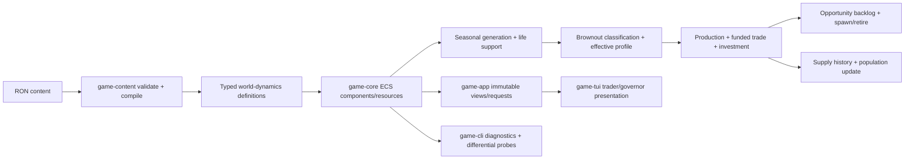

# World Dynamics, Population, and Player Progression Implementation Plan

## Executive Summary

Implement Slice 2 as a phased extension of the completed physical energy economy. Add a visible four-stage brownout ladder, deterministic seasonal generation, slow endogenous NPC fleet adaptation, population hysteresis, market-funded investments, and governor-tier policy controls while preserving the existing headless architecture, checked integer arithmetic, validate-before-mutate operations, and anti-strand guarantee.

The implementation must preserve the timescale hierarchy in todo 007: storage reacts within ticks, the NPC fleet over tens to hundreds of ticks, and population over hundreds to thousands of ticks. The player remains faster than fleet and population adaptation, so relief deliveries and policy changes have a visible window of impact. Work should follow the todo's controlling sequence: brownouts first, diagnostics/player-impact second, endogenous fleet third, population fourth, and investments/governor UI last. Seasonal generation should be inserted after the first ladder diagnostics and before fleet adaptation so it can be validated independently without changing that sequence.

Treat the prototype's 20 systems and nine NPC traders as content values, not algorithmic constants. Fleet pressure, importer-stage distributions, and diagnostic acceptance should use per-system percentages or normalized opportunity measures where map size matters, so larger maps gain redundancy without silently changing thresholds by an order of magnitude.

No new crate or dependency is needed. `game-core` owns mutable state and deterministic behavior; `game-content` validates and compiles authored RON; `game-app` exposes immutable views and typed requests; `game-tui` renders and submits intent; and `game-cli` owns headless diagnostics.

## Problem Statement

Slice 1 can run a solvent physical energy economy, but its world is still largely static. Every market has a fixed generation rate, storage cap, and population; all NPC traders are created at startup; energy distress is reduced to a coarse health label; and policy can only be replaced through a typed command used by content and tests. A disruption can drain a system, but the simulation has no staged industrial response, demographic memory, fleet adaptation, structural investment, or governor play.

This prevents the intended metastable world:

- Energy shortage does not progressively change throughput, advertised demand, or prices before life-support failure.
- Periodic supply patterns do not exist, so route knowledge cannot become a learned player skill.
- NPC transport capacity cannot scale with persistent network opportunity or retire when uneconomic.
- Population neither declines nor recovers, so the map cannot retain a history of crises and player interventions.
- Exporters have no structural sink for surplus, and the player cannot use the existing policy seam as a governor.
- Diagnostics cannot yet prove that one player-scale intervention causes a bounded, visible difference or that a 10,000-tick unattended world remains metastable rather than static or collapsed.

The main implementation risk is feedback coupling. Brownout thresholds alter production, demand, reserves, and prices; those outputs alter trader opportunity; fleet lag alters supply; supply alters population; and population changes burn, labor, and demand. Each layer therefore needs explicit deterministic state, separate tuning windows, and diagnostics before the next layer is enabled.

## Proposed Solution

### Compatibility stance

Use an **additive runtime/content evolution** of Slice 1, not a parallel replacement economy:

- Preserve the physical `core:energy` model, funded settlement, reservation claims, operating reserve, protected liquidation budget, cost basis, and typed policy command.
- Preserve zero-amplitude seasonal behavior as exactly fixed generation.
- Replace production use of authored fixed NPC count with a dynamic fleet mode, while retaining an explicit fixed-count mode for deterministic regression fixtures and A/B diagnostics.
- No save migration or backward-compatible snapshot adapter is required because persistence is not implemented.
- Governance acquisition, population migration/cargo, player-founded markets, quest scaffolding, and Tier 3 multi-system mechanics remain deferred. The prototype may use an authored starting governorship so Tier 2 commands can ship without inventing an acquisition mechanic.

### Simulation contracts to lock in Phase 1

The first phase should turn the todo's direction into tested typed contracts before balance tuning:

1. **Brownout classification:** derive a market's stage from post-generation, post-life-support energy position using deterministic integer ticks-of-burn. Author ordered entry/recovery thresholds in `economy_config.ron`; classify zero stock with unsupplied life support as Starvation. Recovery thresholds or a minimum stage duration should prevent one-tick edge chatter without hiding real collapse.
2. **Stage effects:** keep authored policy unchanged and derive an effective per-tick operating profile. Normal is unchanged; Throttled applies deterministic recipe/labor throughput schedules; Emergency withdraws non-survival demand, disables investment, and raises the energy bid toward an authored checked ceiling; Starvation retains emergency protections and enables demographic decline. Stage demand suppression overrides route subsidy: Emergency and Starvation make premiums for suppressed non-survival goods inactive without revoking them, and recovery automatically resumes a standing premium when that demand is permitted again. Effective throughput is `base × stage modifier × labor modifier`, composed multiplicatively with checked fixed-point arithmetic; apply deterministic carry/duty-cycle remainder exactly once to the final composed value, never once per modifier. Survival-good IDs and stage throughput/price parameters must be validated content, not hard-coded rules.
3. **Reserve consistency:** every quote, funded-quantity, settlement, tank withdrawal, investment, and subsidy path must use one stage-aware purchasing-energy helper. Survival stock remains physical stock, not a second treasury, and neither stage changes nor investments may consume reservation claims, the operating reserve, or the protected liquidation budget.
4. **Seasonal generation:** use a deterministic integer waveform with authored amplitude, period, and phase per system. A triangle wave is recommended because it is learnable and requires no floating-point trigonometry. Amplitude zero must return the current compiled base rate exactly. Collector investments modify base capacity; seasons derive effective output from that base.
5. **Population hysteresis:** sample a fixed-point sufficiency score from energy plus authored essential/tertiary goods into a bounded moving window. Starvation decline uses a faster checked rate; growth requires Surplus/Normal conditions and a long average above threshold, then applies logistic growth toward a supply-history-derived cap at roughly one-fifth to one-tenth the decline rate. Carry fixed-point remainders so small populations do not become permanently frozen by integer truncation.
6. **Fleet lifecycle and conservation:** dynamic spawns use one compiled trader archetype, deterministic IDs, and stable highest-surplus placement. Initial tank energy is withdrawn atomically from the spawn market's unprotected stock, so spawning does not create physical energy. Retirement only completes for an idle trader after reservations and cargo are resolved; residual tank energy returns atomically to a market. Slice 1 resolved worthless cargo with validated positive bootstrap-based liquidation prices and a graph/capability-derived protected budget sized for the minimum whole-unit payout; content compilation rejects infeasible cargo-capacity, tank-headroom, or budget combinations. Deferred laden retirement therefore has a terminating cleanup path: every laden candidate can liquidate into adjacent-jump funding, finish cleanup, and retire rather than remain laden, stranded, and unretirable. If conservation or storage constraints cannot be satisfied, retirement is deferred rather than destroying state. Evidence: `docs/energy-economy.md:50-74`; `crates/game-core/src/lib.rs:1050-1131`; `crates/game-content/src/lib.rs:1079-1089,1578-1607`.
7. **Anti-strand with a changing fleet:** compute protected liquidation requirements from validated fleet archetype capabilities, not the currently active trader count. Spawn/retire count changes therefore cannot weaken the guarantee. Policy changes still recompute and validate the whole protected budget before mutation.
8. **Investment spending:** define all four typed shapes together. Investment energy comes only from the same stage-aware unreserved purchasing pool, after survival and anti-strand protection. Costs, diminishing returns, cooldown/rate limits, and maximum levels are authored and validated. Collectors raise base output; storage raises cap; population support changes growth/cap modifiers; route subsidy adds a funded, visible bid premium that feeds the same opportunity model used by NPCs. Stage demand suppression has final authority: Emergency and Starvation spend no subsidy energy and cannot use a standing premium to re-advertise a suppressed non-survival good; the authorized premium remains configured and resumes automatically after recovery permits that demand.
9. **Governor authority:** add a small ownership/entitlement component and authorize policy commands against it. For this slice, content may grant one starting market to the player; absent-player and AI-default policy execution must use the same autonomous market-policy system. Do not expose unrestricted edits to every system merely because acquisition is deferred.
10. **History ownership:** core owns stage occupancy, transitions, population history aggregates, fleet pressure, and investment outcomes. The app's bounded formatted event history remains presentation-only and must not become score or simulation state.

## Technical Approach

### Architecture



Keep the current `GameSession` owner and explicit deterministic phase ordering. Refactor phase bodies into focused private functions as necessary, but do not introduce async work or terminal types into `game-core`.

Recommended end-state tick order:

```text
complete travel / refresh or expire reservations
→ compute seasonal generation
→ generate, cap storage, and assess mandatory life support
→ classify brownout stage and emit transitions
→ derive stage/labor throughput and execute sources/recipes
→ settle laden arrivals and rebalance idle NPC tanks
→ execute rate-limited autonomous market investments
→ collect deterministic trade requests and opportunity backlog
→ resolve requests in stable order
→ evaluate fleet spawn/retirement for next-tick availability
→ record sufficiency and update population for the next tick
→ advance clock and publish snapshots/events
```

Population changes take effect on the next tick's burn, labor, and demand. Newly spawned traders become eligible on the next tick. These boundaries avoid circular same-tick feedback and make differential tests reproducible.

#### Core state and behavior

Extend or introduce focused `game-core` components/resources rather than placing tuning data in the TUI or CLI:

- `BrownoutStage` and `BrownoutState`: current stage, stage-entry tick, transition count, occupancy counters, and the last classification metric.
- `SeasonalGenerationState`: immutable compiled oscillation plus mutable base generation and current effective generation.
- `PopulationState`: current integer population, baseline/reference population, current cap, rolling sufficiency sum/window, growth/decline remainder, and trajectory counters.
- `MarketOperatingProfile`: a derived per-tick value containing stage-aware throughput, allowed demand, effective energy bid parameters, and investment eligibility; it must not overwrite authored `MarketPolicy`.
- `FleetDynamics`: mode, opportunity persistence counters, spawn cooldown/sequence, active target/backlog metrics, and archetype capability data.
- Per-trader profitability/retirement state with a bounded deterministic evaluation window.
- `InvestmentState` and `InvestmentPolicy`: levels, cooldowns, requested allocation, and last outcome for all four investment kinds.
- `Governance`: owner/AI authority and optional player entitlement; keep it separate from acquisition gameplay.
- Typed events for stage transition, population change/tier change, trader spawned/retired, investment completed/deferred, and governor policy rejection/change.

Use sorted vectors and stable `ContentId` ties for stage-side work, opportunity aggregation, spawn placement, retirement selection, and simultaneous investment allocation. Never use ECS iteration order to choose winners.

Throughput percentages should use checked fixed-point arithmetic plus deterministic carry/duty-cycle state. This avoids permanently rounding a low percentage to zero when recipes currently execute in whole runs. The shared helper computes `effective throughput = base × stage modifier × labor modifier` multiplicatively, then applies one deterministic carry/duty-cycle remainder to the final composed value. It must never round or carry the stage and labor modifiers separately. Source output, recipe execution, operating-reserve calculation, diagnostics, and tests must all consume that composed result; no call site may independently apply either modifier.

#### Brownout pricing and demand

Centralize stage effects around existing quote and funded-settlement primitives:

- `Normal`: current cost-aware pricing and demand.
- `Throttled`: reduce industrial recipe execution before survival functions; continue to advertise prices that expose scarcity.
- `Emergency`: advertise only `core:energy` and authored survival goods, suppress all other demand quantities, and increase the energy bid monotonically toward a validated ceiling as ticks-of-burn falls.
- `Starvation`: retain Emergency demand/pricing and trigger population decline after the tick's sufficiency sample.

The market view should show the stage directly while existing quote rows demonstrate its price consequences. Stage transitions emit facts; no scripted crisis event is needed to drive traders.

#### Fleet opportunity and lifecycle

Extend the current automated-request collection instead of creating an unrelated fleet heuristic. For each tick, aggregate profitable requests that remain unfunded or unserved after existing traders are considered, including reservation shortfall and net margin after travel burn. A dynamic fleet spawn requires the authored threshold to remain exceeded for the authored consecutive evaluation window and the spawn cooldown to be clear.

Spawn placement selects the market with the greatest checked surplus after all protected amounts, then stable system ID. Spawn only when that market can fund the archetype's starting tank without entering a lower protected state. Generate IDs/names from a monotonic deterministic sequence that is never reused during a session.

Retirement candidates are selected from sustained unprofitability or inability to fund a jump after liquidation. Release reservations exactly once, finish or liquidate cargo through existing settlement paths, return tank energy, then despawn and emit an event. In-transit or unresolved laden traders are never deleted. This deferral must terminate: Slice 1's positive bootstrap-based liquidation price plus protected minimum whole-unit payout guarantees a laden candidate can fund an adjacent jump, receive another liquidation opportunity, complete cleanup, and retire within a bounded number of ticks. A trader may not persist in the simultaneous laden, stranded, and unretirable state. Fixed mode bypasses all lifecycle mutation while retaining the same trading behavior. See `docs/energy-economy.md:50-74` and `crates/game-core/src/lib.rs:1050-1131`.

#### Population model

Keep population integer and deterministic while separating immediate harm from slow recovery:

- Life-support burn continues to use current population at tick start.
- Population supplies only the labor modifier relative to a validated reference population and scales authored tertiary demand targets through checked ratios. The shared throughput helper composes that labor modifier multiplicatively with the current stage modifier and applies carry once to the final result; population code and production call sites must not scale throughput independently.
- Each tick records energy sufficiency and the minimum sufficiency of authored essential/tertiary goods.
- Starvation decline applies at the fast authored rate and records a checked remainder.
- Growth is allowed only after the long moving average clears the authored gate and the market is not in distress.
- Carrying capacity derives from sustained supply history and population-support investment, then logistic growth approaches that cap without overshoot.
- Zero population does not spontaneously regrow unless content explicitly authors a nonzero recovery floor; migration remains deferred.

Treat population changes as persistent core state for the session and expose trajectory/tier aggregates in snapshots. No persistence format is added in this slice.

#### Investments and governor flow

Define a common investment shape with kind, base cost, cost-growth curve, maximum level, per-tick/rate limit, and effect parameters. Validate every kind even if the first executable checkpoint enables collectors and storage before population support and route subsidy.

Autonomous policy execution should:

1. Derive spendable investment energy from the stage-aware protected purchasing pool.
2. Normalize or validate allocation weights without hidden over-100% spending.
3. Select investments in stable kind order when allocations tie.
4. Calculate all cost, stock, level, cap, and policy effects before mutation.
5. Apply one atomic result and emit one concise event; insufficient funds or cooldown should update view status without log spam.

Collectors and storage form the first executable investment checkpoint. Population support then modifies only population growth/cap parameters. Route subsidy must reserve/fund its bid premium through normal market settlement so it cannot create money, bypass the energy-bid ceiling, or weaken anti-strand protection. Brownout suppression is evaluated before subsidy: Emergency and Starvation neither advertise nor fund a premium for suppressed non-survival demand, while the standing authorization remains intact and resumes automatically when recovery permits the good again.

The TUI should add a governor surface only for the player's governed market. It edits reserve ratio/ticks, margin, import priorities, and investment allocation through typed `AppRequest`/`GameCommand` paths. The market executes those settings each tick; the player does not click individual investments. Long-run score/view data should derive from population tier and ladder occupancy/history, with no quest system.

### SpecFlow Analysis

#### Main flows

1. **Content/startup:** load global ladder/population/investment defaults, per-system seasonal/population parameters, fleet mode/archetype, and optional starting governorship; aggregate source-aware validation errors; compile format-independent definitions; instantiate core state.
2. **Trader reading distress:** the player sees stage, energy runway, current seasonal phase/output, population/trend, quote changes, and funded demand; a relief delivery affects the same market settlement and pricing paths NPCs use.
3. **Crisis progression:** falling energy crosses stage thresholds; throughput falls before survival demand; Emergency withdraws non-survival bids and raises the energy bid; Starvation records fast population decline; lower population reduces future burn but also labor and tertiary demand.
4. **Recovery:** sustained delivery and/or investment moves a system through recovery thresholds; population does not rebound immediately, but its long sufficiency average eventually raises carrying capacity and permits slow logistic growth.
5. **Fleet response:** persistent opportunity accumulates while player action can still win the window; a slow deterministic spawn is funded at a surplus market; sustained unprofitability eventually retires an empty, reconciled trader.
6. **Governor:** an authored entitlement allows the player to edit one market policy; the autonomous policy system spends only protected surplus and reports completed/deferred investments; pausing player input does not pause governance.
7. **Diagnostics:** baseline and one-intervention runs use identical content/seed and differ only by a recorded delivery; reports identify the first bounded ladder/population divergence. A 10,000-tick run proves continued activity, stage churn, population memory, fleet adaptation, and exact energy reconciliation.

#### Important failure and recovery paths

- Invalid threshold ordering, zero period, excessive amplitude, unknown survival goods, impossible rates/cost curves, invalid fleet windows, or allocation totals fail content compilation with file/field context.
- Checked overflow, reserve violation, or impossible spawn/investment/retirement state fails before any mutation or event.
- A stage may jump across multiple bands after a severe shock, but emits one typed transition containing old stage, new stage, metric, and tick; occupancy accounting remains exact.
- Emergency demand suppression cancels or adjusts only future advertised demand. Existing funded reservations keep their lifecycle and settle through current physical stock rules; mandatory life support may still force a funded partial settlement.
- Fixed fleet mode produces no spawn/retire events and is used for deterministic ladder/population regression tests.
- A dynamic spawn that lacks safe seed energy remains pending; it does not mint a trader tank.
- Retirement with cargo, an active reservation, transit, or an unreconciled tank is deferred.
- A population at zero remains empty absent future migration/recolonization support.
- Governor commands against an unowned market are typed rejections; invalid whole-policy updates leave the prior policy, protected budget, and allocations unchanged.
- Diagnostic interventions are explicitly recorded as external inflow or use a controlled delivery fixture so global reconciliation can explain the delta rather than report false energy creation.

### Data / Content Impact

Update authored schema in one validated evolution:

- `content/economy_config.ron`
  - Brownout entry/recovery thresholds, minimum stage duration if used, stage throughput settings, survival goods, and emergency energy-bid ceiling/ramp.
  - Population sufficiency window, energy/goods gates, decline/growth rates, logistic scale, cap bounds, tertiary-demand mapping, and population tier thresholds.
  - All four investment cost/effect/rate-limit shapes and default AI allocation policy.
  - Diagnostic horizon/window defaults where they are tuning inputs rather than test-only constants.
- `content/economy.ron`
  - Per-system seasonal amplitude/period/phase with amplitude zero as default.
  - Population reference/cap inputs and optional per-market investment/policy overrides.
  - Prototype tuning for only two or three nonzero seasonal systems.
  - Optional authored starting governorship for one prototype market.
- `content/traders.ron`
  - `Fixed` versus `Dynamic` fleet mode.
  - Dynamic initial count, persistent-opportunity threshold/window, spawn cooldown/rate, retirement window/threshold, maximum fleet size, and the common trader archetype.
  - Retain fixed count/distribution only inside the fixed mode shape.

`game-content` should deserialize source structs, validate cross-field ordering and checked arithmetic, resolve good/system IDs, and compile runtime types. Repository-content tests should assert invariants and mode behavior rather than freeze mutable balance values. Because `content/traders.ron` already has user changes, implementation must review and preserve those edits during schema migration rather than overwrite the file wholesale.

### Runtime / Platform Impact

- All simulation math remains checked integer/fixed-point arithmetic. Existing finite `f64` map distance behavior is unchanged.
- A per-market rolling population window and per-trader profitability window are bounded by authored limits; validate maximum sizes to avoid unbounded memory.
- Fleet spawning/despawning uses deferred, stable lifecycle work and must not invalidate iteration in the current tick.
- Diagnostics may retain sampled trajectories rather than every tick; keep full simulation state independent from report formatting.
- The TUI remains an immutable-view adapter. New stage text must not rely on color alone.
- No filesystem, terminal, Tokio, RON, or frontend dependency enters `game-core`.
- No persistence migration is required, but new runtime state should be structured so future snapshots can serialize stable IDs and explicit histories rather than ECS entities.

## Implementation Phases

### Phase 1: Contracts, Schema, and Test Scaffolding

- [x] Add durable Slice 2 design details to `docs/energy-economy.md` or a linked world-dynamics document: stage metric/phase boundary, effective profile, seasonal waveform, population equations, fleet conservation, investment funding, and diagnostic pass/fail definitions.
- [x] Introduce typed core definitions/components/resources for stages, seasons, population history, fleet mode/dynamics, investment kinds/policy/state, governance, and aggregate history without enabling all runtime writers.
- [x] Extend `game-content` source structs and compilation for every new data shape, including all four investments and both fleet modes.
- [x] Add source-aware validation for ordered thresholds, positive windows/periods, amplitude and fixed-point bounds, resolved goods, growth/decline ratio, logistic limits, fleet thresholds/rates/caps, investment curves/rate limits, allocation totals, and starting governorship references.
- [x] Preserve current behavior under zero-amplitude seasons, static population, fixed fleet mode, and disabled/default investments.
- [x] Write pure helper tests first for stage boundaries/recovery, triangle-wave extrema/phase/wrap, checked throughput carry, logistic/cap arithmetic, opportunity persistence reset, investment cost curves, and overflow/zero boundaries. Include a table-driven composed-throughput test with stage and labor modifiers at 0%, a small nonzero value, and 100%; prove one final carry and identical results for production, operating reserve, and diagnostics.

Validation:
- [x] `cargo test -p game-core` passes pure contract tests without a terminal or filesystem.
- [x] `cargo test -p game-content` proves valid repository content compiles and malformed fields report the correct RON source/context.
- [x] `cargo run -p game-cli -- --validate-content` succeeds after content migration.
- [x] A compatibility fixture with fixed fleet, zero seasonal amplitude, static population, and disabled investments matches the pre-Slice-2 deterministic snapshots/events except for intentionally added read-only fields.

### Phase 2: Brownout Ladder on Static Population and Fixed Fleet

- [x] Add post-life-support stage classification and exact occupancy counters to the tick schedule.
- [x] Derive a stage-aware operating profile without mutating `MarketPolicy`.
- [x] Apply deterministic Throttled recipe/labor throughput, Emergency survival-demand filtering, energy-bid ramp/ceiling, and investment suppression.
- [x] Route quotes, funded demand, reserve reporting, settlement checks, and tank transfers through the shared stage-aware protection helper.
- [x] Emit typed transition events and expose stage/metric through snapshots and app event labels.
- [x] Extend app/TUI market and system views with textual stage/runway while retaining visible price/funded-demand consequences.

Validation:
- [x] Table-driven core tests cover every threshold edge, direct multi-band shock, recovery hysteresis, no-event steady state, and occupancy totals.
- [x] Tests prove Emergency advertises only energy/survival goods, raises but caps the energy bid, and cannot spend protected energy.
- [x] Tests prove stage changes preserve anti-strand liquidation, reservation accounting, physical energy reconciliation, and validate-before-mutate atomicity.
- [x] Ratatui `TestBackend` tests render all four stages, transition text, and distress prices without requiring color.

### Phase 3: Diagnostics, Player-Impact Probe, and Seasonal Supply

- [ ] Extend `--economy-diagnostics` interval/final output with per-system net flow, storage percentage, current stage, stage occupancy, and transition counts; add network stage percentages, normalized fleet opportunity per system, and stage-cycle amplitude summaries.
- [ ] Add an identical-seed differential runner with one recorded exogenous delivery or controlled delivery fixture, configurable target/tick/good/quantity, and an explicit divergence horizon.
- [ ] Implement deterministic seasonal effective generation after baseline ladder diagnostics are stable.
- [ ] Expose current base/effective output and seasonal phase/next turning point in app/TUI views so patterns are learnable.
- [ ] Tune only two or three repository systems to nonzero amplitude; keep all others at zero.
- [ ] Add formatter/output tests rather than asserting large complete diagnostic logs.

Validation:
- [ ] Seasonal helper tests cover amplitude zero, period/phase wrap, extrema, negative-generation prevention, overflow, and repeatability.
- [ ] The player-impact fixture produces a ladder-stage or population difference within its authored bounded horizon while baseline and intervention runs otherwise begin identically.
- [ ] Diagnostics reconcile external intervention inflow explicitly and retain exact normal physical-energy reconciliation.
- [ ] Manual diagnostic inspection confirms recurring glut/famine timing is discoverable from the displayed phase and market prices.

### Phase 4: Endogenous NPC Fleet Behind a Mode Flag

- [ ] Compile fixed and dynamic fleet modes; switch production content to Dynamic only after fixed-mode regressions pass.
- [ ] Reuse automated trade request scoring to compute network opportunity backlog and consecutive-tick persistence.
- [ ] Add deterministic, rate-limited spawning at the highest safely fundable surplus market with atomically funded starting tank energy and stable generated IDs.
- [ ] Track bounded rolling profitability and failed-jump/liquidation state for retirement decisions.
- [ ] Implement deferred, conservation-safe retirement after cargo/reservation/tank cleanup.
- [ ] Derive protected liquidation budgets from configured archetype capabilities so active fleet count cannot weaken anti-strand behavior.
- [ ] Add fleet size/backlog and spawn/retire events to snapshots, CLI diagnostics, and app logs.

Validation:
- [ ] Fixed mode produces identical trader count and no lifecycle events across long deterministic runs.
- [ ] Dynamic-mode tests cover threshold persistence/reset, spawn cooldown, maximum count, stable tie-breaking, insufficient safe spawn funding, generated ID stability, and next-tick eligibility.
- [ ] Retirement tests cover sustained loss, anti-strand liquidation failure, active reservation, laden/in-transit deferral, tank return, and exact energy/cargo accounting. A laden, sustained-unprofitable fixture must liquidate through the anti-strand path, finish deferred cleanup, and retire within a bounded number of ticks; it must never persist as a stationary laden trader in the soak run.
- [ ] A tuned fixed-seed run shows NPC capacity keeping importers alive near the Throttled band while preserving a measurable player response window.

### Phase 5: Population Hysteresis and Metastability Soak

- [ ] Refactor static market population into explicit runtime population/history state while preserving the public snapshot value.
- [ ] Record deterministic energy/goods sufficiency samples in a bounded moving window.
- [ ] Implement fast Starvation decline and 5–10x slower long-average-gated logistic growth with remainder carry and checked cap updates.
- [ ] Scale life-support burn, labor/throughput, and authored tertiary demand through shared population helpers.
- [ ] Expose current population, trend, cap/tier, and sampled trajectory in app/TUI/CLI views.
- [ ] Add population milestones and aggregate stage history for governor score inputs.
- [ ] Add the 10,000-tick unattended metastability harness after ladder, seasons, and dynamic fleet are enabled.

Validation:
- [ ] Unit tests cover decline/growth ratios, moving-window initialization/eviction, no instantaneous recovery, logistic no-overshoot, tiny-population remainder progress, zero-population behavior, and insertion-order determinism.
- [ ] Coupling tests prove population changes consistently alter next-tick burn, labor throughput, and tertiary demand without partial mutation, and confirm production and diagnostics use the same single-carry composition when labor and stage modifiers are both active.
- [ ] The 10,000-tick seeded soak has no tick error or accounting mismatch, no global population collapse, continued trade/stage activity in the final window, at least one post-midpoint stage transition, and at least one system settled at a population different from its initial value.
- [ ] Compare multiple fixed seeds or content permutations before accepting tuning so one lucky run does not conceal a population ratchet.

### Phase 6: Investments, Governor Commands, and UI

- [ ] Enable collectors and storage first through the common investment executor; verify diminishing returns, cap/cost arithmetic, stage gating, and rate limits.
- [ ] Enable population support and route subsidy through the same typed shape and atomic spending path.
- [ ] Add authored/default AI investment allocations and one optional starting player governorship; keep acquisition gameplay deferred.
- [ ] Extend typed core/app commands for authorized policy/allocation edits and typed rejection feedback.
- [ ] Build a TUI governor surface for the governed market's reserve, margin, import priorities, and investment allocation; do not expose direct ECS mutation or per-tick upkeep actions.
- [ ] Expose investment levels, next costs, cooldown/status, subsidy premium, population tier, and ladder-history score inputs through immutable views.
- [ ] Update repository content tuning, documentation, and `CHANGELOG.md` under `Unreleased` only after the complete player-facing flow is accepted.

Validation:
- [ ] Investment tests cover exact cost progression, simultaneous allocation ties, insufficient energy, protected-fund exclusion, stage disablement, cooldown/rate limit, maximum level, overflow, and atomic rollback.
- [ ] Collector tests prove seasons scale from the upgraded base output; storage tests preserve stock/cap invariants; population support affects only approved growth/cap inputs; subsidies are funded and alter the normal opportunity backlog. A market with an active subsidy that enters Emergency must advertise only energy/survival goods, spend nothing on the suppressed subsidized good, and automatically resume its premium after recovery.
- [ ] Authorization tests reject unowned-market changes and prove AI-defaulted and player-configured markets execute through the same policy system.
- [ ] App actor tests cover request→command→event→view flow; Ratatui `TestBackend` tests cover governor editing, validation feedback, and read-only non-governed markets.
- [ ] Manual play confirms that a trader can read a seasonal/brownout opportunity, deliver relief before fleet adaptation, govern one market without repetitive upkeep, and observe persistent ladder/population consequences.

## Acceptance Criteria

### Functional Requirements

- [ ] Every market occupies exactly one visible Normal, Throttled, Emergency, or Starvation stage derived deterministically from its energy position, with typed transition events and exact occupancy history.
- [ ] Stage effects change recipe/labor throughput, advertised demand, funded quantity, and energy prices through shared existing market mechanisms; survival and anti-strand energy are never exposed as purchasing power.
- [ ] Authored seasonal amplitude/period/phase deterministically changes generation, while amplitude zero preserves fixed generation exactly; only two or three prototype systems are seasonal.
- [ ] Population is dynamic integer state: Starvation decline is fast, growth is 5–10x slower and gated by a long energy/goods sufficiency average, and logistic cap behavior leaves persistent demographic history.
- [ ] Population consistently drives life-support burn, labor throughput, and tertiary demand.
- [ ] Dynamic fleet mode spawns only after persistent unserved profitable opportunity, adapts slower than player reaction time, and retires sustained unprofitable/stranded traders without creating or destroying physical energy.
- [ ] Fixed-count fleet mode remains available and stable for deterministic regression tests.
- [ ] Protected liquidation remains valid at every stage and for every permitted fleet archetype.
- [ ] All four investment shapes are validated and executable; costs have diminishing returns and rate limits, and spending cannot consume claims, survival reserve, or protected liquidation budget.
- [ ] A player with one governed market can set policy and investment allocation through typed commands while the market executes autonomously using the same code path as AI defaults.
- [ ] Diagnostics report per-system flow/storage/stage/population, network stage distribution, fleet backlog/size/events, and exact physical reconciliation; normalized importer-stage and opportunity metrics remain comparable when system count changes.
- [ ] An identical-seed intervention probe shows a bounded ladder or population difference after one delivery.
- [ ] A 10,000-tick unattended run shows no deadlock or global collapse, ongoing stage churn, and at least one persistent population change.
- [ ] The trader tier remains fully playable; Tier 3 transfers/coordinated policy and governance acquisition are not accidentally implied or partially exposed.

### Quality Requirements

- [ ] `cargo fmt --all -- --check`, `cargo clippy --workspace --all-targets -- -D warnings`, and `cargo test --workspace` pass.
- [ ] `cargo run -p game-cli -- --validate-content` passes with source-aware failure coverage for invalid new schemas.
- [ ] Headless core tests require no terminal, wall clock, filesystem, or async runtime.
- [ ] All new arithmetic and multi-component lifecycle operations follow calculate/validate-before-mutate and emit events only after successful application.
- [ ] Same inputs, content, seed, and fleet mode produce identical snapshots/events/diagnostic summaries on the supported target.
- [ ] No new dependency or crate boundary is introduced without a separately justified need.
- [ ] TUI tests and manual captures show stage, season, population, fleet, and governor information through immutable app views and text labels, not color alone.
- [ ] Save compatibility is explicitly recorded as not applicable while persistence remains deferred.

## Validation Plan

### Automated Validation

Develop tests bottom-up and keep each feedback layer isolated before combining it:

1. Pure checked arithmetic and state-machine tables.
2. Minimal `game-core` fixtures with static population/fixed fleet.
3. Content parse/validation/compile fixtures.
4. Seasonal and differential diagnostic fixtures.
5. Dynamic fleet lifecycle fixtures.
6. Population coupling and long-window fixtures.
7. Investment/governance command and app view tests.
8. TUI `TestBackend` rendering/input tests.
9. Repository-content 1,000-tick balance runs followed by the final 10,000-tick soak.

Run:

```bash
cargo fmt --all -- --check
cargo clippy --workspace --all-targets -- -D warnings
cargo test --workspace
cargo run -p game-cli -- --validate-content
cargo run -p game-cli -- --economy-diagnostics 1000
cargo run -p game-cli -- --economy-diagnostics 10000
```

Add the final player-impact invocation after its CLI shape is implemented. Keep exact numeric assertions in small fixtures; repository content tests should assert invariants, bounded outcomes, and determinism rather than designer-tuned magic numbers.

### Manual Validation

- [ ] Observe one fixed-output and one seasonal market through a complete cycle; confirm output, storage, quotes, and stage changes are understandable and repeat.
- [ ] Deliver energy/survival goods during the fleet-response lag and confirm the target moves stage or later population trajectory within the documented horizon.
- [ ] Let a system starve, then restore supply; confirm decline begins quickly while growth waits for the long average and remains visibly slower.
- [ ] Observe a dynamic trader spawn and retirement in diagnostics/logs; confirm no trader disappears while laden or in transit.
- [ ] Govern one market, change reserve/import/investment allocations, leave the simulation running, and confirm autonomous execution without maintenance clicks.
- [ ] Confirm non-governed markets are read-only and invalid policies produce clear typed feedback.
- [ ] Inspect the final 10,000-tick report for stage churn, changed populations, fleet/backlog movement, and exact reconciliation.

### Evidence to Capture

- Format, Clippy, workspace-test, and content-validation output.
- Focused test names/results for ladder boundaries, seasonal wrap, fleet conservation, population hysteresis, and protected investment spending.
- Baseline/intervention diagnostic diff with first divergence tick and reason.
- 1,000-tick fixed-mode regression and 10,000-tick dynamic metastability summaries.
- TUI screenshots or terminal captures for all four stages, seasonal detail, population trend, fleet events, and governor controls.
- A short balance note recording thresholds/windows/rates, observed cycle amplitude, player response window, and why tuning was accepted.

## Dependencies and Risks

### Technical Dependencies

- Completed Slice 1 physical energy, funded settlement, reservation, anti-strand, policy, view, and diagnostic contracts.
- Existing deterministic `GameSession::step`, stable `ContentId` ordering, and checked `Energy` arithmetic.
- Existing RON/Serde content compiler with aggregated source-aware diagnostics.
- Existing app actor/immutable views, Ratatui `TestBackend`, and CLI diagnostics entry point.
- No external API, new package, or persistence migration is required.

### Risks

| Risk | Impact | Mitigation |
|------|--------|------------|
| Ladder/storage/fleet timing resonates into extreme boom-bust cycles | The world oscillates into collapse rather than useful lumpiness | Add stage occupancy/cycle-amplitude diagnostics before population, recovery hysteresis, bounded stage effects, and staged tuning. |
| Population decline ratchets the whole world downward | Early bad tuning permanently empties the map | Make growth/decline/cap arithmetic explicit, test several seeds, gate acceptance on churn without global collapse, and keep rates authored. |
| Integer throughput or growth rounds to zero | Low-rate systems/populations freeze permanently | Use fixed-point carries/duty cycles and boundary tests instead of repeated truncation. |
| Dynamic spawning mints energy or retirement destroys it | Global reconciliation fails and fleet size changes become an exploit | Fund spawn tanks from markets; defer retirement until cargo/reservations/tank are atomically reconciled. |
| Active fleet count changes anti-strand protection | Traders become stranding-prone after retirement or policy edits | Compute protection from validated archetype capabilities, not active count, and test every stage/mode. |
| Emergency demand and existing reservations conflict | Claims are silently cancelled or survival stock is overspent | Apply suppression to new advertised demand only; retain existing reservation lifecycle and recompute funded settlement from physical stock. |
| Investment competes with survival and trade invisibly | Governor automation causes self-inflicted starvation | Spend only stage-aware unreserved energy, disable investment in Emergency/Starvation, expose blocked reasons and next costs. |
| Route subsidy becomes a second money path | Energy is created or bids bypass solvency | Fund premiums through canonical market stock and the normal reservation/settlement helpers. |
| Governor UI ships before authority exists | Player can edit every market or ownership logic leaks into TUI | Add a small core governance entitlement and authored starting grant; defer only acquisition gameplay. |
| Diagnostics pass on one lucky seed | Metastability claim is brittle | Use fixed reproducible seeds plus permutation/parameter-edge fixtures and report criteria, not visual inspection alone. |
| Content tests freeze balance numbers | Routine tuning breaks CI | Assert schema, ordering, conservation, bounded response, and long-run health invariants; isolate exact values to arithmetic fixtures. |
| Scope expands into Tier 3, migration, quests, or persistence | Slice delivery stalls | Keep explicit deferred hooks and accept Tier 2 with an authored starting governorship only. |

## Documentation and Follow-up

### Documentation to Update

- [ ] `docs/energy-economy.md` or a linked `docs/world-dynamics.md` — record the final ladder, seasons, fleet, population, investment, and determinism contracts.
- [ ] `docs/architecture.md` — update only enduring component/resource, lifecycle, and deterministic phase-order facts.
- [ ] `README.md` — update player-facing diagnostics/governor commands if exposed there.
- [ ] `CHANGELOG.md` — add user-visible world dynamics, diagnostics, TUI, and governor changes under `Unreleased` after implementation.
- [ ] `todos/007-pending-p1-slice-2-world-dynamics-population-and-player-progression.md` — mark complete and add a work log only after all acceptance criteria pass.

### Intentional Follow-up

- [ ] Governance acquisition (purchase, grant gameplay, or founding) remains a later design decision; this slice uses only an authored starting entitlement.
- [ ] Population migration/cargo and player-founded markets remain hooks, not partial implementations.
- [ ] Tier 3 multi-system transfers, coordinated policy, and network-scale subsidies remain deferred until Tier 2 proves the policy model.
- [ ] Quest scaffolding is not required; self-set goals use ladder/population history directly.
- [ ] Evaluate demurrage only if post-investment diagnostics still show harmful energy concentration.
- [ ] Add persistence schemas/migrations only when the persistence crate becomes concrete.

## References & Research

References use project-root-relative paths.

### Internal Evidence Index

- **E1 — Governing design truth:** `todos/007-pending-p1-slice-2-world-dynamics-population-and-player-progression.md:20-69,73-123,127-187` — timescale layering, ladder, seasons, population, dynamic fleet, investments, progression, diagnostics, sequencing, and risks.
- **E2 — Slice 1 runtime contract:** `docs/energy-economy.md:24-40,58-96,98-124` — generation/life support, reserves, anti-strand, deterministic operations/phases, content, and reconciliation.
- **E3 — Architectural boundaries:** `docs/architecture.md:105-156,188-254,304-356` — core commands/events/schedules, immutable app/TUI boundary, content pipeline, determinism, testing, and single-owner async model.
- **E4 — Current core state/schedule:** `crates/game-core/src/lib.rs:190-265,437-511,766-867,1176-1322,1407-1431,2366-2427` — static population/generation, reserve helpers, typed events/commands, startup-only trader spawn, phase order, and generation/life support.
- **E5 — Current policy/trader seams:** `crates/game-core/src/lib.rs:2235-2274,3420-3567,3888,4037,4574` — atomic policy/protected-budget recomputation, stable opportunity ordering, contention/life-support/liquidation regressions.
- **E6 — Content schema/compiler/tests:** `crates/game-content/src/lib.rs:137-218,237-285,441-612,783-793,882-973,1299-1638` — global/static/fixed schemas, compile/validation seams, fixed trader generation, source-aware tests, and deterministic 1,000-tick coverage.
- **E7 — App/TUI seams:** `crates/game-app/src/lib.rs:59-183,190-226,297-329,382-654`; `crates/game-tui/src/lib.rs:420-575` — typed requests, immutable energy/market/player views, event publication, and current textual market rendering.
- **E8 — Diagnostics seam:** `crates/game-cli/src/main.rs:141-157,188-407,461-504` — tick argument, interval activity, market/flow/solvency output, and formatter tests.
- **E9 — Current authored configuration:** `content/economy_config.ron:1-16`; `content/traders.ron:1-25` — no ladder/season/population-dynamics/investment shape and fixed count of nine NPC traders.
- **E10 — Dependency plan:** `docs/plans/2026-07-12-feature-energy-denominated-economy-foundation-plan.md` — accepted Slice 1 implementation sequence, validation patterns, compatibility stance, and deferred Slice 2 scope.

### Institutional Knowledge

- `docs/solutions/rust-ecs-validate-before-mutate.md:9-33` — calculate and validate every affected next state before mutation; emit events only after successful application.

### Research Notes

- Repository research used the root fast pass plus three bounded parallel spikes for core simulation, content compilation, and diagnostics/app seams. Important evidence was verified with direct file reads.
- `cg_search_repo` could not run because `rg` is unavailable on PATH; bounded `find`/`grep` and direct reads were used instead. Negative searches were limited to `crates/` and `content/` and found no existing brownout, seasonal, population-hysteresis, investment, governor, or trader lifecycle implementation.
- The only relevant solution artifact was the validate-before-mutate economy guidance cited above.
- Broad supplemental research was skipped because todo 007, the completed Slice 1 contract/plan, and current implementation provide strong project-local direction.
- No authoritative external docs cross-check was needed because the plan adds no dependency and does not rely on uncertain external engine/framework/package behavior.
- The pre-existing modified `content/traders.ron`, untracked todo 007, and unrelated `.obsidian/` directory were treated as read-only research inputs during planning.
