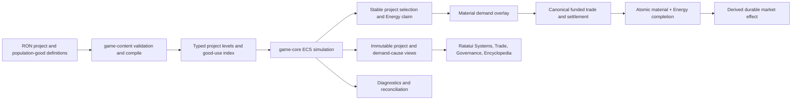

# Advanced Goods and Development Projects Implementation Plan

## Executive Summary

Give advanced goods a direct, visible strategic purpose by replacing passive tertiary sinks with market development projects. A market will accumulate protected Energy, advertise demand for the material goods required by one selected project, consume the complete Energy-and-material cost atomically, and receive a durable typed improvement.

The first project set generalizes the four existing investments rather than introducing a parallel building system:

| Project | Representative material role | Durable result |
| --- | --- | --- |
| Collector Array | Industrial Machinery + Reactor Assemblies | Higher base Energy generation |
| Storage Depot | Industrial Machinery + Ceramic Composite | Higher Energy storage capacity |
| Habitat Expansion | Habitat Modules + Industrial Machinery | Higher population support and growth potential |
| Trade Relay | Industrial Machinery + Reactor Assemblies | Stronger solvent route-subsidy premium |

Exact names, quantities, and level costs remain content-tuning decisions. Each level should author its exact Energy cost, material list, and effect delta so the UI can show a concrete goal and content validation can reject impossible definitions.

This creates the intended loop:

```text
Energy and raw extraction
  → primary processing
  → advanced manufacturing
  → funded project-material demand
  → durable market capability
  → larger population/industrial/logistics potential
  → new demand and harder operating obligations
```

Habitat Modules also need a genuine recurring population-consumption path. The current population model mostly checks whether target stock is present; after the one tertiary recipe removes stock, a delivered module can otherwise satisfy a small market indefinitely. Add deterministic fractional population consumption so Habitat Modules remain both a project material and a recurring settlement good.

This is a full replacement of the current passive tertiary-recipe workflow. There are no saves to migrate. The final implementation should have one canonical development-project path, remove the three repository tertiary recipes, remove or reject zero-output recipe definitions, and rename population `tertiary_demand` terminology to its actual population-goods purpose. Do not retain duplicate passive sinks solely for compatibility.

No new crate or dependency is needed. The headless simulation remains authoritative; content defines projects; the app exposes immutable causal views; the TUI only renders those views and submits governance policy.

## Problem Statement

The current economy correctly models physical Energy, production cost, funded trade, reservations, population pressure, and autonomous investment, but the production chain lacks a convincing payoff:

- Primary products are useful only because secondary recipes consume them.
- Industrial Machinery, Habitat Modules, and Reactor Assemblies mostly flow into tertiary recipes that delete inputs and produce no output.
- Collector, storage, population-support, and route-subsidy investments consume Energy only, bypassing the goods chain.
- Production sites run recipes automatically, so the player cannot choose advanced production as a deliberate development strategy.
- Market views show stock, target, quotes, and funded demand, but not *why* a market wants a good or what completing that demand accomplishes.
- “Orbital Shipyard” and “Research Enclave” currently imply ships and research that do not exist.

The result is an active simulation without a legible player-facing purpose. Advanced goods can be profitable cargo, but the player cannot connect their delivery to a durable world change.

The implementation must solve more than presentation. Better help text cannot explain a causal benefit that does not exist. The feature needs a physical material sink, a durable effect, visible procurement progress, and a clear relationship between demand and development.

## Goals and Non-Goals

### Goals

- Make every secondary good participate in at least one durable development project or recurring population use.
- Preserve the existing autonomous-governor model: the player configures allocation and policy rather than clicking an upkeep action every tick.
- Allow AI and player-governed markets to use the same project-selection, procurement, completion, and effect code.
- Reserve project Energy before advertising material demand so markets do not request project cargo they cannot structurally fund.
- Consume Energy and all material inputs atomically with validate-before-mutate behavior.
- Show project progress, missing materials, blockers, effect, and demand causes in immutable app views and both supported TUI layouts.
- Replace passive tertiary recipes without breaking deterministic trade, population dynamics, exact Energy reconciliation, or anti-strand guarantees.
- Keep project definitions and balance data in RON rather than hard-coding good IDs or quantities in simulation logic.

### Non-Goals

- Technology trees, research points, or unlock graphs.
- Constructing player or NPC ships from goods.
- Building placement, planetary tiles, or facility-layout UI.
- Direct player control of individual recipe execution.
- Per-tick “build now” or maintenance-click gameplay.
- Multi-system governance or transfers between owned markets.
- Save migration or persistence work.
- A generalized scripting/effect language; project effects remain a closed typed enum.
- Indefinite endgame demand for every good in this slice. If post-maximum saturation is undesirable, add explicit maintenance/replacement or future fleet/research projects as a separate designed system rather than restoring unexplained sinks.

## Proposed Solution

### Product contract

A market may have at most one **active development project** at a time.

1. In Normal or Throttled conditions, the autonomous executor ranks enabled, allocated, non-maximum, non-cooling-down project kinds by descending allocation and stable `InvestmentKind` tie-break.
2. A project becomes active only when the market can place a nonphysical claim for the level’s complete Energy cost after life support, trade reservation claims, operating reserve, and protected liquidation budget.
3. Once active, the project’s material requirements add a separate project-demand overlay to the market’s ordinary target. The claimed Energy remains unavailable to ordinary purchasing; additional unreserved Energy funds material imports at canonical bids.
4. Incoming materials remain ordinary physical inventory and retain their cost basis. The active project view reports required, held, and missing quantities.
5. When every material and the claimed Energy are available, the executor prepares the complete next state, removes all material cost-basis stock, burns the exact claimed Energy, increments the level, applies the effect, starts cooldown, releases the claim, records ledgers/history, and emits one typed completion event.
6. If any checked operation fails, no Energy, material, level, effect, ledger, or event changes.
7. Emergency and Starvation suspend new project selection, project demand, and completion. Existing material stock remains physical. Mandatory life support can consume physical Energy despite an older project claim; the project resumes only when recovery and current stock make the claim valid again.
8. Setting an active kind’s allocation to zero cancels the project claim and demand overlay but does not destroy already purchased materials. A future selection may reuse the market stock.

The project claim is not escrow and does not create a second inventory. It is analogous to other protected claims: a spending constraint over canonical market Energy, excluded from the physical flow ledger until completion actually burns Energy.

### Authored project levels

Replace the current `base_cost + growth_percent + effect_per_level` shape with explicit level definitions. The prototype has few kinds and levels; explicit data is easier to balance, inspect, validate, and explain than a hidden material-growth formula.

Conceptual source shape:

```ron
(
  kind: Collector,
  name: "Collector Array",
  enabled: true,
  cooldown_ticks: 100,
  levels: [
    (
      energy_cost: 4000,
      materials: [
        (good: "frontier:industrial_machinery", quantity: 2),
        (good: "frontier:reactor_assemblies", quantity: 1),
      ],
      effect_delta: 2,
    ),
    // Exact later-level values are authored, not inferred.
  ],
)
```

The example values are illustrative and must not be frozen into tests. Repository content should be tuned through diagnostics after the contracts are implemented.

Validation must require:

- A unique definition for every supported `InvestmentKind`.
- A non-empty stable display name.
- At least one level for enabled projects.
- Positive Energy cost, material quantities, and effect delta.
- Known, non-Energy, tradable material IDs with no duplicates in one level.
- Checked aggregate quantities/costs and level effects.
- A level count representable by runtime/UI types.
- A valid cooldown and allocation policy.
- Every repository secondary good to have at least one durable project or recurring-consumption use.

### Initial project-to-goods mapping

The first tuning pass should preserve differentiated supply chains without claiming mechanics that do not exist:

| Project | Required goods direction | Why it is legible |
| --- | --- | --- |
| Collector Array | Machinery and Reactor Assemblies | Machines and power components expand collection capacity. |
| Storage Depot | Machinery and Ceramic Composite | Equipment and durable structures expand storage. |
| Habitat Expansion | Habitat Modules and Machinery | Physical habitats and installation equipment raise support capacity. |
| Trade Relay | Machinery and Reactor Assemblies | Logistics infrastructure raises the market’s route incentive. |

Primary products still matter through secondary recipes. Direct primary-good project costs may be added only if they do not make intermediate processors irrelevant or create competition that needs project material reservation.

The names “Orbital Shipyard” and “Research Enclave” should leave current repository runtime content until ships and research have actual outcomes. They may remain in the historical prototype document, clearly marked as historical.

### Recurring population goods

Replace `population.tertiary_demand` with an explicit `population_goods` definition containing a target-buffer rate and a per-tick consumption rate. Use checked fractional carry so small populations eventually consume whole units without consuming one unit every tick:

```text
numerator = population × units_per_thousand_per_tick + prior_carry
consumed requirement = floor(numerator / 1000)
next carry = numerator mod 1000
```

For each population good:

- The target-buffer rate continues to create visible market demand.
- The consumption rate removes available units up to the requirement in a deterministic population-consumption phase.
- Missing units contribute to that tick’s goods-sufficiency sample and an unsupplied counter.
- Successful consumption removes the corresponding cost basis and records a dedicated per-good population-consumption ledger entry.
- Population changes affect target and consumption on the following tick, matching existing life-support/labor boundaries.

The initial repository content should use Habitat Modules. Adding food, medicine, or consumer goods is future content work using the same contract.

### Demand causes and player legibility

A market’s final advertised quantity may have multiple causes. Core/app projections should preserve the causes rather than forcing the TUI to infer them:

- Authored market buffer.
- Local recipe input.
- Population buffer/consumption.
- Active project material requirement.

Project demand is an additive overlay, not a mutation of authored targets. The project requirement must not become population-scaled accidentally. For a project good:

```text
effective target = ordinary effective target + active project requirement
advertised demand = max(0, effective target − inventory)
```

If a good has several causes, expose each contribution in stable order while continuing to show one canonical aggregate advertised/funded quantity. Funding and settlement remain canonical; causes are explanatory metadata, not independent treasuries.

### Compatibility stance

Use **full replacement**:

- Remove the three tertiary recipes from `content/recipes.ron` and their assignments/targets from `content/economy.ron` only after project and population demand are working.
- Remove `RecipeLayer::Tertiary` if no new explicit consumer contract uses it.
- Reject outputless production recipes rather than silently treating them as sinks.
- Rename `tertiary_demand` to `population_goods` in source/runtime terminology without a legacy alias.
- Keep `docs/initial-prototype.md` historical; update current docs and encyclopedia prose to describe projects and population consumption.
- No save or schema compatibility adapter is required because persistence does not exist.

## Technical Approach

### Architecture



Preserve dependency direction from `docs/architecture.md`. `game-core` owns project state, claims, demand, consumption, effects, and events. `game-content` owns RON parsing and validation. `game-app` resolves IDs/names into immutable views. `game-tui` renders those views and submits existing typed allocation commands. `game-cli` reports project and goods-flow diagnostics.

### Core types and state

Refactor existing investment types rather than creating a second executor:

```rust
pub struct DevelopmentProjectDefinition {
    pub kind: InvestmentKind,
    pub name: String,
    pub enabled: bool,
    pub cooldown_ticks: u32,
    pub levels: Vec<DevelopmentLevelDefinition>,
}

pub struct DevelopmentLevelDefinition {
    pub energy_cost: Energy,
    pub materials: Vec<GoodAmount>,
    pub effect_delta: u32,
}

pub struct ActiveDevelopmentProject {
    pub kind: InvestmentKind,
    pub target_level: u32,
    pub energy_claim: Energy,
}
```

Names are provisional. Prefer focused development terminology in player-facing APIs while retaining `InvestmentKind` internally if renaming it would add churn without clarity.

Extend status with enough typed information to explain blockers:

- `Disabled`
- `DisabledByStage`
- `Unallocated`
- `MaximumLevel`
- `CoolingDown`
- `SavingEnergy { available, required }`
- `ProcuringMaterials`
- `Ready`
- `Completed`

The snapshot/view carries material rows separately; do not embed an unbounded material vector in every status enum variant.

Add to `Market`:

- Optional active project.
- Project Energy claim.
- Population-good fractional carries.
- Population consumption/unsupplied counters.
- Dedicated project material-consumption counters or history.

The project Energy claim must participate in the shared unreserved-purchasing calculation alongside reservation claims, operating reserve, and protected liquidation budget. It must not enter physical Energy reconciliation until completion burns it.

### Effect application

Keep the four effects typed and deterministic:

- Collector: increase mutable seasonal base output; seasonal effective output continues deriving from that base.
- Storage: increase storage cap without creating Energy.
- Population Support: increase support capacity and growth bonus without directly creating population.
- Route Subsidy: increase the existing solvent bid premium while retaining processor ceilings, stage suppression, and physical settlement.

Prepare every field affected by completion before mutation. Where possible, derive totals from authored base plus completed level deltas rather than repeatedly mutating values; this makes validation, inspection, and future persistence safer. If the implementation keeps additive mutation, tests must prove each level applies exactly once and replay/insertion order cannot duplicate effects.

### Tick order

Recommended end-state ordering:

```text
travel completion / reservation refresh and expiry
→ seasonal generation, storage cap, and mandatory life support
→ brownout classification and effective operating profile
→ source and primary/secondary recipe production
→ recurring population-good consumption
→ arrival settlement and idle NPC tank balancing
→ active project completion or new project selection/claim
→ derive project-demand overlay
→ automated commitment collection and stable resolution
→ dynamic fleet evaluation
→ population sufficiency/history/change for next-tick effect
→ clock advance and immutable snapshots
```

The executor already runs after arrivals and before automated trade collection, which is the correct seam: a delivery can complete a project immediately, and a newly selected project can advertise material demand later in the same tick.

### Atomicity and accounting

Project completion must clone/prepare all affected state before committing:

1. Revalidate active kind, target level, stage, cooldown, claim, stock, and level definition.
2. Remove every material quantity from a cloned inventory and its exact embodied cost from cloned cost bases.
3. Subtract the exact Energy cost from canonical Energy stock.
4. Compute the new level, effect fields, cooldown, status, ledgers, aggregate history, and event.
5. Commit only after every checked operation succeeds.

Accounting additions:

- Retain or rename `investment_burned` as the project Energy sink in exact reconciliation.
- Add project material units consumed, ideally keyed by project kind and good in diagnostic history rather than only one aggregate count.
- Add population-good units consumed and unsupplied by good.
- Include the exact consumed materials in `DevelopmentProjectCompleted` events/snapshots for auditability.
- Do not count project Energy claims as a physical flow.

### SpecFlow Analysis

#### Main flows

1. **Content startup:** parse project levels and population goods; resolve all goods; validate costs, effects, allocations, and repository-use coverage; compile typed definitions.
2. **Saving for development:** a healthy market ranks projects. If no candidate can claim its Energy cost, statuses show `SavingEnergy` and no project material demand is advertised.
3. **Procurement:** after a project claims Energy, its material requirements appear as an explicit demand cause. Traders use the existing funded quote/reservation/settlement path.
4. **Completion:** arrivals settle; the executor sees complete stock; Energy, materials, cost basis, level, effect, cooldown, ledgers, and event update atomically.
5. **Brownout:** Emergency/Starvation suppress selection, completion, and project material demand. Recovery resumes the prior active project if its claim remains fundable; otherwise it returns to saving status without losing physical materials.
6. **Governance:** the player edits allocation policy on the authorized market. AI markets use authored defaults. Allocation zero cancels the corresponding active claim; there is no per-tick build button.
7. **Population use:** fractional carry periodically produces a whole Habitat Module requirement; available stock is consumed and missing supply affects sufficiency.
8. **Inspection:** Systems shows production inputs/outputs and “used by”; Trade shows aggregate demand plus causes; Governance shows project level, effect, Energy claim, material progress, and blocker.
9. **Diagnostics:** short focused tests prove atomicity/determinism; repository soaks prove exact Energy reconciliation, continuing activity, project completion, material movement, and no advanced-good deadlock.

#### Failure and recovery paths

- Invalid or duplicate material definitions fail content validation with file/project/level/field context.
- A project never advertises material demand before its Energy claim is established.
- Life support may consume Energy that was previously claimed; the project does not burn negative stock or partially complete.
- A project blocked by missing one material retains all physical stock and reports that exact deficit.
- A policy change to zero releases only the project claim/overlay; it does not delete stock or rewind completed levels.
- An arrival that only partially fills demand remains ordinary market inventory and is reflected in progress next tick.
- A checked overflow or missing cost basis aborts the complete operation with no event.
- Existing trade reservations are not cancelled by project selection, completion, cancellation, or brownout.
- Population consumption can be partially supplied; consumed and unsupplied quantities reconcile and contribute deterministically to sufficiency.
- Narrow terminal layouts must preserve the blocker and missing-good information through a selected-row detail area even if the table cannot show every material column.

## Data / Content Impact

### `content/economy_config.ron`

- Replace Energy-only investment shapes with named development-project level definitions.
- Replace `population.tertiary_demand` with `population.population_goods`, including target and consumption rates.
- Keep default allocation percentages and existing brownout/population settings.

### `content/economy.ron`

- Remove tertiary recipe assignments and sink-only market targets after project/population demand is active.
- Preserve primary/secondary production sites.
- Tune market starting stock and Energy only as needed to bootstrap the first project without eliminating trade.
- Keep player authority and per-market allocation overrides.

### `content/recipes.ron`

- Remove Settlement Expansion, Orbital Shipyard, and Research Enclave as zero-output recipes.
- Retain only recipes that produce physical goods.

### `content/encyclopedia.ron`

- Add “Why produce advanced goods?”, development-project, project-demand, Energy-claim, and population-consumption articles.
- Give each secondary good a concise “used by” explanation.
- Remove prose implying that named sinks create ships, research, or settlement expansion without an implemented effect.

### Schema evolution

No backward-compatible RON aliases are required. Update repository content and tests in one migration. Content-validation tests should protect schema invariants and relationships rather than exact mutable balance quantities.

## Runtime / Platform Impact

- One optional active project and a small material vector per market are bounded by authored content.
- Demand-cause vectors are small and should be stable-sorted; they do not require unbounded event history.
- Population-good carry is bounded by the denominator and one entry per configured good/market.
- Existing checked integer arithmetic remains mandatory; no floating-point economic math is introduced.
- The TUI remains an immutable-view consumer and must not inspect ECS/catalog state directly.
- Compact `80x30` and regular `160x45` layouts need deterministic scrolling/detail behavior for material lists.
- No async, filesystem, terminal, or RON dependency enters `game-core`.
- No new crate or third-party dependency is justified.

## Design Decisions to Confirm During Refinement

These decisions should be settled in Phase 0 before implementation:

1. **Exact project names and per-level Energy/material/effect tables.** The mapping above is directional, not final balance.
2. **Project cancellation semantics.** Recommended: allocation zero cancels the active claim and overlay, preserves stock, and does not impose a penalty.
3. **Claim recovery after life-support erosion.** Recommended: retain active identity but clamp/revalidate the claim each tick; advertise zero project demand until the full claim is restored.
4. **Population consumption rate.** Choose a rate that creates recurring Habitat demand without overwhelming the small prototype populations.
5. **Post-maximum advanced demand.** The MVP intentionally permits finite capital saturation. Use diagnostics to decide whether the next feature should be maintenance/replacement, ship construction, research, or additional project levels. Do not preserve passive sinks as a hidden fallback.
6. **Terminology rename depth.** Recommended player-facing term is “Development Projects”; internal `InvestmentKind` may remain temporarily if it does not leak into content or UI.

## Implementation Phases

### Phase 0: Lock the Economy Contract

- [ ] Add the project lifecycle, Energy-claim ordering, demand-overlay equation, cancellation semantics, population-consumption equation, and accounting rules to `docs/energy-economy.md`.
- [ ] Author the first project/level balance table for all four kinds and verify every secondary good has a named use.
- [ ] Decide the population Habitat target and consumption rates using a small deterministic spreadsheet/test spike.
- [ ] Decide whether core/runtime types are renamed from Investment to Development now or only player-facing content/views are renamed.
- [ ] Record the accepted full-replacement stance for tertiary recipes.

Validation:
- [ ] A paper walkthrough covers a project from Energy saving through trader delivery, completion, effect, brownout interruption, cancellation, and recovery.
- [ ] A stock-flow walkthrough proves project material purchases plus project Energy burn do not create Energy or double-count embodied cost.

### Phase 1: Typed Content and Pure Contracts

- [ ] Add typed development project/level/material definitions to `game-core`.
- [ ] Replace the content source shape and compile exact project levels with source-aware errors.
- [ ] Add population-good target/consumption definitions and compile fractional-carry parameters.
- [ ] Add pure helpers for project-level lookup, stable candidate ranking, Energy-claim eligibility, additive target computation, fractional population consumption, and checked effect totals.
- [ ] Validate duplicate/unknown/Energy material IDs, zero values, empty enabled levels, overflow, missing kinds, invalid allocations, and unsupported outputless recipes.
- [ ] Add repository-use validation proving each secondary good has a project or recurring-consumption use.

Validation:
- [ ] `cargo test -p game-core` covers pure boundary/overflow/tie cases.
- [ ] `cargo test -p game-content` covers valid compilation and source-context errors.
- [ ] `cargo run -p game-cli -- --validate-content` passes the migrated schema before runtime behavior is enabled.

### Phase 2: Active Project Selection and Material Demand

- [ ] Add active-project identity and project Energy claim to market state/snapshots.
- [ ] Include project claims in canonical unreserved-purchasing calculations without adding them to physical flow ledgers.
- [ ] Select at most one project per market in stable market/kind order after arrival settlement.
- [ ] Implement allocation-zero cancellation and brownout suspension.
- [ ] Add the project material-demand overlay without mutating authored/population targets.
- [ ] Preserve one aggregate advertised/funded quantity while exposing stable demand causes.
- [ ] Ensure automated commitments, local player sales, route subsidies, reservations, and final settlement all consume the canonical project-adjusted demand projection.

Validation:
- [ ] No project demand is advertised before full Energy claim eligibility.
- [ ] A selected project advertises exactly its material deficit plus ordinary target needs.
- [ ] Emergency/Starvation advertise zero non-survival project demand and recovery resumes it.
- [ ] Same-tick market/entity insertion permutations produce identical active projects, claims, demand, and events.
- [ ] Policy cancellation releases the claim but preserves inventory and cost basis.

### Phase 3: Atomic Completion and Durable Effects

- [ ] Replace the Energy-only executor with validate/prepare/commit project completion.
- [ ] Remove all required material quantities and their cost basis atomically.
- [ ] Burn claimed Energy exactly once and record it in exact reconciliation.
- [ ] Apply Collector, Storage, Population Support, and Route Subsidy effect deltas exactly once.
- [ ] Advance level/cooldown/status, release claim, increment aggregate history, and emit a typed completion event containing consumed requirements.
- [ ] Add project material-consumption diagnostics by kind/good.
- [ ] Ensure project effects continue to honor seasons, capacity, population gates, processor ceilings, and brownout suppression.

Validation:
- [ ] Focused tests reject one-missing-material, insufficient-Energy, cost-basis, overflow, and effect-overflow cases without partial mutation or events.
- [ ] A successful completion reconciles Energy and exact material debits and applies one level once.
- [ ] Replaying/insertion-order variants produces identical project histories and market states.
- [ ] Route-subsidy project completion raises canonical demand only within existing solvency ceilings.

### Phase 4: Recurring Population Consumption and Tertiary Cutover

- [ ] Add deterministic population-good consumption after production and before trade settlement/project execution.
- [ ] Track per-good carry, units consumed, units unsupplied, and contribution to sufficiency.
- [ ] Remove tertiary recipes and their economy assignments/targets from repository content.
- [ ] Remove `RecipeLayer::Tertiary` and reject outputless production recipes if no other legitimate consumer uses the type.
- [ ] Rename population tertiary-demand fields/types to population-goods terminology.
- [ ] Retune repository stocks/targets/project costs so every advanced chain trades and at least one project can complete without global collapse.

Validation:
- [ ] Tiny populations eventually consume whole Habitat Modules according to exact carry math.
- [ ] Missing Habitat supply lowers sufficiency without underflow or duplicate consumption.
- [ ] No passive zero-output recipe remains in current content/runtime documentation.
- [ ] Focused repository run shows Habitat, Machinery, and Reactor movement caused by named population/project uses.

### Phase 5: Immutable Views and TUI Legibility

- [ ] Extend app project views with name, level, next effect, Energy required/claimed, material required/held/missing, cooldown, and typed status.
- [ ] Extend market rows with stable demand-cause views and distinguish ordinary target from project overlay.
- [ ] Expand production views to show recipe inputs as well as outputs and expose a catalog-level “used by” index.
- [ ] Update Systems detail with production-chain and use summaries.
- [ ] Update Trade selected-good detail with destination demand causes such as “Collector Array: needs 1 Reactor Assembly.”
- [ ] Rename Governance Investments to Development Projects and show selected-row material progress/blocker details.
- [ ] Preserve read-only behavior for AI markets and typed authority for policy edits.
- [ ] Update compact and regular TUI tests/captures, ensuring blocker text is meaningful without color.
- [ ] Update Encyclopedia content with the actual causal loop.

Validation:
- [ ] App tests prove every displayed quantity/name/status comes from immutable core/catalog projections.
- [ ] Ratatui `TestBackend` tests cover `80x30` and `160x45`, long names, several materials, missing material, stage block, saving, ready, and completed states.
- [ ] A player can answer from the UI: “Who wants this good?”, “Why?”, “How many?”, and “What changes when supplied?”

### Phase 6: Diagnostics, Balance, and Acceptance

- [ ] Extend economy diagnostics with active projects, claims, completions by kind, material consumed by good, population goods consumed/unsupplied, and post-maximum project state.
- [ ] Add a deterministic short scenario where one advanced-goods delivery causes a bounded project completion and visible market-effect divergence.
- [ ] Run scarcity/throughput tuning so projects create opportunities without draining life-support markets or monopolizing all transport.
- [ ] Verify advanced production remains useful for a meaningful play horizon and measure when all markets reach maximum levels.
- [ ] Decide from evidence whether maintenance/replacement demand is the next feature; document saturation rather than masking it.
- [ ] Refresh `docs/world-dynamics-validation.md` with the required gate output.
- [ ] Update `CHANGELOG.md` under Unreleased and current README designer/UI descriptions.

Validation:
- [ ] Routine format, Clippy, workspace tests, and content validation pass.
- [ ] The documented 1,000-tick deterministic activity soak passes with project/goods evidence.
- [ ] The 10,000-tick diagnostics pass exact Energy reconciliation, metastability, active final-window trade/production, and no stationary-laden deadlock.
- [ ] The player-impact probe still finds a bounded stage/population divergence.
- [ ] A project-impact probe finds a bounded project/effect divergence after one advanced-goods intervention.

## Acceptance Criteria

### Functional Requirements

- [ ] Every repository secondary good has at least one visible durable project or recurring population use.
- [ ] A market activates no more than one project at a time through stable autonomous allocation.
- [ ] Project material demand appears only after the project’s Energy cost is safely claimed.
- [ ] Project demand uses canonical quotes, funding, reservations, partial settlements, and route-subsidy ceilings.
- [ ] Completion consumes exact Energy and all materials atomically and applies one durable effect once.
- [ ] Emergency/Starvation suppress project selection, completion, and non-survival project demand without deleting stock.
- [ ] Allocation zero cancels an active project claim/overlay without destroying materials or completed levels.
- [ ] Population consumes Habitat Modules deterministically over time; supply affects population sufficiency.
- [ ] Current content contains no passive tertiary recipe that merely deletes advanced goods.
- [ ] AI and player-governed markets execute through the same core project system.
- [ ] UI views explain production inputs, goods uses, demand causes, project progress, blocker, and effect.

### Quality Requirements

- [ ] All economic arithmetic remains checked integer/fixed-point arithmetic.
- [ ] Project claims are nonphysical and excluded from Energy-flow reconciliation until completion.
- [ ] Material cost basis, inventory, counters, level, effect, and events preserve validate-before-mutate atomicity.
- [ ] Stable IDs determine all contention and display ordering; ECS iteration order never chooses a project.
- [ ] Content errors identify file, project kind, level, and field where practical.
- [ ] Tests protect invariants, not mutable designer balance numbers.
- [ ] No new dependency or crate boundary is introduced.
- [ ] Compact/regular textual UI remains usable without relying on color.

## Validation Plan

### Automated Validation

```bash
cargo fmt --all -- --check
cargo clippy --workspace --all-targets --all-features -- -D warnings
cargo test --workspace --all-features
cargo run -p game-cli -- --validate-content
cargo run -p game-cli -- --headless
cargo run -p game-cli -- --economy-diagnostics 500
```

Mandatory economy gates:

```bash
cargo test -p game-content \
  tests::repository_energy_economy_remains_active_and_deterministic_for_1000_ticks \
  -- --ignored --exact --nocapture
cargo run -p game-cli --release -- --economy-diagnostics 10000
cargo run -p game-cli --release -- --player-impact \
  --impact-target frontier:system_04 --impact-tick 300 \
  --impact-good core:energy --impact-quantity 500 --impact-horizon 500
```

Add a project-impact command or focused integration test with identical baseline/intervention sessions. The intervention should deliver one missing advanced good to a market with funded active development and assert the first completion/effect divergence within a bounded horizon.

### Manual Validation

- [ ] Start at the governed market and identify the selected project, its effect, Energy claim, and missing materials.
- [ ] Find a required good in Trade, verify the destination explains the project demand, deliver it, and observe progress/completion.
- [ ] Confirm the completed effect changes generation, storage, population support, or bid premium as described.
- [ ] Change allocation to zero during procurement and verify claim release, preserved stock, and clear UI status.
- [ ] Observe project suppression in Emergency and resumption after recovery.
- [ ] Let a small settlement run long enough to consume a Habitat Module and verify replenishment demand and sufficiency behavior.
- [ ] Inspect AI markets read-only and confirm they expose the same project facts without editable controls.

### Evidence to Capture

- Routine test/content-validation summary.
- Focused atomic failure/success test names and results.
- `80x30` and `160x45` text-buffer captures for Governance project detail and Trade demand cause.
- Before/after project completion diagnostic excerpt showing material debit, Energy burn, level/effect change, and reconciliation difference zero.
- Updated 1,000-tick, 10,000-tick, player-impact, and project-impact outputs in `docs/world-dynamics-validation.md`.

## Dependencies and Risks

### Technical Dependencies

- Existing cost-aware pricing, funded-demand, reservation, and settlement primitives.
- Existing stable autonomous investment executor and governor allocation policy.
- Existing brownout suppression and project eligibility seam.
- Existing cost-basis inventory accounting and exact Energy-flow reconciliation.
- Existing immutable app/TUI boundary and content-driven encyclopedia.

### Risks

| Risk | Impact | Mitigation |
| --- | --- | --- |
| Project Energy claims starve ordinary trade or production | Markets can become safe but inert | Claim only after all higher-priority protections; expose claims; tune costs; test cancellation and brownout erosion. |
| Material purchases consume the Energy needed to build | Projects procure indefinitely without completing | Protect exact build Energy separately; fund material purchases only from additional unreserved stock. |
| Finite project levels eventually saturate | Machinery/Reactor demand can fall late-game | Measure time-to-saturation; add explicit maintenance, ships, research, or new levels as designed follow-up, not hidden sinks. |
| Removing tertiary recipes changes population sufficiency | Habitats may become permanently sufficient or population may collapse | Implement fractional recurring consumption before content cutover; tune with short and 10k diagnostics. |
| Project overlay double-counts ordinary targets | Markets overbuy goods and distort prices | Keep authored, population, and project causes separate; define one checked aggregate target and test overlaps. |
| Stock is consumed by another system before completion | Progress appears to move backward | Initial mappings favor final secondary goods; selected-row UI reports held/missing live; add material claims later only if real competing consumers require them. |
| Durable effects apply twice after retries/errors | Generation/cap/support/subsidy inflates | Prepare/commit atomically, level-gate effects, and test failure/replay/insertion order. |
| Explicit level tables become verbose | Content maintenance cost increases | Only four kinds/few levels; verbosity buys inspectability and differentiated material composition. Add tooling only if content scale proves need. |
| TUI cannot fit material/cause detail | Feature remains opaque despite mechanics | Use selected-row detail and scrolling; table columns remain summaries; test both supported layouts. |
| Existing unrelated working-tree changes are overwritten | User work is lost | Make focused edits, preserve current UI/content changes, and avoid wholesale rewrites of modified files. |

## Documentation and Follow-up

### Documentation to Update

- [ ] `docs/energy-economy.md` — authoritative project, population-consumption, phase-order, accounting, and validation contracts.
- [ ] `docs/architecture.md` — only if public core/app view contracts materially change.
- [ ] `content/encyclopedia.ron` — player-facing economy loop, projects, uses, and demand causes.
- [ ] `README.md` — Governance/Trade controls and designer project schema.
- [ ] `CHANGELOG.md` — user-visible additions/changes under Unreleased.
- [ ] `docs/world-dynamics-validation.md` — refreshed acceptance evidence.

### Intentional Follow-up

- [ ] Decide maintenance/replacement demand from measured post-maximum behavior.
- [ ] Add ship construction only when traders/fleets can be produced through a physical shipyard contract.
- [ ] Add research consumption only with a real unlock/knowledge system.
- [ ] Consider project material claims if future recipes, maintenance, or player purchases create harmful competition for held project stock.
- [ ] Consider multi-system governance and coordinated project supply after the single-market loop is legible.

## References & Research

### Internal References

- `docs/architecture.md` — headless core, immutable application views, TUI adapter, content pipeline, deterministic scheduling, and testing boundaries.
- `docs/energy-economy.md` — physical Energy model, claims/reserves, investments, population sufficiency, phase order, reconciliation, and mandatory world-dynamics gates.
- `docs/initial-prototype.md` — historical definition of primary/secondary/tertiary layers and explicit warning that prototype balance/mechanics were not final.
- `content/recipes.ron:11-25` — secondary manufacturing and current zero-output tertiary sinks.
- `content/economy_config.ron:30-55` — current population Habitat demand and Energy-only investment shapes.
- `content/economy.ron:114-134` — current tertiary consumer systems and sink-oriented targets.
- `content/encyclopedia.ron:37-76,78-129,147-152` — current goods, recipes, tertiary activity, and investment explanations.
- `crates/game-content/src/lib.rs:103-136,161-244,596-648,1233-1262,1298-1351` — recipe/project source shapes, compilation, and tertiary validation seams.
- `crates/game-core/src/lib.rs:120-143,442-521,1011-1019,1196-1223` — recipe, investment, cost-curve, and population-demand contracts.
- `crates/game-core/src/lib.rs:1414-1450,1531-1600` — market/material and Energy accounting state.
- `crates/game-core/src/lib.rs:3009-3025,3160-3194,4329-4472,4746-4825,5028-5128` — tick order, market demand, autonomous investments, population sufficiency, and recipe execution.
- `crates/game-app/src/lib.rs:120-138,206-279,314-336,425-442,1220-1285` — current immutable production, market, investment, and application views.
- `crates/game-tui/src/lib.rs:1680-1755,1934-2075,2167-2273` — current production, market-demand, and investment presentation.
- `docs/world-dynamics-validation.md` — accepted baseline gates and tuning evidence to preserve/re-run.
- `docs/plans/2026-07-13-feature-world-dynamics-population-player-progression-plan.md` — existing autonomous investment/governance design and phase-order rationale.

### External References

- None. This is a project-local game-economy design using established repository contracts; no external engine/package API behavior is assumed.

### Institutional Knowledge

- No relevant solution document was found under `docs/solutions/` for advanced-goods capital projects or replacement of tertiary sinks.
