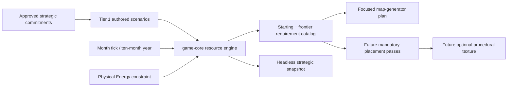

# Stage 4: Resource Engine and Constructive Map Requirements

## Executive Summary

Stage 4 will design and establish the minimum deterministic resource engine that supports the governance strategy game described by the Governance Sandbox direction. Energy and ticks are constraints that create pressure, delayed commitments, and opportunity cost; they are not the subject of a mathematical balancing game.

The stage will then identify what that engine requires from a playable starting locale and from the generated frontier. Those requirements become inputs to a later focused map-generator implementation plan. Required map elements will be placed by construction, before optional procedural texture. The game will not generate arbitrary worlds and then test whether they are economically “solvent.”

The existing direction’s word **solvency** is interpreted as design intent: a starting position must not be fundamentally impossible because the map omitted something the resource engine requires. It is not a literal per-seed economic inequality, long-run stability proof, or CI balance gate.

This plan deliberately reduces human design approval to three gameplay-facing agreements. Seed algorithms, fingerprints, stable generated IDs, and similar implementation details remain engineering decisions unless they change player-visible design.

## Problem Statement

The current Stage 3 substrate represents one living origin, physical resource stocks, deposits, reclaimable sites, locations, and explicit topology. It has no tick system, production/upkeep model, projects, strategic resource commitments, or map generator. Consequently, the project cannot yet know what resources and relationships make a starting locale playable. See E1–E3.

The current direction documents jump ahead by describing origin “solvency with surplus margin” and neighborhood resource floors as exact generated-world assertions. That wording risks turning an unresolved strategy-game loop into arbitrary arithmetic and encourages tests that define balance before gameplay exists. See E4–E6.

The intended order is instead:

1. design the strategic resource engine;
2. demonstrate its decisions in small authored scenarios;
3. identify the map ingredients required by those decisions;
4. place required ingredients unconditionally when map generation is designed;
5. use procedural generation for optional layout, variation, and frontier texture.

## Design Agreement Gate

Only the following gameplay decisions require human designer agreement during this stage.

### A1 — Strategic resource decisions

> **DESIGN AGREEMENT REQUIRED:** Identify the meaningful competing commitments the resource engine must support.

The first implementation should make at least two meaningfully different uses of limited resources compete over time. Candidate directions come from G6:

- **bank** — retain physical reserves against future pressure;
- **develop** — commit resources to origin capability or infrastructure;
- **expand** — prepare scouting, an expedition, or another outward commitment.

Stage 4 need not implement the complete scouting, expedition, or reclamation features. It must establish a truthful resource commitment mechanism that those features can later use; it must not add fictional placeholder actions solely to complete the trio.

Agreement should answer:

- Which commitments are represented in the first Tier 1 strategic scenario?
- What qualitatively distinguishes their benefit, delay, and risk?
- Which decisions are immediate, and which lock resources across later ticks?

### A2 — Required starting-locale ingredients

> **DESIGN AGREEMENT REQUIRED:** After the resource scenario exists, list the map components without which the scenario cannot be played.

Examples may include Energy supply, physical stocks, population, a production capability, a deposit, storage, topology access, or a project slot—but only mechanisms actually approved for the resource engine belong on the list.

This agreement defines **presence and relationships first**, not a universal balance formula. Quantities are tuned in small authored scenarios and playtests. A required ingredient is placed unconditionally by future map construction; it is not searched for after generation.

### A3 — Required frontier element catalog

> **DESIGN AGREEMENT REQUIRED:** Identify which implemented frontier element kinds must appear somewhere in every generated map and their required placement scope.

For each required kind, record:

- whether every map requires it;
- whether it belongs at the origin, in a starting neighborhood, or anywhere in the frontier;
- any required relationship, such as topology reachability or attachment to a location;
- whether one placed record can fulfill more than one role.

Optional quantities, distribution, rarity, and unusual local outcomes remain procedural texture unless a later gameplay feature makes them required.

## Proposed Solution

### Resource engine

Add the smallest format-independent engine that can express:

- one gameplay population unit, fictionally representing approximately one billion people;
- integer physical Energy accounting without requiring a settled fictional conversion unit;
- one simulation tick representing one origin month, with a ten-tick local year;
- deterministic recurring resource inputs and unavoidable baseline costs where approved;
- physical stockpiles;
- explicit resource commitments that may consume, reserve, or apply resources over time;
- deterministic completion, suspension, or failure outcomes appropriate to the approved scenario;
- checked arithmetic and validate-before-mutate behavior.

The engine should expose strategic state and consequences, not economic diagnostics designed to prove stability. It should make the player choose what to commit now, what to retain, and what pressure to accept.

### Constructive map requirements

Produce a versioned requirements catalog derived from implemented gameplay:

- `StartingRequirement` records what must be present at or connected to the origin.
- `FrontierRequirement` records which element kinds must appear and where they may be placed.
- Requirements describe structural presence and relationships, not emergent economic quality.
- Later map generation will execute mandatory placement passes before optional procedural filling.

The catalog may initially be a design/content contract rather than a generalized runtime type if only a few requirements exist. Do not build a framework before concrete requirements justify it.

### Corrected testing stance

Generated-world acceptance must not include:

- an `is_solvent` check;
- prescribed economic surplus;
- long-run survival or stability;
- favorable distributions;
- statistical seed thresholds;
- rerolling or screening worlds that feel difficult.

Testing should instead verify resource mechanisms in hand-computable scenarios and verify mandatory map-placement mechanisms when the generator is implemented.

## SpecFlow Analysis

### Strategic resource flow

1. The authored Tier 1 scenario starts with one origin and a small, legible physical state.
2. The player or test harness chooses between approved competing commitments.
3. The engine validates the complete commitment before changing stocks or project state.
4. Ticks apply deterministic recurring flows and advance commitments in explicit order.
5. The snapshot exposes stocks, commitments, time remaining, and consequences needed to understand the decision.
6. Different choices produce exact short-horizon outcomes without requiring a soak run.

### Insufficient-resource flow

- A commitment that cannot begin is rejected before mutation with the limiting resource identified.
- If ongoing commitments can be interrupted, the approved design specifies whether they pause, lose progress, consume partial inputs, or fail.
- Baseline Energy pressure may constrain activity, but Stage 4 does not need to prove that every state remains recoverable.
- Population loss, collapse, or brownout behavior is included only if required by the approved scenario; it is not reintroduced from the retired market prototype by default.

### Map-requirement derivation flow

1. Inspect each approved strategic scenario and implemented commitment.
2. List every map-owned prerequisite used by the scenario.
3. Classify it as starting-locale, neighborhood, frontier-wide, or optional texture.
4. Record required references and topology relationships.
5. Human designer approves the resulting A2/A3 catalog.
6. Hand the catalog to the later map-generator plan; do not invent quantity floors unsupported by gameplay.

### Future map-construction flow

1. Create the origin and place all approved starting requirements.
2. Place every required neighborhood/frontier element according to its declared scope.
3. Validate structural IDs, references, and topology.
4. Generate optional locations, quantities, distributions, and texture.
5. Normalize the result deterministically.
6. Return structural errors as generator defects; never reroll based on economic quality.

### Important boundaries

- A difficult or locally poor frontier is not a failed world.
- A starting locale missing an explicitly required component is a construction defect.
- Whether a starting quantity feels generous, harsh, or interesting is a design/playtest question unless it violates an exact mechanism contract.
- A generated map need not place every supported optional element. It must place every element explicitly classified as required by A3.
- Stage 4 does not restore a playable executable or terminal interface.

## Technical Approach

### Architecture

`game-core` remains the owner of format-independent state, checked resource operations, deterministic tick ordering, commitment state, and snapshots.

`game-content` should gain source types only when the approved resource definitions or project recipes need authored data. RON, files, and source provenance remain outside `game-core`.

No new crate is expected. Do not add a general map-generation framework during the resource-engine implementation slice.

### Data / Content Impact

- Use small 3–6-location Tier 1 fixtures only where geography matters.
- Keep scenario values intentionally hand-computable and scoped to mechanism evidence.
- Do not turn fixture quantities into universal generator constants.
- If recipes or commitments are content-defined, validate unknown fields, references, nonzero durations, checked resource requirements, and duplicate IDs before runtime construction.
- Do not add production authored world content yet.

### Runtime / Platform Impact

- The simulation remains headless and deterministic.
- One tick represents one origin month; a local year is ten ticks.
- Energy remains an integer physical resource. Fictional conversion units can remain unspecified.
- Short scenarios should execute in milliseconds; no soak or performance target is required.
- Tick ordering must be explicit so recurring flows and project commitments do not depend on ECS insertion order.

## Implementation Phases

### Phase 1: Correct the direction and approve the strategic scenario

- [ ] Replace literal generated-world solvency language with the clarified construction intent in the controlling docs.
- [ ] Resolve A1 and write one short strategic scenario showing competing uses of limited resources over several ticks.
- [ ] Specify the minimum state, player/test commands, tick order, and observable consequences used by that scenario.
- [ ] Decide which deferred mechanisms—seasonality, population change, brownout, scouting, or expeditions—the scenario genuinely requires; omit the rest.
- [ ] Record one pop as approximately one billion people, one tick as one month, and ten ticks as one local year; leave Energy’s fictional conversion unspecified.

Validation:
- [ ] Human designer confirms the scenario resembles a strategy-game decision rather than a stability or arithmetic benchmark.
- [ ] Every expected scenario outcome can be computed by hand over a short horizon.

### Phase 2: Develop the resource engine test-first

- [ ] Add failing Tier 1 tests for accepted commitments, rejected unaffordable commitments, tick advancement, deterministic ordering, and exact resulting stocks/state.
- [ ] Implement the minimum recurring-flow and commitment state required by the approved scenario.
- [ ] Validate all resource and state transitions before mutation.
- [ ] Expose a compact headless snapshot containing only information needed to inspect strategic state and consequences.
- [ ] Preserve input-order independence where ordering is not domain state.

Validation:
- [ ] Run each new test by exact name during development.
- [ ] Compare accepted and rejected operations with complete before/after state.
- [ ] Demonstrate at least two approved choices from equal initial state and compare their exact short-horizon outcomes.

### Phase 3: Derive constructive map requirements

- [ ] Resolve A2 by tracing every map prerequisite used by the approved resource scenario.
- [ ] Resolve A3 by cataloging currently required frontier elements and placement scopes.
- [ ] Separate required elements from optional texture and future feature ideas.
- [ ] Record structural relationships without inventing economic surplus or distribution floors.
- [ ] Add focused content/schema validation only if the catalog becomes machine-readable in this stage.

Validation:
- [ ] Every required item traces to an implemented or approved gameplay responsibility.
- [ ] Removing each starting requirement from the Tier 1 fixture demonstrably makes its associated action unavailable for the expected structural reason.
- [ ] No requirement exists solely to make a generated-world quality check pass.

### Phase 4: Documentation and handoff

- [ ] Update the engine invariant registry so no reserved or active entry claims generated-world economic solvency.
- [ ] Update architecture and README with the resource-engine boundary and continued absence of playable startup.
- [ ] Update `CHANGELOG.md` under `Unreleased` for user-visible resource-engine behavior.
- [ ] Write a focused follow-up plan for map generation using the approved A2/A3 catalog.
- [ ] Keep map texture diagnostics and seed-corpus quality gates out of CI.

Validation:
- [ ] Review current docs for contradictory solvency, surplus-margin, neighborhood-floor, or per-seed viability-test requirements.
- [ ] Run all workspace gates and verify no ignored soak or generated-world quality test was added.

## Acceptance Criteria

### Functional Requirements

- [ ] The resource engine supports the approved competing strategic commitments in a short deterministic origin scenario.
- [ ] Ticks apply approved recurring flows and commitment progress in explicit deterministic order.
- [ ] Resource operations use checked physical quantities and validate before mutation.
- [ ] Rejected commitments leave complete relevant state unchanged and identify the limiting requirement.
- [ ] The Stage 4 requirement catalog identifies all map components needed by implemented starting gameplay.
- [ ] Every currently required frontier element has an approved future placement scope.
- [ ] No generated-world economic solvency, surplus, stability, or distribution oracle is introduced.

### Quality Requirements

- [ ] A1–A3 have explicit human design approval.
- [ ] Gameplay behavior has short, hand-computable Tier 1 scenario coverage.
- [ ] Tests protect mechanisms and construction responsibilities rather than mutable balance values.
- [ ] `game-core` remains independent of RON, filesystem, terminal, and frontend concerns.
- [ ] No unnecessary dependency or crate boundary is added.
- [ ] Formatting, check, Clippy with warnings denied, tests, and `git diff --check` pass.

## Test-Development Recommendations

1. **Scenario before constants:** write the strategic choice and expected consequences before selecting fixture quantities. Choose small values only to make the scenario legible.
2. **Branch from equal state:** clone one initial fixture and apply different commitments so tests demonstrate opportunity cost rather than unrelated setups.
3. **Short horizons:** keep gameplay scenarios to a few ticks. If behavior requires a soak to observe, it is not adequate gameplay acceptance evidence.
4. **Atomic rejection:** compare all affected stocks, commitments, progress, and emitted evidence before and after every rejected command.
5. **Explicit tick ordering:** test cases where recurring input, baseline cost, and project funding occur on the same tick.
6. **Avoid balance locks:** assert exact fixture outcomes, but do not promote fixture production rates or project costs into universal worldgen requirements.
7. **Constructor tests later:** when map generation is implemented, test mandatory placement passes directly with tiny maps instead of running a post-generation `is_playable` or `is_solvent` validator.
8. **Retain real failures:** if generation later omits a required element, reduce it to a small mandatory-placement fixture and keep that regression test.

## Validation Plan

### Automated Validation

- [ ] Focused tests for each accepted/rejected commitment and tick-order case.
- [ ] `cargo fmt --all -- --check`
- [ ] `cargo check --workspace --all-targets --all-features`
- [ ] `cargo clippy --workspace --all-targets --all-features -- -D warnings`
- [ ] `cargo test --workspace --all-features`
- [ ] `git diff --check`
- [ ] Search executable tests and CI for `is_solvent`, statistical seed thresholds, rerolling, and world-quality acceptance.

### Manual Validation

- [ ] Human designer reviews the first scenario as a strategic choice: what is committed, what is forgone, when the benefit arrives, and what pressure remains.
- [ ] Play through or inspect each scenario branch over the short approved horizon.
- [ ] Review A2/A3 and confirm each required map element exists because gameplay consumes it, not because a balance formula demands it.
- [ ] Review intentionally unusual frontier examples as design texture without pass/fail classification.

### Evidence to Capture

- Approved A1 strategic scenario and A2/A3 requirement catalog.
- Exact focused-test output for scenario branches, rejection atomicity, and tick ordering.
- Compact before/after snapshots for each strategic branch.
- Final registry-to-test mapping and workspace gate summaries.
- Search evidence proving no generated-world solvency or statistical quality gate was added.

## Dependencies and Risks

### Technical Dependencies

- Stage 3’s `WorldDefinition`, one origin, neutral locations, physical stocks, deposits, sites, topology, stable IDs, and checked resource transfers.
- G5–G8 and G17–G22 as strategy-game direction, interpreted through this clarified construction stance.
- Human designer approval of A1–A3.
- Later focused plans for generated maps, startup, scouting, expeditions, and reclamation.

### Risks

| Risk | Impact | Mitigation |
|------|--------|------------|
| Resource mechanics are designed to satisfy equations rather than create choices. | The game remains a mathy balancing toy. | Begin with A1 strategic branches and derive numbers only for those scenarios. |
| “Solvency” survives as a literal generated-world oracle. | Tests freeze premature balance assumptions. | Correct controlling docs and registry before generator implementation. |
| The engine reintroduces retired market simulation. | Strategy remains indirect or trader-centered. | Implement only origin-owned physical resources and approved commitments. |
| Deferred gameplay is represented by fake placeholder projects. | Tests validate mechanics the game does not actually intend. | Require a truthful current responsibility for every command and state field. |
| Map requirements become arbitrary quantity floors. | Generator design is constrained before gameplay establishes need. | Record presence/relationships first; derive quantities from later scenarios. |
| Optional frontier texture is mistaken for required content. | Every world becomes uniform and overconstrained. | A3 explicitly distinguishes required kinds from optional distribution. |
| Tick processing depends on ECS insertion order. | Strategic outcomes become unstable. | Define phase ordering and test semantic input permutations. |

## Documentation and Follow-up

### Documentation to Update

- [ ] `docs/2026-07-20-design-direction-governance-sandbox.md` — clarify G18 as playable-start construction intent rather than literal solvency testing.
- [ ] `docs/2026-07-20-testing-stance-correction.md` — remove mandatory per-seed economic inequalities and describe required-element construction tests.
- [ ] `docs/2026-07-20-engine-invariant-registry.md` — replace reserved solvency/affordance oracles with truthful structural construction responsibilities.
- [ ] `docs/architecture.md` — document the new resource-engine boundary and generator handoff.
- [ ] `README.md` and `CHANGELOG.md` — report current capability without claiming playable startup.

### Intentional Follow-up

- Focused map-generator plan: mandatory origin/frontier placement followed by optional procedural texture.
- Playable startup and terminal composition.
- Scouting, expeditions, reclamation, and richer resource chains.
- Descriptive world-texture tooling, if useful to the designer, outside CI acceptance.

## References & Research

References use paths relative to the repository root.

### Evidence Index

- **E1 — current substrate and non-playable boundary:** `docs/architecture.md:3-65,88-116`
- **E2 — current core world/resource types:** `crates/game-core/src/lib.rs:77-208,285-313`
- **E3 — checked validation and resource mutation:** `crates/game-core/src/lib.rs:536-687,712-757`
- **E4 — existing literal generated-world guarantee language:** `docs/2026-07-20-testing-stance-correction.md:81-107,232-248`
- **E5 — G6 strategic margin allocation and G18 worldgen language:** `docs/2026-07-20-design-direction-governance-sandbox.md:58-65,152-166`
- **E6 — reserved solvency and affordance entries:** `docs/2026-07-20-engine-invariant-registry.md:175-199`
- **E7 — retained CI gates:** `.github/workflows/ci.yml:1-22`; `README.md:39-49`

### Internal References

- `docs/plans/2026-07-20-feature-origin-frontier-substrate-stage-3-plan.md` — completed substrate and testing handoff.
- `AGENTS.md:5-27` — headless architecture, deterministic scenarios, constructive generation, and design-review constraints.
- `crates/game-content/tests/fixtures/three_locations.ron:1-21` — current small source-fixture pattern, not a balance contract.

### External References

No broad supplemental research or authoritative API cross-check was needed. This plan concerns project-local strategy design and Rust domain boundaries.

### Institutional Knowledge

- `docs/solutions/rust-ecs-validate-before-mutate.md` — compute and validate every affected result before applying state changes.
