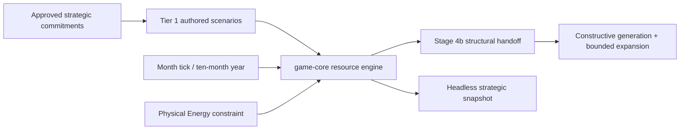

# Stage 4: Origin Resource and Infrastructure Engine

## Executive Summary

Stage 4 will design and establish the minimum deterministic resource engine that supports the governance strategy game described by the Governance Sandbox direction. Energy and ticks are constraints that create pressure, delayed commitments, and opportunity cost; they are not the subject of a mathematical balancing game.

This slice stops at the authored, headless origin engine. Constructive map generation, frontier guarantees, generator identity, and the first bounded outward/scouting action move together into Stage 4b so their intent is preserved without forcing premature economic or exploration rules into the engine slice.

The existing direction’s word **solvency** is interpreted as deferred design intent: future generated starts must construct the structural prerequisites approved from implemented gameplay. It is not a literal per-seed economic inequality, long-run stability proof, or CI balance gate.

Only decisions explicitly identified as agreed are binding. An implementing agent must not fill unresolved gameplay questions from thin air. Seed algorithms, fingerprints, stable generated IDs, and similar generator decisions belong to Stage 4b unless they change player-visible design.

## Problem Statement

The current Stage 3 substrate represents one living origin, physical resource stocks, deposits, reclaimable sites, locations, and explicit topology. It has no tick system, production/upkeep model, projects, strategic resource commitments, or map generator. Consequently, the project cannot yet know what resources and relationships make a starting locale playable. See E1–E3.

The current direction documents jump ahead by describing origin “solvency with surplus margin” and neighborhood resource floors as exact generated-world assertions. That wording risks turning an unresolved strategy-game loop into arbitrary arithmetic and encourages tests that define balance before gameplay exists. See E4–E6.

The intended order is instead:

1. design the strategic resource engine;
2. demonstrate its decisions in small authored scenarios;
3. record the origin-engine structural inputs demonstrated by those scenarios;
4. hand those inputs to Stage 4b for constructive generation and bounded expansion; and
5. leave procedural layout, frontier texture, and generator identity out of Stage 4.

## Design Agreement Gate

Only the following gameplay decisions require human designer agreement during this stage.

### A1 — Strategic resource decisions

Stage 4 implements the first two G6 directions through staged authored fixtures:

- **bank** — take no discretionary commitment and passively retain physical resources as a buffer against predictable cyclic, seasonal pressure;
- **develop** — commit resources over time to construct infrastructure at the origin, using the FIFO work system whose completed developments change concrete system capabilities.

Stage 4 does not implement **expand**. Stage 4b must define the first truthful bounded outward action and may reuse the deferred scouting-probe sketch without treating it as approved. No acceptance criterion requires bank/develop/expand to coexist at tick zero.

### A2 — Required starting-locale ingredients

The initial starting locale follows a deliberately small classic strategy-game resource setup:

- `core:energy` — physical Energy used for life support, infrastructure operation, and construction;
- `core:ore` — the one initial raw resource, extracted from finite deposits; and
- `core:alloy` — the one initial refined resource, produced from Ore and used for construction.

The origin system starts with a seasonal per-Collector Energy-efficiency profile, one `200 Ore` deposit, one body with six generic development slots, exactly one functional Energy Collector, no Battery/Extractor/Refinery, and one system construction queue. It starts at population `0` with system stocks of `10 Energy`, `10 Ore`, and `0 Alloy`, and relies on intrinsic Energy retention plus the free origin work to bootstrap additional developments. Construction is the only activity that consumes population-derived work. Extraction, refining, and Energy production are automatic consequences of functional developments rather than player-issued work orders. Developments may consume Energy upkeep each tick, making Energy-producing developments necessary to support a developed system. Functional Battery developments determine how much Energy the system can retain; Energy above installed storage capacity overflows instead of remaining in system stocks.

The basic construction capability is the work-and-queue system itself; Stage 4 must not add a fictional Construction Bay building merely to enable construction. This agreement defines **presence and relationships first**, not a universal balance formula. The approved infrastructure costs, work requirements, upkeep, throughput, and starting quantities are designer-authored Tier 1 values rather than future generator floors. Required map-owned ingredients are placed unconditionally by future map construction. Bodies and slots are physical system geography; installed developments occupy slots; stocks and the construction queue belong to the system.

### A3 — Frontier requirements (deferred to Stage 4b)

Stage 4 makes no frontier placement guarantee. Stage 4b will derive the concrete A3 catalog from the completed origin engine and its bounded outward action. The preserved direction is that the frontier contains the same basic Energy-efficiency and raw-resource families with a different distribution from the origin, placed constructively before optional texture. Exact witnesses, adjacency, bodies/slots, quantities, and relationships remain Stage 4b design decisions.

The existing standalone `ReclaimableSiteDefinition` remains unchanged in Stage 4. Stage 4b may place it structurally if later approved, but reclamation behavior and site-model migration remain later work.

### A4 — Infrastructure placement model (agreed)

Stage 4 adopts G13 directly:

```text
system/location → bodies → development slots → developments
```

The current `LocationDefinition` remains the strategic system identity. A Stage 4 body contains only a stable ID, display name, and ordered generic slots; no body type, statistic, compatibility, or bonus field is added. Bodies attach to a location; slots attach to a body; a development occupies one slot. Energy efficiency and deposits remain system/location characteristics rather than development slots.

The minimum Stage 4 state model must support generic empty slots and developments whose condition is `Functional`, `Damaged`, or `Ruined`. Any approved Stage 4 development may occupy any empty slot; slots have no type, restriction, compatibility field, or inherent bonus. Only functional developments apply production, storage, extraction, refining, or upkeep consequences. Stage 4 construction performs only an empty-slot → functional-development transition; damage, repair, ruin creation, reclamation, body simulation, and habitability remain deferred.

A system construction queue item targets one specific body slot. An accepted item reserves that slot so a second queued item cannot target it. Completion installs the selected development into the reserved slot. Rejected enqueue, failed tick validation, and sequence overflow leave slot reservation and queue state unchanged. Construction with zero applied work may be cancelled between ticks. Applying any construction work permanently marks the item as begun and makes it non-cancellable. A successful cancellation returns the complete committed resource cost, removes the unstarted item, and releases its slot and any Extractor-deposit reservation atomically. If any refund result is invalid, cancellation leaves stocks, committed resources, queue state, and reservation unchanged. When returned Energy exceeds current Battery capacity, cancellation still succeeds: retain as much as capacity permits and route the excess through the same explicit Energy-overflow accounting channel used by production.

### A5 — System and community ownership (agreed)

The system is the persistent physical owner. It owns bodies, slots, developments, Energy efficiency, deposits, available resource stocks, Battery capacity, committed construction resources, construction queue/projects, and overflow/accounting evidence. Those records remain at the system when population reaches zero and may later participate in reclamation.

The community is the system’s population, not a second treasury or infrastructure owner. Population supplies construction work while present; the origin system contributes its one free work even at zero population. Non-origin systems with zero population produce no work. Stage 4 executes active gameplay only at the origin, but the ownership model must not bake origin-only ownership into the domain types.

This changes the Stage 3 contract in which physical stocks are stored on `OriginCommunityDefinition`/`ResourceStore`. Stage 4 must migrate stocks to persistent system state and leave the community representation responsible only for population.

## Stage 4 Implementation Contract

This section records the approved Stage 4 implementation contract. Numeric values remain designer-tunable content, but the fixture values and deterministic mechanics below are the implementation/test oracle. Changes to gameplay rules require design review rather than implementation-agent substitution.

### Time, seasonal supply, and baseline cost

- `SimulationTime.tick` starts at `0`; advancing a tick uses seasonal phase `tick % 10`, then increments the tick.
- One tick is one origin month and ten ticks are one local year.
- Map-owned Energy efficiency is a ten-phase seasonal per-Collector output profile, but it does not add Energy directly to system stocks. The initial designer-authored profile is `[40, 40, 30, 20, 10, 10, 20, 30, 40, 40]`.
- Each functional Energy Collector independently produces the local profile’s output for the current phase.
- The initial designer-authored population life-support cost is `10 Energy` per population unit per tick. Functional developments may impose recurring Energy costs.

Routine Energy shortage advances the tick and produces an in-game shortage outcome rather than rejecting the tick. Functional Energy Collectors and Batteries have no Energy upkeep. Each Collector produces the system’s current per-Collector seasonal Energy-efficiency output every tick, and Batteries contribute capacity passively. The initial designer-tuned Extractor and Refinery recipes each require `10 Energy` per successful cycle-progress tick. The initial profile is approved but remains designer-tunable. Stage 4 shortage consequences are limited to the paid/unpaid and supported/underserved evidence defined below. Future generated values must not be accepted or rejected by comparing them with fixture values.

### System work capacity (agreed)

Each system produces an integer work budget every tick:

```text
system work per tick = supported population + origin bonus
origin bonus = 1 for the origin system, otherwise 0
```

Each population unit that receives its full life-support allocation contributes one work that tick. An underserved population unit contributes no work. The origin always contributes one additional free work, including when its population is zero or every population unit is underserved, so a zero-population or fully underserved origin can bootstrap rather than deadlock. Work is tick-local and is not stockpiled when unused. Population addition and every work calculation use checked arithmetic.

Stage 4 must remove the current nonzero-origin-population validation contract and add Tier 1 coverage for a zero-population origin producing exactly one work. Whether a zero-population origin has other survival or fiction consequences remains outside this stage.

### Infrastructure consequences (agreed direction)

There are no per-tick `Idle`, `Extract`, or `Refine` work orders and no production-work allocation question. Population-derived work is applied only to construction. Once installed, infrastructure creates deterministic per-tick consequences:

- each Energy Collector produces physical Energy from the system’s current seasonal per-Collector efficiency value;
- each Extractor is explicitly assigned to one deposit in its system and has a designer-authored nonzero cycle duration; each fully funded operating tick advances cycle progress by one, and completion removes `1 Ore` from the assigned deposit and adds it to system stocks; a depleted deposit causes no upkeep, progress, consumption, or output;
- each functional Refinery independently runs a designer-authored nonzero-duration `2 Ore → 1 Alloy` cycle; starting an idle cycle atomically commits `2 Ore` from system stocks, each fully funded operating tick advances progress by one, and completion consumes the committed Ore into the production ledger and produces one Alloy; paused cycles retain committed Ore; multiple Refineries retain independent cycle and committed-input state;
- Battery infrastructure contributes to the system’s end-of-tick Energy-retention capacity and causes excess retained Energy to overflow through an explicit accounting channel; and
- any infrastructure recipe may declare recurring Energy upkeep.

The initial implementation contains exactly one production chain, `2 core:ore` → `1 core:alloy` per Refinery batch, plus Energy production and storage. It should contain only the minimum Collector, Battery, Extractor, and Refinery developments needed by the approved scenario. All functional developments are always active in Stage 4 and cannot be manually enabled or disabled. Each automatically attempts its approved consequence every tick. Development operation is all-or-nothing per operating tick: it must receive its complete upkeep and any inputs required by the approved cycle rule or it consumes nothing, produces nothing, and gains no cycle progress that tick. Extractor output is exactly `1 Ore` per completed cycle, so every nonempty integer deposit can be depleted. The exact recipes, throughput, upkeep, tick order, and insufficient-input behavior are defined in this contract and its 20-tick fixture. Every system has an initial designer-authored intrinsic Energy-retention capacity of `10 Energy`, sufficient to bootstrap initial construction. Each functional Battery adds `100 Energy`. These remain independent tunable values; the initial 10% relationship is design guidance rather than a runtime percentage formula. Collector production stacks linearly with checked arithmetic and has no separate system-wide production cap. Development is constrained by the system’s finite generic slots and the opportunity cost of occupying them, allowing Energy outcomes to emerge from slot count, Collector count, and local efficiency. Total Energy capacity is the checked sum of intrinsic capacity plus the capacity of every functional Battery development; Batteries stack linearly with no Stage 4 diminishing returns. Damaged and ruined Batteries contribute no capacity. Incoming Energy transfers succeed fully: the destination retains what fits immediately and records the excess as overflow, with exact source decrease = destination retention + overflow reconciliation. A Stage 4-enabled initial state whose available Energy exceeds derived capacity is rejected as structurally invalid rather than normalized or recorded as overflow. This validation is not applied retroactively to substrate-only Stage 3 definitions that lack the Stage 4 resource-engine prerequisites. Functional Energy Collectors have zero Energy upkeep, continue operating when storage is full, and route Energy not consumed during the tick to overflow at the retention phase. Overflow accounting uses checked quantities with a cumulative system total, a last-tick retention-overflow value, and typed per-operation evidence for `Retention`, `Transfer`, and `CancellationRefund`. The cause breakdown is engineering evidence for exact reconciliation, not a separate design gate. The implementing agent must not invent priorities, partial operation, shutdown, overflow, or brownout behavior.

### Tick-based construction queue

Each system with development state owns one FIFO construction queue; the first Tier 1 scenario exercises the origin’s queue. Construction work and completed effects belong to that system rather than to a global queue. The initial catalog contains four development roles—Energy production, Energy storage (Battery), raw-resource extraction, and refining. Every Stage 4 development recipe requires nonzero Energy. The bootstrap Refinery is the exception to Alloy construction: it consumes Ore so a zero-Alloy origin can establish refining. Collectors, Batteries, and Extractors consume Alloy and never Ore at enqueue. After the first Refinery exists, further infrastructure growth depends on refining Ore into Alloy. Collectors, Batteries, and Refineries may have multiple installed copies; Extractors are limited to one assignment per deposit. The initial Battery and Energy Collector recipes each cost `10 Energy + 2 Alloy` and require `4 work`. The Extractor costs `10 Energy + 2 Alloy` and requires `4 work`; the Refinery costs `10 Energy + 2 Ore` and requires `4 work`. Initial Extractor and Refinery cycle durations are one tick. All values remain designer-tunable content. Each completed development occupies exactly one targeted slot. An Extractor development additionally retains an explicit assigned deposit ID. A deposit may be assigned to at most one queued or installed Extractor, regardless of development condition.

The following enqueue, funding, FIFO, completion, and cancellation rules are approved:

1. Each `enqueue_construction(body, slot, recipe)` call is a between-ticks command that attempts to append exactly one approved development recipe to one empty, unreserved slot in the system. Enqueuing an Extractor additionally requires an explicit deposit ID. Callers enqueue multiple items through multiple calls; each call is independently atomic.
2. The target body/slot, vacancy, reservation status, complete cost, and any required Extractor deposit assignment are validated before mutation. An assigned deposit must exist in the same system, contain the resource supported by the Extractor recipe, and have no queued or installed Extractor assignment. An accepted Extractor enqueue reserves both its slot and deposit. On acceptance, the complete cost immediately leaves available system stocks, moves into that queue item’s committed-resource store, and the slot becomes reserved. Construction has no staged or completion-time funding. Rejection leaves stocks, reservations, queue, and sequence allocation unchanged.
3. Construction items use their own monotonically increasing `u64` sequence counter starting at `0`. An accepted enqueue receives the current value and increments the counter with checked arithmetic. FIFO order is domain state and is exposed in snapshots.
4. During the construction phase, apply the system’s available construction work to the head item first.
5. If the head needs less work than remains in the tick, complete it and immediately apply the overflow to the next FIFO item in the same tick. One tick may therefore progress or complete multiple queue items.
6. Continue until no construction work remains or the queue is empty. Unused work is discarded rather than banked.
7. A newly enqueued item is eligible for work on the next tick.
8. When an item’s remaining work reaches zero, its committed resources move to the spent/build ledger, its functional development is installed in the reserved slot, the reservation clears, and the item leaves the queue immediately.
9. Completion installs a functional development immediately. It participates only in phases that have not yet run: a newly completed Battery increases that tick’s final retention cap, while newly completed Energy, extraction, or refining developments first operate on the next tick.
10. An item may be cancelled only while `work_applied == 0`. Successful cancellation atomically returns its complete committed cost, removes it, and releases its slot and any Extractor-deposit reservation. Begun items cannot be cancelled. Energy refunds above Battery capacity do not block cancellation; excess refunded Energy uses the explicit overflow channel. Reordering, acceleration, damage, maintenance, construction failure, and a queue-capacity limit are outside Stage 4.

Normative overflow example: an origin with population `2` produces `3` work. If the head item needs `1` work and the next item needs `4`, the tick completes the head and leaves the next item needing `2`; none of the three work is discarded.

The queue must be implemented as construction state, not as a generic project framework. Generalization waits until a second implemented mechanic proves shared semantics.

### Definition, content, and snapshot boundaries

- `ResourceStore` remains the sole physical stock ledger for Energy, Ore, Alloy, and committed resources; infrastructure production and upkeep must reconcile through it rather than through parallel balances. Battery capacity constrains system-held available Energy without changing generic resource quantities or silently altering the existing exact transfer contract. A system-level Energy receipt operation must account separately for retained and overflowed quantities.
- `WorldDefinition` gains bodies attached to locations/systems, slots attached to bodies, developments occupying slots, and a map-owned ten-phase seasonal Energy-efficiency profile attached to locations. Each profile value is the integer Energy output of one functional Collector in that phase; it is not stock and never supplies a system without a Collector.
- Existing resource deposits become mutable runtime quantities so Extractor cycle completion changes world state truthfully. The omniscient world snapshot exposes remaining deposits and Energy-efficiency profiles.
- System state derives functional infrastructure consequences by aggregating developments, their independent cycle progress, and committed production inputs across its body slots. It also owns derived Energy capacity, per-tick and cumulative Energy-overflow evidence, a construction FIFO with slot reservations, simulation time, life-support paid/unpaid evidence, supported/underserved population counts, derived construction work, and spent-resource ledgers.
- The strategic snapshot exposes bodies, slots, development identity/condition, Extractor deposit assignments, current functional consequences, life-support paid/unpaid evidence, supported/underserved population, derived construction work, Energy capacity, available headroom, Energy overflow evidence, queued item target/sequence/applied-and-required-work/committed resources, and production-cycle progress/required duration/committed inputs.
- Numeric gameplay parameters are designer-authored data compiled by `game-content` into format-independent `game-core` definitions: per-population life support, intrinsic Energy capacity, per-role construction costs and required work, Collector phase outputs, Battery capacity, Extractor throughput/upkeep/cadence, and Refinery input/output/upkeep/cadence. No gameplay duration or work requirement is hard-coded. Initial values approved in this plan are fixture/content values, not hard-coded engine constants.
- Consequence kinds and deterministic algorithms remain typed `game-core` behavior; do not introduce a general scripting or effect-expression language merely to expose numeric tuning.
- Existing Stage 3 worlds without Stage 4 potential or infrastructure remain structurally loadable and snapshotable. Advancing them must fail atomically with a specific missing-resource-engine-prerequisite error rather than retroactively making Stage 4 content a universal `WorldState::new` invariant.
- Do not create a generalized building framework before the initial infrastructure catalog, recipes, and consequence semantics are approved.

### Tick order and atomicity

`advance_tick` computes every affected result before committing mutation. The approved infrastructure order is:

1. read the current seasonal phase;
2. each functional Energy Collector produces the current phase’s local per-Collector Energy-efficiency output with zero upkeep; sum all Collector output with checked arithmetic;
3. pay population life support and derive supported population/construction work;
4. fund and operate functional Extractors in stable body/slot order;
5. fund and operate functional Refineries in stable body/slot order;
6. apply supported-population plus origin-bonus construction work across each system FIFO, carrying overflow into later items in the same tick;
7. cap retained available Energy using intrinsic capacity plus all functional Batteries, including any Battery completed this tick, then record excess as overflow;
8. increment the tick; and
9. emit the end-of-tick strategic snapshot and accounting evidence.

Energy capacity is strictly a retention limit: produced Energy may flow through same-tick costs and production even when it temporarily exceeds capacity, and only the remaining available Energy is capped at the end of the tick. Population life support has first claim on available Energy before any development upkeep. Let `required = population × per_pop_life_support` and `paid = min(available_energy, required)`. Deduct all `paid` Energy, record `unpaid = required - paid`, derive `supported_population = min(population, paid / per_pop_life_support)`, and leave population unchanged. `population - supported_population` is underserved and contributes no construction work that tick. Development upkeep and recipe contention use the approved order Collector production → life support → Extractors → Refineries → construction → retention. Batteries require no operating phase beyond contributing capacity at retention. Developments within the same role use stable body-ID then slot-ID order. Functional developments are always active and cannot be manually disabled. Newly completed Batteries affect that tick’s final retention cap and never require upkeep; Energy-production, extraction, and refining phases have already passed, so other newly completed developments first operate next tick. Routine scarcity does not reject a tick. Stage 4 represents life-support shortage through paid/unpaid and supported/underserved evidence only: it does not change population or add a separate brownout/go-dark state. Ticks rejected for invalid state, invalid commands, or arithmetic failure remain atomic.

### Tier 1 strategic scenario skeleton

The scenario begins with the approved zero-population, Collector-only bootstrap state. It first demonstrates construction of the Refinery and production of initial Alloy. Later checkpoints may be cloned when comparing choices that are actually available from the same state; no test branches into unavailable tick-zero actions. Coverage must include:

- life-support-derived supported/underserved population, construction work from supported population, and the free origin work;
- exactly one installed functional Collector and no starting Battery, Extractor, or Refinery;
- seasonal per-Collector Energy efficiency, intrinsic Energy-retention capacity, explicit overflow, and later development upkeep;
- one `200 Ore` origin deposit, physical Energy/Ore/Alloy stocks, and an empty construction FIFO;
- the staged Refinery → Alloy → Battery/Extractor bootstrap; and
- exact snapshots over the approved 20-tick fixture horizon.

The bootstrap issues these between-tick commands: enqueue the Refinery before tick 1; enqueue the Battery after tick 8; enqueue the Extractor after tick 12. The exact checkpoints are:

| Checkpoint | Available stocks `(Energy, Ore, Alloy)` | Functional developments | Ore deposit | Cumulative Energy overflow |
| --- | --- | --- | ---: | ---: |
| After initial Refinery enqueue | `(0, 8, 0)` | Collector | `200` | `0` |
| End tick 4 | `(10, 8, 0)` | Collector, Refinery | `200` | `120` |
| End tick 8 | `(10, 0, 4)` | Collector, Refinery | `200` | `150` |
| After Battery enqueue | `(0, 0, 2)` | Collector, Refinery | `200` | `150` |
| End tick 12 | `(50, 0, 2)` | Collector, Refinery, Battery | `200` | `260` |
| After Extractor enqueue | `(40, 0, 0)` | Collector, Refinery, Battery | `200` | `260` |
| End tick 16 | `(110, 0, 0)` | Collector, Refinery, Battery, Extractor | `200` | `260` |
| End tick 20 | `(110, 0, 2)` | Collector, Refinery, Battery, Extractor | `196` | `330` |

At tick 20, construction has spent `30 Energy`, `4 Alloy`, and `2 Ore`; development operation has spent `100 Energy` and refined `12 Ore` into `6 Alloy`; the Extractor has moved `4 Ore` from the deposit. Exact Energy reconciliation is `10 starting + 560 produced = 30 construction + 100 upkeep + 110 retained + 330 overflow`.

Separate focused fixtures must prove populated/underserved work, same-tick FIFO overflow across multiple items, cancellation/refund overflow, multi-tick production pauses, transfer-at-capacity reconciliation, input-order independence, and rejected-command atomicity.

### Implementation readiness resolution

Implementation maps the approved contract onto core/content types without speculative body fields, migrates community-owned stocks and immutable deposit snapshots, uses `ResourceStore` as the sole quantity model, and retains Stage 3 substrate loading while requiring complete Stage 4 prerequisites for tick advancement.

The controlling architecture, G18, testing stance, and invariant registry assign generation/scouting responsibilities to Stage 4b rather than Stage 4.

## Proposed Solution

### Resource engine

Add the smallest format-independent engine that can express:

- one gameplay population unit, fictionally representing approximately one billion people;
- integer physical Energy accounting without requiring a settled fictional conversion unit;
- one simulation tick representing one origin month, with a ten-tick local year;
- bodies, development slots, and functional/damaged/ruined developments;
- seasonal per-Collector Energy efficiency converted into physical Energy by functional Collectors, stacking linearly within finite generic slots;
- recurring population and development Energy costs once approved;
- physical Energy, raw, and refined resource stockpiles;
- the approved population-derived work budget and FIFO-overflow construction semantics;
- deterministic extraction, refining, storage, and Energy-production consequences from functional developments;
- a system construction queue with approved resource-commitment semantics; and
- deterministic completion and shortage behavior defined by the final scenario;
- checked arithmetic and validate-before-mutate behavior.

The engine should expose strategic state and consequences, not economic diagnostics designed to prove stability. It should make the player choose what to commit now, what to retain, and what pressure to accept.

### Stage 4b handoff

Stage 4 records only the authored origin fixture and format-independent engine contracts. Stage 4b owns the constructive starting-locale/frontier catalog, mandatory placement passes, generated topology, optional procedural texture, generator identity/provenance, and the first bounded outward action. Stage 4 must not add generalized runtime requirement types or map-generation code.

### Corrected testing stance

Generated-world acceptance must not include:

- an `is_solvent` check;
- prescribed economic surplus;
- long-run survival or stability;
- favorable distributions;
- statistical seed thresholds;
- rerolling or screening worlds that feel difficult.

Testing should instead verify resource mechanisms in hand-computable scenarios and verify mandatory map-placement mechanisms when the generator is implemented.

## SpecFlow Analysis

### Strategic resource flow

1. The authored Tier 1 scenario starts from the approved state skeleton above.
2. Functional developments apply Energy production, storage, upkeep, extraction, and refining consequences without per-tick work orders.
3. The harness follows the staged zero-population bootstrap from Collector to Refinery, Alloy, Battery, and Extractor.
4. Construction applies supported-population plus origin-bonus work through the FIFO with same-tick overflow.
5. Development consequences transform declared physical inputs without implicit value conversion.
6. The strategic snapshot exposes stocks, seasonal phase, bodies/slots/developments, production-cycle state, and construction FIFO state.
7. The 20-tick fixture produces exact hand-computable snapshots without requiring a soak run.

### Insufficient-resource flow

- A commitment that cannot begin is rejected before mutation with the limiting resource identified.
- Accepted construction receives its allocated work on every successful tick and carries excess work through the FIFO.
- Unstarted construction may be cancelled for a complete refund; begun construction cannot.
- Seasonal Energy pressure may constrain activity, but Stage 4 does not need to prove that every state remains recoverable.
- Routine inability to pay life support or upkeep advances time and records the approved shortage evidence; it is not a transactional error.
- Population arrival, loss, growth, collapse, and separate brownout/go-dark states are deferred.

### Important boundaries

- Stage 4 uses authored fixtures and makes no generated-world quality claim.
- Whether a fixture quantity feels generous, harsh, or interesting is a design/playtest question unless it violates an exact mechanism contract.
- Existing `ReclaimableSiteDefinition` data remains unchanged and outside the resource-engine behavior.
- Stage 4 does not restore a playable executable or terminal interface.

## Technical Approach

### Architecture



`game-core` remains the owner of format-independent state, checked resource operations, deterministic tick ordering, commitment state, and snapshots.

`game-content` should gain source types only when the approved resource definitions or project recipes need authored data. RON, files, and source provenance remain outside `game-core`.

No new crate is expected. Do not add a general map-generation framework during the resource-engine implementation slice.

### Data / Content Impact

- Use small 3–6-location Tier 1 fixtures only where geography matters.
- Keep scenario values intentionally hand-computable and scoped to mechanism evidence.
- Do not turn fixture quantities into universal generator constants.
- Keep the initial Energy/raw/refined resource chain and building catalog deliberately small; a classic strategy-game shape does not justify speculative production breadth.
- Validate all designer-authored numeric tuning values, including nonzero required work/durations/cadences where applicable, references, and typed development records. Keep consequence algorithms typed; do not create a generalized scripting/effect schema.
- Do not add production authored world content yet.

### Runtime / Platform Impact

- The simulation remains headless and deterministic.
- One tick represents one origin month; a local year is ten ticks.
- Energy remains an integer physical resource. Fictional conversion units can remain unspecified.
- Short scenarios should execute in milliseconds; no soak or performance target is required.
- Tick ordering must be explicit so recurring flows and project commitments do not depend on ECS insertion order.

## Implementation Phases

### Phase 1: Correct the direction and approve the strategic scenario

- [x] Replace literal generated-world solvency language with structural Stage 4b intent in the controlling docs.
- [x] Resolve Stage 4 A1 around passive banking and infrastructure development; defer outward commitment to Stage 4b.
- [x] Define system work as one per population plus one free origin work, including at zero population.
- [x] Define FIFO construction progress with same-tick overflow into later queue items.
- [x] Adopt G13 systems → bodies → generic slots → developments; construction targets and reserves a specific empty slot.
- [x] Make the system the persistent owner of stocks, developments, Battery capacity, deposits, queues, and projects; community state is population only.
- [x] Resolve population-derived work as construction-only; extraction, refining, storage, and Energy production are functional-development consequences.
- [x] Commit each development’s complete resource cost at enqueue, removing it immediately from available system stocks.
- [x] Allow cancellation only before any construction work is applied; cancellation releases the reserved slot.
- [x] Refund the complete committed cost when unstarted construction is cancelled.
- [x] Let cancellation succeed when its Energy refund exceeds capacity, routing the excess through explicit Energy-overflow accounting.
- [x] Use exactly one Stage 4 production chain: each Refinery batch converts `2 core:ore` → `1 core:alloy`.
- [x] Allow multiple Refineries; each independently attempts one batch per tick in stable body/slot order.
- [x] Require nonzero Energy for every construction recipe; Collector/Battery/Extractor also require Alloy, while the bootstrap Refinery requires Ore instead of Alloy.
- [x] Give Collectors and Batteries zero Energy upkeep; set initial designer-authored Extractor and Refinery upkeep to `10 Energy` per successful operating tick.
- [x] Assign each Extractor explicitly to one same-system compatible deposit.
- [x] Permit at most one queued or installed Extractor assignment per deposit; enqueue reserves the deposit and unstarted cancellation releases it.
- [x] Set Extractor output to `1 Ore` per completed cycle; a depleted deposit consumes, progresses, and produces nothing.
- [x] Make Extractor and Refinery cycle durations nonzero designer-authored tuning values; each fully funded operating tick advances progress by one.
- [x] Commit `2 Ore` atomically when a Refinery cycle starts, retain it through pauses, and produce `1 Alloy` on completion.
- [x] Require every numeric gameplay tuning parameter—including construction work requirements and action durations—to come from validated designer-authored content/configuration rather than hard-coded `game-core` constants.
- [x] Set the initial designer-authored per-Collector profile to `[40, 40, 30, 20, 10, 10, 20, 30, 40, 40]`.
- [x] Set the initial designer-authored Battery and Energy Collector recipes to `10 Energy + 2 Alloy`, requiring `4 work` each.
- [x] Start the origin at population `0` with one functional Collector, no Battery/Extractor/Refinery, one `200 Ore` deposit, and stocks `10 Energy/10 Ore/0 Alloy`.
- [x] Set the Extractor to `10 Energy + 2 Alloy`, `4 work`, one-tick cycles; set the Refinery to `10 Energy + 2 Ore`, `4 work`, one-tick cycles.
- [x] Set the authored origin to one body, six slots, `10 Energy`, `10 Ore`, `0 Alloy`, one Collector, population `0`, and a `200 Ore` deposit.
- [x] Calculate and record exact snapshots and complete Energy/Ore/Alloy reconciliation for the 20-tick bootstrap fixture.
- [x] Set initial designer-authored intrinsic Energy capacity to `10` and each functional Battery to `+100`; keep them independently tunable.
- [x] Stack functional Battery capacity linearly with checked arithmetic; damaged and ruined Batteries contribute no capacity.
- [x] Apply Battery capacity only as an end-of-tick retention limit after all same-tick Energy production and spending.
- [x] Apply a newly completed Battery to that tick’s end-of-tick retention cap; other completed developments begin operating next tick.
- [x] Let incoming Energy transfers succeed fully at capacity: retain what fits and route the excess through explicit overflow accounting.
- [x] Reject Stage 4-enabled initial state with available Energy above derived capacity as a structural definition error.
- [x] Give Energy Collectors zero Energy upkeep; they operate at full storage and unused output overflows.
- [x] Expose cumulative overflow, last-tick retention overflow, and typed per-operation `Retention`/`Transfer`/`CancellationRefund` evidence.
- [x] Keep all functional developments always active with no Stage 4 enable/disable control.
- [x] Make development operation all-or-nothing per tick: full upkeep and inputs for full consequence, otherwise no consumption or output.
- [x] Resolve contention by explicit development-role priority, with stable body/slot order within a role.
- [x] Approve Collector → life support → Extractor → Refinery → construction → retention ordering; Batteries contribute passively at retention.
- [x] Defer outward/scouting commands, costs, durations, knowledge state, and tick phase to Stage 4b.
- [x] Finalize the exact 20-tick bootstrap outcomes.
- [x] Advance routine Energy-shortage ticks instead of rejecting them transactionally.
- [x] Set initial designer-authored life support to `10 Energy` per population unit per tick and give it priority over all development upkeep.
- [x] Consume all available Energy on a life-support shortfall, record exact unpaid support, leave population unchanged, and remove underserved population from that tick’s work.
- [x] Use paid/unpaid life-support and supported/underserved population as the complete Stage 4 shortage evidence; defer population change and separate brownout/go-dark state.
- [x] Record one pop as approximately one billion people, one tick as one month, and ten ticks as one local year; leave Energy’s fictional conversion unspecified.

Validation:
- [x] Human designer confirms the scenario resembles a strategy-game decision rather than a stability or arithmetic benchmark.
- [x] Every expected scenario outcome can be computed by hand over a short horizon.

### Phase 2: Develop the resource engine test-first

- [x] After Phase 1 approval, add failing Tier 1 tests for zero-population origin work, supported-population work, same-tick FIFO overflow, and the finalized 20-tick bootstrap scenario.
- [x] Migrate physical stocks from `OriginCommunityDefinition` to persistent system state.
- [x] Replace the current nonzero-origin-population validation with zero-population support and exact origin-bonus tests.
- [x] Add and validate bodies, slots, development conditions, slot occupancy, and queue reservations in `game-core` and `game-content`.
- [x] Add and validate approved per-Collector seasonal Energy-efficiency profiles in `game-core` and `game-content`; retain structural loading for Stage 3 fixtures without Stage 4 profiles.
- [x] Make runtime deposit quantities mutable and snapshot depletion caused by extractor infrastructure.
- [x] Implement approved development consequences, system state, construction queue, and accounting; do not add productive-work or outward commands.
- [x] Validate every enqueue, cancellation, production-cycle transition, transfer, and complete tick before mutation.
- [x] Expose the exact strategic snapshot fields defined above while retaining an omniscient engine snapshot for substrate tests.
- [x] Preserve input-order independence where ordering is not domain state.

Validation:
- [x] Run each new test by exact name during development.
- [x] Compare accepted and rejected operations with complete before/after state.
- [x] Demonstrate the approved staged bootstrap, passive banking, and development consequences with exact snapshots.

### Phase 3: Stage 4b handoff

- [x] Record the implemented origin fixture’s structural inputs without promoting fixture quantities into generator floors.
- [x] Create `docs/plans/2026-07-20-feature-constructive-world-generation-stage-4b-plan.md` for constructive generation, generator identity, and the first bounded outward action.
- [x] Preserve the direction that required elements are placed before optional texture, with no reject/reroll or economic-quality screening.
- [x] Leave `ReclaimableSiteDefinition` unchanged and explicitly defer any site migration or reclamation behavior.

Validation:
- [x] Every Stage 4b candidate requirement is labeled deferred rather than claimed as Stage 4 acceptance.
- [x] The handoff contains no economic surplus, affordability, or distribution floor.

### Phase 4: Documentation and handoff

- [x] Update the engine invariant registry so reserved G18 entries are structural Stage 4b responsibilities rather than economic oracles.
- [x] Update architecture and README with the implemented resource-engine boundary and continued absence of playable startup.
- [x] Update `CHANGELOG.md` under `Unreleased` for user-visible resource-engine behavior.
- [x] Link the Stage 4b plan that preserves constructive generation and bounded-expansion intent.
- [x] Keep map texture diagnostics and seed-corpus quality gates out of CI.

Validation:
- [x] Review current docs for contradictory solvency, surplus-margin, neighborhood-floor, or per-seed viability-test requirements.
- [x] Run all workspace gates and verify no ignored soak or generated-world quality test was added.

## Acceptance Criteria

### Functional Requirements

- [x] The approved 20-tick zero-population bootstrap produces its documented bank/develop outcomes.
- [x] Each fully supported population unit produces one construction work; underserved population produces none; the origin adds one free work.
- [x] A zero-population or fully underserved origin produces exactly one work per tick.
- [x] Construction applies allocated work in FIFO order and carries same-tick overflow across as many queued items as the budget permits.
- [x] Systems persistently own stocks, bodies, developments, deposits, queues, projects, and accounting evidence; communities contain population only.
- [x] Bodies own generic slots; each slot is empty or occupied by one development; queued construction reserves one empty slot.
- [x] Only functional Energy, Battery, extraction, and refining developments apply approved deterministic consequences, without consuming construction work.
- [x] Multiple Refineries retain independent progress and committed Ore, complete one `2 Ore → 1 Alloy` batch after their authored cycle duration, and use stable body/slot order.
- [x] Every Extractor retains and validates one exclusive same-system compatible deposit assignment, including queued reservation and cancellation release.
- [x] Battery infrastructure caps retained system Energy and routes excess through an exact overflow/curtailment accounting channel.
- [x] Every functional development automatically attempts its consequence each tick; there is no enable/disable control.
- [x] Tick processing follows Collector → life support → Extractor → Refinery → construction → retention order, with Batteries contributing passive capacity and stable body/slot order within active roles.
- [x] Population life support is paid before development upkeep; exact paid/unpaid support and supported/underserved counts are exposed.
- [x] Development operation is atomic per progress tick: complete required upkeep/inputs advance the cycle once; otherwise the development consumes nothing, produces nothing, and does not progress.
- [x] Construction enqueue validates atomically, commits the complete cost from available system stocks, and reserves the target slot.
- [x] Unstarted construction can be cancelled atomically for a complete refund; begun construction cannot; successful cancellation releases the target slot and explicitly accounts for any overflowing refunded Energy.
- [x] Invalid commands and invalid/arithmetic-failure ticks leave complete relevant state unchanged and identify the limiting requirement; routine scarcity advances through the shortage path.
- [x] The authored origin fixture has one body/six slots, the approved Energy profile, one `200 Ore` deposit, stocks `10 Energy/10 Ore/0 Alloy`, one Collector, no other developments, and population `0`.
- [x] No generated-world, scouting, outward-action, economic-solvency, surplus, stability, or distribution oracle is introduced.

### Quality Requirements

- [x] The concrete Stage 4 origin-engine contract has explicit human design approval.
- [x] Gameplay behavior has short, hand-computable Tier 1 scenario coverage.
- [x] Tests protect mechanisms and construction responsibilities rather than mutable balance values.
- [x] `game-core` remains independent of RON, filesystem, terminal, and frontend concerns.
- [x] No unnecessary dependency or crate boundary is added.
- [x] Formatting, check, Clippy with warnings denied, tests, and `git diff --check` pass.

## Test-Development Recommendations

1. **Use the approved fixture exactly:** recipes, costs, durations, commands, and expected outcomes above are the Tier 1 implementation oracle. Tune values only through a reviewed design/content change.
2. **Branch only at a valid decision point:** bootstrap first, then clone a later checkpoint when multiple choices are simultaneously available. Do not require unavailable actions at the initial state.
3. **Short horizons:** keep gameplay scenarios to a few ticks. If behavior requires a soak to observe, it is not adequate gameplay acceptance evidence.
4. **Atomic rejection:** compare all affected stocks, commitments, progress, and emitted evidence before and after every rejected command.
5. **Explicit tick ordering:** test cases where recurring input, baseline cost, and project funding occur on the same tick.
6. **Avoid balance locks:** assert exact fixture outcomes, but do not promote fixture production rates or project costs into universal worldgen requirements.
7. **Constructor tests later:** when map generation is implemented, test mandatory placement passes directly with tiny maps instead of running a post-generation `is_playable` or `is_solvent` validator.
8. **Retain real failures:** if generation later omits a required element, reduce it to a small mandatory-placement fixture and keep that regression test.

## Validation Plan

### Automated Validation

- [x] Focused tests for each accepted/rejected commitment and tick-order case.
- [x] Battery tests below, at, and above capacity; stacked-capacity overflow; completion timing; transfer-at-capacity behavior; and exact reconciliation where source decrease equals destination retention plus overflow.
- [x] `cargo fmt --all -- --check`
- [x] `cargo check --workspace --all-targets --all-features`
- [x] `cargo clippy --workspace --all-targets --all-features -- -D warnings`
- [x] `cargo test --workspace --all-features`
- [x] `git diff --check`
- [x] Search executable tests and CI for `is_solvent`, statistical seed thresholds, rerolling, and world-quality acceptance.

### Manual Validation

- [x] Human designer reviews the zero-population bootstrap, passive banking, delayed development capability, seasonal retention, and shortage evidence.
- [x] Inspect exact bootstrap snapshots over the approved 20-tick horizon.
- [x] Confirm Stage 4b—not Stage 4—owns generated frontier and outward-action decisions.

### Evidence to Capture

- Approved Stage 4 origin fixture and exact 20-tick bootstrap snapshots.
- Exact focused-test output for construction, production cycles, shortage evidence, rejection atomicity, and tick ordering.
- Compact before/after snapshots for each strategic branch.
- Final registry-to-test mapping and workspace gate summaries.
- Search evidence proving no generated-world solvency or statistical quality gate was added.

## Dependencies and Risks

### Technical Dependencies

- Stage 3’s `WorldDefinition`, one origin, neutral locations, physical stocks, deposits, sites, topology, stable IDs, and checked resource transfers.
- G5–G8 and G17–G22 as strategy-game direction, interpreted through this clarified construction stance.
- Human designer approval of the concrete Stage 4 origin-engine contract.
- Stage 4b for generated maps and bounded scouting/expansion; later plans for startup, expeditions, and reclamation.

### Risks

| Risk | Impact | Mitigation |
|------|--------|------------|
| Resource mechanics are designed to satisfy equations rather than create choices. | The game remains a mathy balancing toy. | Begin with A1 strategic branches and derive numbers only for those scenarios. |
| “Solvency” survives as a literal generated-world oracle. | Tests freeze premature balance assumptions. | Correct controlling docs and registry before generator implementation. |
| The engine reintroduces retired market simulation. | Strategy remains indirect or trader-centered. | Implement only system-owned physical resources and approved origin developments. |
| Deferred gameplay is represented by fake placeholder projects. | Tests validate mechanics the game does not actually intend. | Require a truthful current responsibility for every command and state field. |
| Map requirements become arbitrary quantity floors. | Generator design is constrained before gameplay establishes need. | Record presence/relationships first; derive quantities from later scenarios. |
| Tick processing depends on ECS insertion order. | Strategic outcomes become unstable. | Define phase ordering and test semantic input permutations. |

## Documentation and Follow-up

### Documentation to Update

- [x] `docs/design/direction/README.md#legacy-g-label-mapping` — stage bank/develop before expand and redefine G18 structurally.
- [x] `docs/plans/2026-07-20-testing-stance-correction.md` — split Stage 4 engine work from Stage 4b generation/outward work.
- [x] `docs/2026-07-20-engine-invariant-registry.md` — reserve structural Stage 4b G18 and generation-identity entries.
- [x] `docs/architecture.md` — document the Stage 4 engine and Stage 4b generator handoff.
- [x] `README.md` and `CHANGELOG.md` — report current capability without claiming playable startup.

### Intentional Follow-up

- `docs/design/ideas/infrastructure-and-slots.md` records future slot restrictions and body/slot bonuses; Stage 4 slots remain generic.
- `docs/plans/2026-07-20-feature-constructive-world-generation-stage-4b-plan.md`: constructive origin/frontier placement, generator identity/provenance, optional procedural texture, and one bounded outward action.
- Playable startup and terminal composition.
- Deeper scouting, crewed expeditions, reclamation, population arrival/change, and richer resource chains.
- Descriptive world-texture tooling, if useful to the designer, outside CI acceptance.

## References & Research

References use paths relative to the repository root.

### Evidence Index

- **E1 — current substrate and non-playable boundary:** `docs/architecture.md:3-65,88-116`
- **E2 — current core world/resource types:** `crates/game-core/src/lib.rs:77-208,285-313`
- **E3 — checked validation and resource mutation:** `crates/game-core/src/lib.rs:536-687,712-757`
- **E4 — corrected structural generated-world testing stance and Stage 4/4b split:** `docs/plans/2026-07-20-testing-stance-correction.md`
- **E5 — staged G6 allocation and structural G18 direction:** `docs/design/direction/README.md#legacy-g-label-mapping`
- **E6 — reserved structural G18 and generation-identity entries:** `docs/2026-07-20-engine-invariant-registry.md`
- **E7 — retained CI gates:** `.github/workflows/ci.yml:1-22`; `README.md:39-49`

### Internal References

- `docs/plans/2026-07-20-feature-origin-frontier-substrate-stage-3-plan.md` — completed substrate and testing handoff.
- `AGENTS.md:5-27` — headless architecture, deterministic scenarios, constructive generation, and design-review constraints.
- `crates/game-content/tests/fixtures/three_locations.ron:1-21` — current small source-fixture pattern, not a balance contract.

### External References

No broad supplemental research or authoritative API cross-check was needed. This plan concerns project-local strategy design and Rust domain boundaries.

### Institutional Knowledge

- `docs/solutions/rust-ecs-validate-before-mutate.md` — compute and validate every affected result before applying state changes.
