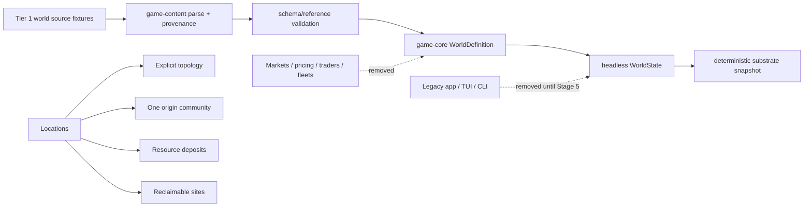

# Stage 3: Origin-and-Frontier Substrate Cutover

## Executive Summary

Stage 3 will replace the remaining trader/market product model with the minimum
truthful substrate required by G17 and G18: stable locations, exactly one living
origin community, physical resource stocks and deposits, minimally represented
reclaimable sites, and topology that exists independently of markets. It will
remove pricing, wallets, commercial trade and reservations, player/NPC traders,
fleet ecology, market-per-location state, authored market startup/content, and
the current app/TUI/CLI gameplay surfaces.

This is a **full replacement**, not a compatibility migration. No adapter,
deprecated alias, empty frontend shell, startup placeholder, or archived copy
will preserve the old game. The retained workspace may contain only
`game-core` and `game-content` and need not be playable until Stage 5. It must
remain buildable, retain exact evidence for applicable engine contracts, and
make current documentation truthful.

Stage 3 will not generate worlds, define G18 values or inequalities, restore
startup, add extraction/reclamation actions, design bodies/slots/surveys, or
create player-owned logistics. Those responsibilities remain with Stages 4–8.

## Problem Statement

The implementation still treats a location as a live commercial market.
`SystemDefinition` combines position with inventory, production, population,
governance, pricing policy, investment policy, and market logistics; session
construction then spawns a `Market` at every system. The runtime world and
snapshot are organized around markets, traders, reservations, fleets, and
commercial Energy contracts. See E1–E3.

The content pipeline preserves the same assumption. Its repository loader
requires systems, goods, recipes, economy, economy configuration, traders, and
encyclopedia inputs together. Compilation rejects a system without a matching
market, folds that market into `SystemDefinition`, constructs a graph from the
combined type, and then compiles player/NPC traders. See E4.

The executable boundary still completes the obsolete chain: CLI loads the
market bundle, constructs the trader-based session, the app selects the first
market, and the TUI exposes Trade, Logistics, Governance, and market inspection
against those DTOs. These are complete obsolete product surfaces rather than
neutral adapters that need compatibility. See E5–E7.

Deleting those types also affects tests and the invariant registry. Current
registry evidence names market population, trader contention, dynamic fleet
IDs, commercial Energy contracts, and automated trader recovery. Stage 3 must
not retain obsolete behavior merely to keep those test names resolvable, but it
also must not silently leave active contracts without applicable,
non-vacuous evidence. See E8.

## Proposed Solution

Introduce a small, format-independent substrate with these contracts:

1. **Resource catalog**
   - `ResourceDefinition`: stable ID and display name only.
   - `core:energy` remains the canonical physical Energy ID.
   - Pricing, bootstrap cost/cost basis, bid/ask categories, commercial margins,
     and market targets are absent.
2. **Geography**
   - `LocationDefinition`: stable ID, display name, and finite `Position3`.
   - A location carries no population, inventory, policy, production, or market
     component by implication.
3. **One living origin**
   - `OriginCommunityDefinition`: stable community ID, a reference to one
     location, nonzero population, and checked physical resource stocks.
   - The world definition owns one origin field rather than a community list;
     Stage 3 therefore cannot accidentally author multiple living communities.
   - Runtime composition uses a neutral community component plus an origin
     marker. Only the referenced origin location receives them.
4. **Frontier affordances**
   - `ResourceDepositDefinition`: stable ID, known location, known resource,
     and nonzero checked quantity.
   - `ReclaimableSiteDefinition`: stable ID and known location. The dedicated
     type is the complete Stage 3 site taxonomy; site internals, bodies, slots,
     survey state, yields, and reclamation outcomes are deferred.
   - Any location may have zero or more deposits and sites. Non-origin
     locations remain non-living regardless of those records.
5. **Topology**
   - `TopologyDefinition` contains explicit undirected location-ID edges.
   - Compilation canonicalizes endpoint order, rejects self-edges, duplicate
     edges, and unknown endpoints, and derives finite edge distance from
     location positions.
   - Empty and disconnected topology is valid in Stage 3. The current
     nearest-three inference and global-connectivity rule are removed so Stage
     4 can choose generation and navigability contracts deliberately.
6. **Compiled world**
   - `WorldDefinition` contains resource definitions, locations, the origin,
     deposits, sites, and topology.
   - IDs are unique within each definition kind; all references resolve before
     runtime instantiation. Diagnostics aggregate independent failures in
     deterministic source/ID/field order.
   - A headless `WorldState` (or equivalently named non-playable core owner)
     instantiates and snapshots this substrate. It exposes no no-op gameplay
     `step`, trader command, market query, or compatibility snapshot.

Use a single schema-specific RON source for focused tests, compiled through the
existing `game-content` crate. Keep generic parsing, stable-ID conversion,
source-aware diagnostics, and error aggregation in that crate; do not create a
new crate. Delete the production `content/` market bundle. Put 3–6-location RON
fixtures under `crates/game-content/tests/fixtures/` so they are explicitly
Tier 1 evidence rather than a canonical playable universe.

Retain only neutral low-level mechanisms that have a current responsibility:
checked `Energy`/quantity arithmetic, stable content IDs, finite positions and
distance, deterministic collections/order, validate-before-mutate resource
transfers, and exact physical-resource ledger/reconciliation helpers. Remove
commercial market/trader logistics and its tests. Review and update every
registry row in the same implementation change:

- replace market/trader insertion-order evidence with non-vacuous substrate
  compile/instantiation ordering evidence;
- retain exact Energy, checked arithmetic, atomic transfer, stable-reference,
  and source-validation evidence under neutral fixtures;
- narrow dynamic-ID language/evidence to domains that still exist;
- return `INV-LOGISTICS-001` to reserved status until player-owned automated
  logistics exists, rather than preserving commercial carriers as evidence;
- remove obsolete test names from all registry rows.

## SpecFlow Analysis

### Developer flow: define and compile a small world

1. Author a 3–6-location source fixture with resources, one origin, optional
   deposits/sites, and explicit topology edges.
2. Parse through the format adapter and accumulate syntax/schema diagnostics.
3. Validate all IDs, finite coordinates, positive quantities/population,
   references, and edge structure without constructing partial runtime state.
4. On any error, return deterministic aggregated diagnostics with source,
   definition ID, and field path; instantiate nothing.
5. On success, compile to `WorldDefinition`, normalize collection/edge order,
   instantiate `WorldState`, and produce a deterministic snapshot.

### Runtime composition flow

1. Instantiate every location with stable identity and position only.
2. Attach resource deposits and reclaimable sites to their referenced
   locations without creating living state.
3. Attach the community and origin marker only at the origin reference.
4. Store physical stocks on the community, not on geography or a market.
5. Build explicit topology independently of community, deposit, or site
   presence.
6. Expose headless snapshot/query evidence only. There is no Stage 3 player
   command loop or terminal flow.

### Invalid-input and atomicity flow

- Duplicate IDs, unknown location/resource references, non-finite positions,
  zero population/deposit quantity, self/duplicate topology edges, and
  independent simultaneous errors reject compilation with complete provenance.
- Resource-store transfers calculate source and destination results with checked
  arithmetic before either store or any ledger/event evidence changes.
- A rejected transfer leaves both stores and reconciliation state exactly equal
  to their pre-operation snapshots.

### Demolition flow

1. Classify each current core/content test by retained neutral responsibility.
2. Add or adapt the new Tier 1 fixture first where a retained registry oracle
   would otherwise lose evidence.
3. Delete market/trader/fleet/pricing code, tests, and content together; do not
   leave dead types to satisfy compilation.
4. Delete `game-app`, `game-tui`, and `game-cli` if no separately inventoried
   neutral code survives. Do not retain crate shells merely to preserve the old
   dependency chain.
5. Run source/content/docs searches to prove obsolete behavior survives only in
   explicit historical decision records and Git history.

### Important variations and boundaries

- An origin location may also contain deposits or sites; this does not create a
  second community.
- A dead location may contain neither resources nor sites and may be isolated.
- Multiple deposits/sites may share a location; each has its own stable ID.
- No Stage 3 test asserts map viability, resource floors, site reachability,
  connectivity, seasonal surplus, distribution quality, or authored counts.
- No gameplay/manual TUI flow is expected. Buildability and focused substrate
  tests are the acceptance surface.
- There is no save conversion or compatibility path because persistence is not
  implemented and the prototype is explicitly replaceable.

## Technical Approach

### Architecture

Within `game-core`:

- Replace `GameDefinition`/`SystemDefinition` with the neutral world/resource,
  location, origin, deposit, site, and topology definitions above.
- Replace `Market` as world ownership with separate ECS components/resources
  for location identity, spatial position, community state, origin marking,
  resource stores, deposits, sites, and topology.
- Replace `CoreSnapshot` with a substrate snapshot containing locations, origin,
  deposits, sites, topology, and physical stocks only.
- Refactor `SystemGraph` into topology over location definitions and explicit
  edges. Preserve deterministic route/distance arithmetic where it is neutral;
  remove nearest-three construction and connectivity acceptance.
- Delete market quote/trade/reservation/fleet/investment/brownout/population
  dynamics and commercial Energy-logistics systems when they have no Stage 3
  responsibility. Do not keep market-named wrappers around neutral arithmetic.
- Keep reusable checked arithmetic and validate-before-mutate resource-store
  operations in focused modules with nouns that match their physical role.

Within `game-content`:

- Separate generic RON loading/parse provenance from schema-specific world
  compilation.
- Compile resources, locations, the origin, deposits, sites, and explicit edges
  in dependency order while collecting independent diagnostics.
- Remove `MarketSource`, `EconomySource`, market/economy policy sources,
  `TraderConfigSource`, fleet compilation, protected-budget compilation,
  pricing/bootstrap-cost semantics, and the fixed repository-directory loader.
- Delete the production authored market files. Add only focused valid and
  invalid fixture files under the crate's test fixture directory.

At the workspace boundary:

- Remove `game-app`, `game-tui`, and `game-cli` crate directories and dependency
  edges unless implementation inventory finds a concrete neutral utility with
  independent tests and no old DTO dependency. The default expectation is
  deletion, not preservation.
- Keep the workspace wildcard or enumerate only the retained crates if wildcard
  behavior becomes ambiguous after deletion. Do not add a replacement binary.
- Keep CI on formatting, workspace check, Clippy, and retained tests.

### Data / Content Impact

This is a destructive prototype-schema cutover:

- Delete `content/economy.ron`, `content/economy_config.ron`,
  `content/traders.ron`, and `content/encyclopedia.ron`.
- Delete or replace `content/systems.ron`, `content/goods.ron`, and
  `content/recipes.ron`; no production repository bundle is required after the
  stage. Existing recipes are removed unless a neutral checked recipe mechanism
  remains independently consumed and tested.
- Do not convert old content, preserve old IDs, retain aliases, or write a
  migration tool. Git history is the recovery path.
- New fixture sources must not encode G18 margins, resource floors, starting
  ranges, generator parameters, or a canonical universe.
- No save data exists, so no save migration or compatibility test is required.

### Runtime / Platform Impact

- The workspace remains Rust 2024 on the current MSRV and introduces no
  dependency or crate boundary.
- The retained simulation remains headless and has no terminal, filesystem, or
  RON dependency in `game-core`.
- Removing app/TUI/CLI intentionally removes normal startup and visual/manual
  gameplay acceptance until Stage 5.
- The much smaller runtime should reduce compile/test surface; no performance
  target is needed beyond keeping deterministic operations bounded by fixture
  size.
- CI commands remain unchanged, but they run against the reduced retained
  workspace.

## Implementation Phases

### Phase 1: Freeze the Stage 3 contracts and establish test-first evidence

- [x] Add exact Tier 1 constructors/fixtures for three locations: one origin,
      one resource-bearing dead location, one site-bearing dead location, and
      explicit edges. Expected outcomes must be hand-computable.
- [x] Add failing/then-passing unit tests for the new definition contracts:
      finite unique locations, one required origin reference, nonzero origin
      population, checked stocks/deposits, known references, and edge
      normalization/validation.
- [x] Add a deterministic permutation test that compiles and instantiates the
      same non-empty substrate from different input orders and compares the
      complete normalized snapshot.
- [x] Add focused validate-before-mutate resource transfer tests for accepted,
      insufficient-source, destination-overflow, and ledger-overflow paths,
      including exact before/after snapshots and reconciliation channels.
- [x] Create a registry migration table mapping every currently cited test to
      **retain neutral**, **replace evidence**, **remove obsolete**, or **reserve
      until applicable** before deleting implementation.
- [x] Update registry status/oracle wording as needed so no active entry relies
      on market, trader, fleet, commercial contract, or population behavior.

Validation:
- [x] Run the new exact tests by name and confirm each conditional test asserts
      its non-vacuity setup before its oracle.
- [x] Review the registry table manually and verify every surviving active entry
      has at least one resolvable exact test after the planned deletions.

### Phase 2: Replace the core model and remove commercial simulation

- [x] Introduce the resource, location, origin, deposit, site, topology, compiled
      world, runtime component, and snapshot types defined above.
- [x] Instantiate locations first, then topology/frontier records, then the one
      origin community; validate all results before publishing runtime state.
- [x] Move neutral finite-distance and route arithmetic from `SystemGraph` to the
      location topology boundary and require explicit edges.
- [x] Move checked physical stocks, transfer, ledger, and reconciliation helpers
      out of market/trader ownership without retaining compatibility type names.
- [x] Delete `Market`, trader definitions/components, player-trade access,
      quotes, wallets/cost basis, reservations, commercial Energy contracts,
      dynamic fleets, NPC systems, market governance/investment, and obsolete
      schedule phases/events/snapshots.
- [x] Delete brownout/population/seasonal/productive behavior that is still
      coupled to the market model and lacks a current Stage 3 contract; later
      stages re-derive it rather than inherit wrappers or balance constants.
- [x] Rewrite retained tests around neutral Tier 1 fixtures, then delete tests
      whose only responsibility was removed gameplay.

Validation:
- [x] `cargo test -p game-core --all-features`
- [x] Confirm a dead location snapshot contains no community, population,
      market, policy, trader, fleet, or implicit inventory state.
- [x] Confirm disconnected and empty-edge topology compiles, while unknown,
      duplicate, and self edges fail deterministically.
- [x] Confirm exact physical transfer/reconciliation and rejection atomicity
      tests remain non-vacuous and pass.

### Phase 3: Rebuild content compilation around the substrate

- [x] Define one schema-specific Stage 3 world source and compiler in
      `game-content`, using the existing generic RON/provenance approach.
- [x] Validate and compile resource/location definitions before resolving the
      origin, deposits, sites, and topology; aggregate independent errors in a
      stable order.
- [x] Remove market/economy/trader/fleet source types, commercial semantic
      validation, protected-budget computation, and the fixed directory bundle
      loader.
- [x] Add 3–6-location valid fixtures and focused invalid fixtures under
      `crates/game-content/tests/fixtures/`; do not copy the old universe.
- [x] Test duplicate IDs, malformed IDs, non-finite coordinates, zero values,
      unknown references, duplicate/self edges, and multiple independent errors
      with exact source/ID/field diagnostics.
- [x] Delete the authored production `content/` bundle instead of translating it
      into a nominal origin/frontier universe.

Validation:
- [x] `cargo test -p game-content --all-features`
- [x] Verify the valid fixture compiles without markets/traders and all invalid
      fixtures fail before runtime instantiation.
- [x] Verify a fixture location with no community, deposit, site, or edge is
      accepted.

### Phase 4: Delete obsolete product boundaries and prove the cutover

- [x] Delete `game-app`, `game-tui`, and `game-cli` implementations, tests, and
      manifests unless a concrete neutral survivor was identified in Phase 1;
      do not leave placeholder crates or public compatibility DTOs.
- [x] Remove obsolete app/TUI/CLI dependencies and any setup/docs references to
      the removed executable.
- [x] Update the invariant registry to its final resolvable evidence list after
      all test renames/deletions.
- [x] Update the transition status, migration audit completion evidence,
      architecture migration boundary, README, and `CHANGELOG.md` under
      `Unreleased`.
- [x] Search executable source, manifests, test fixtures, current operational
      docs, and production content for active trader/market/pricing/wallet/fleet
      concepts and copied legacy content. Governance decision records may retain
      historical terminology.
- [x] Leave `.obsidian/` and untracked `notes/2026-07-16.md` untouched.

Validation:
- [x] `cargo fmt --all -- --check`
- [x] `cargo check --workspace --all-targets --all-features`
- [x] `cargo clippy --workspace --all-targets --all-features -- -D warnings`
- [x] `cargo test --workspace --all-features`
- [x] `git diff --check`
- [x] Confirm the default and ignored test lists contain no obsolete gameplay
      acceptance and that no production content/startup path remains.

## Acceptance Criteria

### Functional Requirements

- [x] A compiled world can contain finite, stably identified locations without
      markets, populations, inventories, communities, deposits, sites, or
      topology edges.
- [x] Exactly one origin community is required by the Stage 3 definition shape,
      references a known location, has nonzero population, and owns its physical
      stocks separately from geography.
- [x] Non-origin locations never receive living or market state implicitly.
- [x] Resource deposits reference known locations/resources and carry nonzero
      checked quantities; reclaimable sites are distinct stable records attached
      to known locations.
- [x] Explicit topology compiles independently of markets, permits empty or
      disconnected graphs, normalizes deterministic edge order, and rejects
      unknown, duplicate, or self edges.
- [x] No runtime or content type implements pricing, bids/asks, wallets,
      commercial reservations/contracts, player/NPC traders, dynamic fleets,
      market-per-location state, or legacy startup.
- [x] No app/TUI/CLI compatibility surface or production authored market bundle
      is required or retained.
- [x] World generation, G18 guarantee values, extraction/reclamation actions,
      playable startup, replay, bodies/slots/surveys, and player-owned logistics
      remain out of scope.

### Quality Requirements

- [x] All retained engine-registry entries have exact, applicable, non-vacuous,
      resolvable test evidence; unavailable automated logistics is reserved
      rather than vacuously passing.
- [x] New behavior is developed with short deterministic Tier 1 tests before
      obsolete broad tests are removed.
- [x] Source validation reports deterministic source, definition ID, and field
      context and aggregates independent failures.
- [x] Checked physical-resource transfers validate all results before mutation
      and reconcile exactly on success.
- [x] `game-core` remains headless and independent of RON, filesystem, terminal,
      and Ratatui concerns.
- [x] No new dependency or crate boundary is introduced.
- [x] Formatting, check, Clippy with warnings denied, workspace tests, and
      `git diff --check` pass.
- [x] No manual gameplay, visual capture, save compatibility, or playable
      executable acceptance is claimed for Stage 3.

## Validation Plan

### Automated Validation

- [x] Run focused new/changed tests by exact name during each phase, especially
      permutation, invalid-reference aggregation, disconnected topology,
      atomic transfer rejection, and exact reconciliation tests.
- [x] `cargo fmt --all -- --check`
- [x] `cargo check --workspace --all-targets --all-features`
- [x] `cargo clippy --workspace --all-targets --all-features -- -D warnings`
- [x] `cargo test --workspace --all-features`
- [x] `git diff --check`
- [x] Use `git grep` or a bounded Python/grep fallback (because `rg` may be
      unavailable) to confirm obsolete symbols and authored product inputs are
      absent from executable Rust, manifests, tests, README operational
      guidance, and production content. Exclude governance/history documents
      from this absence check.

### Manual Validation

- [x] Review a successful compiled fixture snapshot and prove only the origin
      has community/population/stocks while frontier locations remain dead.
- [x] Review one aggregated invalid fixture and confirm every independent error
      includes actionable provenance.
- [x] Compare the final invariant registry against the actual test list and
      confirm no deleted or vacuous evidence remains.
- [x] Review the workspace tree for placeholder app/TUI/CLI crates, copied
      market content, or an `archive/` substitute; none is allowed.

### Evidence to Capture

- Final format/check/Clippy/test summaries and ignored-test count.
- Exact output from the focused substrate permutation, validation aggregation,
  atomic rejection, and Energy reconciliation tests.
- A compact compiled snapshot from the valid three-location fixture.
- Registry-to-test mapping notes after final deletion.
- Search output proving obsolete product concepts survive only in intentional
  governance/history text.
- `git diff --name-status` showing the replacement model, focused fixtures, and
  intentional deletions without copied archives.

## Dependencies and Risks

### Technical Dependencies

- Stage 1 governance and migration classifications remain authoritative.
- Stage 2's invariant registry and focused test boundary must remain truthful
  throughout deletion.
- Existing `ContentId`, `Energy`, `Position3`, checked arithmetic, and
  source-aware diagnostics provide the neutral starting mechanisms.
- Stage 4 owns the authored origin resource/infrastructure engine; Stage 4b
  owns generator configuration, generated topology, structural G18 guarantees,
  map-scale rules, and generation identity.
- Stage 5 owns the new app/session/CLI/TUI composition and startup acceptance.
- Generated invariant sweeps, runtime replay, and frontier diagnostics are not
  migration prerequisites and have no scheduled owner.

### Risks

| Risk | Impact | Mitigation |
|------|--------|------------|
| A market/trader type survives because a retained test names it. | Obsolete gameplay remains an accidental compatibility target. | Create neutral evidence first, then delete both wrapper and obsolete test; review the registry in the same change. |
| Core demolition removes checked arithmetic or exact reconciliation with its commercial host. | Durable G22 data-integrity contracts lose evidence. | Extract only neutral physical-resource operations and add exact non-vacuous Tier 1 tests before deletion. |
| The new substrate prematurely defines worldgen balance or connectivity. | Stage 4b inherits accidental G18/map-quality contracts. | Permit empty/disconnected explicit topology and omit margins, floors, ranges, seed identities, and statistical checks. |
| `OriginCommunityDefinition` grows into a premature gameplay model. | Stage 3 absorbs Stage 4/5/8 design work. | Limit it to identity, location, nonzero population, and physical stocks; add no commands, schedules, policies, surveys, or reclamation state. |
| A production sample world becomes the new authored-universe benchmark. | Tests and tuning again solve for one repository map. | Keep only clearly named Tier 1 fixture files under the test tree; delete production world content until generation owns it. |
| Deleting frontend crates is mistaken for an architectural regression. | Time is spent building placeholders or compatibility DTOs. | Cite the migration build policy; accept only retained core/content build and tests until Stage 5. |
| Removing nearest-three construction also loses useful geometry arithmetic. | Later generation must rediscover basic distance behavior. | Retain finite position/distance and explicit-edge route arithmetic with small exact fixtures, not the old connectivity policy. |
| Broad rewrites make failures hard to localize. | Review and regression diagnosis become slow. | Execute test-first phases, keep each phase buildable, and run focused crate tests before workspace gates. |
| Obsolete material is copied into an archive or notes. | Stale guidance and content remain in the working tree. | Use Git history only and include archive/copy searches in final evidence; leave unrelated untracked notes untouched. |

## Documentation and Follow-up

### Documentation to Update

- [x] `docs/plans/2026-07-20-testing-stance-correction.md` — mark Stage 3 complete with
      concise implementation and validation evidence only after acceptance.
- [x] `docs/plans/2026-07-20-authored-market-world-migration-audit.md` — record final
      Stage 3 disposition and current evidence without rewriting historical
      decisions.
- [x] `docs/2026-07-20-engine-invariant-registry.md` — update statuses, oracles,
      and exact test names in lockstep with retained code.
- [x] `docs/architecture.md` — replace remaining market-era data model and
      current-crate claims with the truthful substrate and non-playable migration
      boundary.
- [x] `README.md` — report the retained workspace and validation commands; do
      not advertise removed startup.
- [x] `CHANGELOG.md` — record the origin/frontier substrate and removed
      trader/market/content/frontend surface under `Unreleased`.

### Intentional Follow-up

- **Stage 4:** implement the authored origin resource/infrastructure engine.
- **Stage 4b:** define generator parameters/provenance/versioning, generated
  topology, structural origin/neighborhood placement guarantees, and exact
  per-output tests without economic inequalities.
- **Stage 5:** create the origin-first session/app/CLI/TUI boundary and truthful
  playable/headless startup without trader compatibility.
- **Stage 7:** independently verify that no unjustified market-network surface
  or compatibility copy remains.
- **Stage 8/future ideas:** completed by recording resource chains, community
  dynamics, scouting, expeditions, reclamation, daughter communities,
  specialists, and delayed information in `docs/ideas.md`; automated freight
  and delegated logistics were deliberately not carried forward.

## References & Research

References use paths relative to the repository root.

### Evidence Index

- **E1 — current combined definitions:**
  `crates/game-core/src/lib.rs:663-770`
- **E2 — runtime market/trader ownership and topology:**
  `crates/game-core/src/lib.rs:1624-1854,2003-2058`
- **E3 — market-only session/snapshot/schedule:**
  `crates/game-core/src/lib.rs:2498-2520,2760-3000,3284-3312`
- **E4 — fixed content bundle and market-per-system compilation:**
  `crates/game-content/src/lib.rs:59-337,384-489,847-955`
- **E5 — obsolete app requests/views/startup:**
  `crates/game-app/src/lib.rs:73-129,360-398,540-619,655-727`
- **E6 — obsolete TUI activity/input:**
  `crates/game-tui/src/state.rs:8-16,183-200`;
  `crates/game-tui/src/input.rs:31,82,102-105`;
  `crates/game-tui/src/lib.rs:272-438`
- **E7 — authored executable chain and UI acceptance:**
  `crates/game-cli/src/main.rs:1-79`;
  `crates/game-tui/tests/mode_state_acceptance.rs:135-203`
- **E8 — active/reserved contract authority:**
  `docs/2026-07-20-engine-invariant-registry.md:28-188`
- **E9 — Stage 3 controlling scope and constraints:**
  `docs/plans/2026-07-20-testing-stance-correction.md:163-177,225-235`
- **E10 — product direction:**
  `docs/2026-07-20-design-direction-governance-sandbox.md:163-226`
- **E11 — architecture and migration acceptance:**
  `docs/architecture.md:54-84,306-347,393-419`;
  `AGENTS.md:5-27`; `README.md:8-35`
- **E12 — prior migration inventory:**
  `docs/plans/2026-07-20-authored-market-world-migration-audit.md:28-166,285-330`

### Internal References

- `docs/plans/2026-07-20-feature-two-tier-test-boundary-stage-2-plan.md` — Stage
  2 completion boundary, focused test policy, and intentional Stage 3 handoff.
- `.github/workflows/ci.yml:12-25` — retained workspace gates.
- `CHANGELOG.md:1-19` — `Unreleased` structure for user-visible migration notes.

### External References

No broad supplemental research or authoritative external API cross-check was
needed. This stage changes project-local Rust domain/content boundaries and
introduces no new engine, package, platform, or third-party API behavior.

### Institutional Knowledge

- `docs/solutions/rust-ecs-validate-before-mutate.md` — calculate and validate
  every affected result before mutation, apply validated values together, and
  emit success evidence only afterward; checked arithmetic alone is not proof
  of atomicity.
